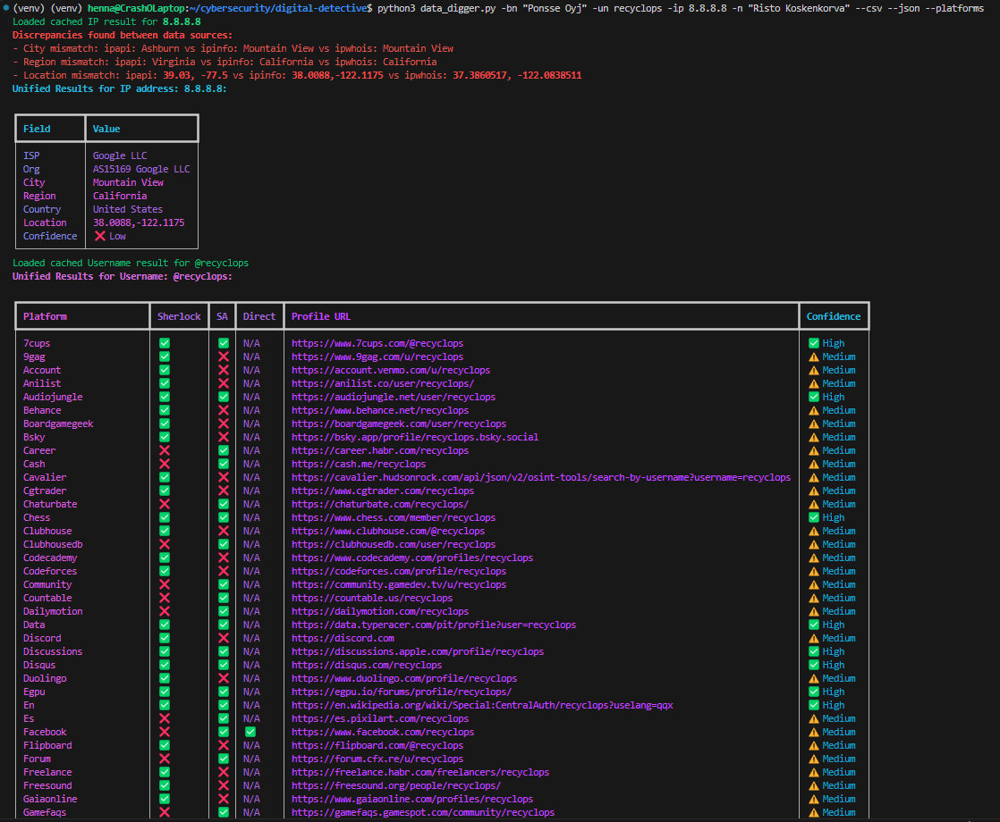

# Digital Detective 🕵️‍♂️

## Overview :globe_with_meridians:

Digital Detective is a CLI tool that scrapes the internet for user-provided data, validates it through cross-referencing, and saves the report to a file, while also displaying the output in the terminal. 


## Table of Contents :book:
- [Overview](#overview-globe_with_meridians)
- [Technologies Used](#technologies-used-wrench)
- [Setup and Installation Instructions](#setup-and-installation-instructions-computer)
- [Functionality](#functionality-mag_right)
- [Usage Guide](#usage-guide-running)
- [Bonus Features](#bonus-features-gift)
- [Key Concepts](#key-concepts-key)
- [Example](#example-bulb)
- [Disclaimer](#disclaimer-exclamation)
- [Author](#author-construction_worker)


## Technologies Used :wrench:

- Python Virtual Environment
- OSINT APIs:
    - ip-api.com
    - ipinfo.io
    - ipwho.is
    - Sherlock: sherlockproject.xyz
    - Social Analyzer
    - SerpApi (used with Google to query data from: ytj.fi, finder.fi, linkedin.com, opencorporates.com)
- Visual Studio Code
- WSL (Ubuntu)
- Version Control System (Git)
- Repository (Gitea)
- VCS Client (Bash)


## Setup and Installation Instructions :computer:

1. **Install Python and Pip**

The program is written in Python, so please ensure you have Python installed, or download it from <a href="https://www.python.org/downloads/">python.org</a>, OR for Linux, you can run the command: 
```console
sudo apt install python3 python3-pip python3-venv
```   

2. **Clone the repository to your computer and change directory to it:**

```
git clone https://github.com/HennaVenho/digital-detective.git
cd digital-detective
```

3. **Create a Virtual Environment:**
```console
python3 -m venv venv
``` 

4. **Activate the Virtual Environment:**

- WSL/Linux/macOS:
```console
source venv/bin/activate
```

- Windows (PowerShell):
```console
venv\Scripts\Activate
```

5. **Install Dependencies:**

```console
pip install -r requirements.txt
```

6. **Install Sherlock (Optional for Username Search)**

    Sherlock is an external tool that must be installed separately. It is used to perform username lookups.
    You can install it following their official instructions at [https://github.com/sherlock-project/sherlock](https://github.com/sherlock-project/sherlock), OR using these commands:

    1. Clone the Sherlock repo:
    ```console
    git clone https://github.com/sherlock-project/sherlock.git ~/cybersecurity/tools/sherlock
    ``` 

    2. Install its dependencies:
    ```console
    cd ~cybersecurity/tools/sherlock pip install .
    ``` 

    3. If you install Sherlock at `~/cybersecurity/tools/sherlock`, the Digital Detective CLI will use it automatically.

7. **Setup SerpAPI (Optional for Name and Business Name Search)**

    SerpAPI is used to search Google results for full names and businesses. To enable it, you need an API key (see also [API Key Protection](#api-key-protection) below). 
    
    1. Register for a free SerpAPI account with your personal details at [https://serpapi.com/](https://serpapi.com/). You will get **100 free searches per month**.
    
    2. Copy your personal API key from the [SerpAPI Dashboard](https://serpapi.com/manage-api-key).  
    
    3. To securely use SerpAPI API key with dotenv, create a `secrets.env` file in a new directory named `config/` at the root of the project: 

    ```console
    mkdir config
    touch config/secrets.env
    ```

    4. Add your SerpAPI key in your `config/secrets.env` file like this:

    ```
    SERPAPI_KEY=your_real_api_key_here
    ```
    The project uses `python-dotenv` to load this variable securely. The file is already excluded from version control via `.gitignore`.


8. **Select the Python Interpreter in VS Code:**

- Press `Ctrl+Shift+P`, search `Python: Select Interpreter` 
- Choose: `.venv/bin/python` (or `.venv\Scripts\python.exe`)


After the setup is done, please check [Usage Guide](#usage-guide) for how to run the Digital Detective program.   


## Functionality :mag_right:

This tool supports searching and combining results from multiple OSINT sources:

- IP Address Lookup (from ipapi, ipinfo, ipwhois)

- Username Lookup (from Sherlock, Social Analyzer, and direct platform probing)

- Full Name Lookup (from Fonecta, and SerpAPI)

- Business Name Lookup (from Fonecta, Finder, and SerpAPI, with scraping from ytj.fi, finder.fi, linkedin.com, and opencorporates.com via SerpAPI)

It handles both single and multi-parameter lookups and produces unified console output (via rich) and `.txt` files, as well as optional `.csv`, and `.json` files.


## Usage Guide :running:

For Usage Guide, run: 
```console
python3 data_digger.py --help
```

Run IP lookup, with or without the optional flags for storing results in a CSV or JSON file:
```console
python3 data_digger.py -ip <ip address> --csv --json
```

Run username lookup, with or without the optional flags. The flag `--platforms` runs lookup directly from the specific social media platforms in addition to the two APIs. 
```console
python3 data_digger.py -un <username> --platforms --csv --json
```

Run full name lookup, with or without the optional flags: 
```console
python3 data_digger.py -n <"Firstname Lastname"> --csv --json
```

Run business name lookup, with or without the optional flags: 
```console
python3 data_digger.py -bn <"Business Name"> --csv --json
```

The program saves searched data in cache files, for performance and rate-limit protection, but you can make a new search and replace the old cache file using an optional flag: `--force-refresh`

To use multi-mode, you can also run multi-parameter searches:

```console
python3 data_digger.py -ip <ip address> -un <username> -n <"Firstname Lastname"> -bn <"Business Name"> --platforms --csv --json --force-refresh
```
For example:
```console
python3 data_digger.py -ip 8.8.8.8 -un recyclops -n "Henna Venho" -bn "Ponsse Oyj" --platforms --csv --json --force-refresh
```

## Bonus Features :gift:

- Exporting lookup results to both CSV and JSON files is enabled with optional flags: `--csv` and `--json`
- Enhanced data visualization in the console with `rich.console` and `rich.table`
- More than the required two APIs used, and with more than required data is provided: 
    - 3 APIs for IP lookup
    - 2 APIs and an additional search directly from the platforms enabled for username lookup with optional flag: `--platforms`
    - Scraping addresses and phones numbers with full name search is prevented for ethical and legal reasons, but a bonus business name lookup is provided to demonstrate more detailed name searches, and 3 sources are cross-referenced for it
- Multi-parameter search enabled in a single command (`-ip`, `-un`, `-n`, `-bn` all in one call) 
- Caching searched data for performance and rate-limit protection
- API key protection for SerpAPI key, and purposefully restrained from using legally or ethically questionable methods scraping, storing or sharing sensitive data


## Key Concepts :key:

<details id="osint">
<summary>OSINT</summary>

- Open Source Intelligence: the practice of gathering public, open-source information.

</details>

<details id="cia-triad">
<summary>CIA Triad</summary>

- Confidentiality, Integrity, and Availability, in cybersecurity. 
- The CIA triad is a common model that forms the basis for the development of security systems. They are used for finding vulnerabilities and methods for creating solutions. 
    - Confidentiality involves the efforts of an organization to make sure data is kept secret or private. To fight against confidentiality breaches, you can classify and label restricted data, enable access control policies, encrypt data, and use multi-factor authentication (MFA) systems.
    - Integrity involves making sure your data is trustworthy and free from tampering. To protect the integrity of your data, you can use hashing, encryption, digital certificates, or digital signatures. 
    - Availability involves ensuring that data is available to those in the organization and the customers they serve, even in unusual circumstances like a power outage. To ensure availability, organizations can use redundant networks, servers, and applications. 

</details>

<details id="digital-footprint">
<summary>Digital Footprint</summary>

- The record of a person's online activity — it's the data they leave behind when they browse, post, or interact online. This includes everything from social media updates and blog posts to search history and website visits, which can be collected both intentionally and unintentionally.

</details>

<details id="api-key-protection">
<summary>API Key Protection</summary>

- This tool accesses the `SERPAPI_KEY` without exposing it in the source code by using:
    - `python-dotenv` to load the API key from a `.env` file (`config/secrets.env`)
    - `.gitignore` to exclude this file from version control, ensuring the key is never accidentally uploaded
    - A `load_env()` helper function in `utils/validators.py` to make the key accessible at runtime
- This approach keeps the key accessible to the program at runtime but private and secure for development and deployment, and complies with best practices for secret management in CLI applications.

</details>

<details id="rate-limiting-protection">
<summary>Rate-Limiting Protection</summary>

- Rate limiting can block or throttle users, bots, or applications that are over-using or abusing a web property. 
- Digital Detective automatically caches results after the first lookup. If a user tries to search the same data again, whether as a single-argument lookup or as part of a multi-argument lookup, the tool uses the cached result instead of sending another API request. This reduces unnecessary traffic and protects against rate-limiting issues with external services.
- The tool also avoids overwhelming servers by introducing optional delays and respecting rate limits. 

</details>

<details id="libraries-and-methods-for-web-scraping">
<summary>Libraries and Methods for Web Scraping</summary>

- `requests`: For sending HTTP GET requests to APIs and public pages.
- `beautifulsoup4`: For parsing HTML pages (used in Fonecta, Finder, and SerpAPI parsing).
- `python-dotenv`: For loading secrets from `.env` files safely.
- `Sherlock`: For username discovery across online platforms.
- `Social Analyzer`: Another username analysis and metadata discovery tool.
- `SerpAPI`: Used to extract data from Google search results about names or companies.
- **Approach:**
    - Public profiles and OSINT APIs are used.
    - Scraping is limited to legal, public data (e.g., open directories like Fonecta or Google Search via SerpAPI).
    - No login-based scraping, no CAPTCHA bypass, and no automated form submission.

</details>

<details id="ethical-considerations">
<summary>Ethical Considerations</summary>

- Digital Detective was developed with a strong focus on ethical web scraping, data protection, and legal compliance, especially under GDPR and Finnish privacy laws. The tool carefully limits the scope of its searches to publicly available information and avoids collecting sensitive personal data unless it is lawfully and openly published.
- Digital Detective follows ethical scraping principles:
    - It only accesses public URLs and profiles.
    - No credentials, captchas, or private data are bypassed. The program never attempts to access private information behind user accounts.
    - It respects robots.txt rules where applicable. (Robots.txt is a publicly available file that websites use to tell crawlers and scrapers which parts of the site they should not access.)
    - Environment variables are used to securely store sensitive information like API keys, preventing hard-coded exposure.
    - It avoids overwhelming servers by respecting rate limits, introducing optional delays, and caching results.

</details>

<details id="how-is-accuracy-validated">
<summary>How Is Accuracy Validated</summary>

- **IP Address Search**: the tool queries three independent public APIs (ip-api.com, ipinfo.io, ipwho.is). It compares results for ISP, city, region, and coordinates. Discrepancies are printed, and confidence is rated as High, Medium, or Low depending on agreement across sources.

- **Username Search**: The tool uses Sherlock and Social Analyzer to check existence across platforms. It can also optionally probe the platform directly using HTTP requests. Confidence is High if all sources agree, Medium if two match, and Low if only one or none do.

- **Full Name Search**: The tool compares full name search results between Fonecta and SerpAPI Google search. If both find the same first and last name combination, confidence is High. If only partial matches or mismatches are found, the result is downgraded to Medium or Low. Multiple matches from Fonecta are handled and displayed as separate rows with corresponding confidence levels.

- **Business Name Search**: The tool gathers business data from three sources: Fonecta (direct HTML parsing), SerpAPI (Google results for sites like ytj.fi, finder.fi, linkedin.com, opencorporates.com), and Finder.fi (direct parsing). Fields such as phone, address, city, email, and website are extracted and compared. Confidence is High if 60% or more of these fields match across sources, Medium if only some match, and Low if there is no agreement.

</details>

<details id="how-does-the-tool-extract-personal-information">
<summary>How Does the Tool Extract Personal Information</summary>

- **Full Name Search**: The tool intentionally does not extract personal addresses or phone numbers for individuals due to ethical and legal concerns related to privacy and GDPR compliance. Instead, if this data is encountered in search results, it is replaced with "Not found". The tool demonstrates name-matching accuracy through cross-referencing first and last name combinations from Fonecta.fi and SerpAPI (Google search results), and returns a confidence score based on that.

- **Business Name Search** (Bonus Feature): To ethically demonstrate personal information extraction (such as phone numbers, emails, and physical addresses), the tool includes a business search feature. This feature targets publicly available business registry data from:
    - Fonecta.fi (parsed HTML)
    - Finder.fi (parsed HTML)
    - SerpAPI (scraped Google search results for sites like ytj.fi, linkedin.com, and opencorporates.com)

    Because this information is publicly published for legal or contact purposes, extracting such data from businesses (not individuals) falls within the ethical bounds of OSINT practice.

</details>

<details id="how-does-the-ip-search-provide-location-and-isp-information">
<summary>How Does the IP Search Provide Location and ISP Information</summary>

- Digital Detective uses three public IP lookup APIs (`ip-api.com`, `ipinfo.io`, and `ipwho.is`) to gather location and ISP data. It sends an HTTP request with the target IP and parses JSON responses to extract fields like `city`, `region`, `country`, `ISP`, and `organization`.

</details>

<details id="how-does-the-tool-determine-if-a-username-exists">
<summary>How Does the Tool Determine if a Username Exists</summary>

- By checking public user profile URLs on popular platforms like GitHub, Reddit, Facebook, Instagram, etc. If a public profile URL returns HTTP 200 OK (page exists), it is marked as existing.

</details>


## Example :bulb:

You can find examples of the tool search results in the `./examples/` folder, and here is a visual of the Digital Detective tool in action:




## Disclaimer :exclamation:

This tool only scrapes publicly visible data from legal sources, and  does not store personal information. Full name searches are limited to public business data or sanitized individual lookups. The tool is intended for educational and ethical OSINT purposes only. Do not use for harassment, stalking, or profiling. Obey GDPR and local data laws.


## Author :construction_worker:
Henna Venho