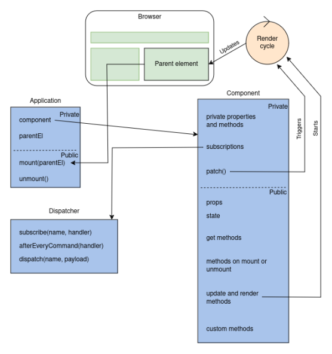

# Dot-js framework

## Table of Content
- [Framework Overview](#framework-overview)
    - [Framework architecture](#architecture)
- [Installation](#installation)
- [Getting Started](#getting-started-with-examples-of-todo-project)
    - [Project initialization](#project-initialization)
    - [Writing the project](#writing-the-project)
- [Detailed Explanation of Each Feature](#detailed-explanation-of-each-feature)
    - [defineComponent](#define-component)
    - [createApp](#create-app)
    - [h](#h)
    - [hFragment](#h-fragment)
    - [HashRouter](#hash-router)


## Framework Overview
Dot-js is designed as a lightweight and efficient frontend framework that follows a virtual DOM-based, component-driven architecture. It provides a simple API for building interactive web applications.

### Architecture

1. **Virtual DOM**  
Framework uses virtual DOM representation of UI elements to efficiently update and render changes. Instead of modifying the real DOM directly, the framework calculates differences between previous and new states, and patches only the necessary parts.
2. **Component-based structure**  
Applications are built using components that handle their own state and handle events, which makes them reusable and easy to maintain.
3. **State manager**  
Components define their own `state()`, and changes trigger automatic updates to the UI. State updates happen via `updateState()`.
4. **Event-driven communication**  
Components communicate using an event system with `emit()`. Events prevent unnecessary re-renders and maintain a clear data flow.
5. **Built-in router for navigation**  
Framework includes `HashRouter` to handle client-side navigation using URL fragments (`#routes`). This allows single-page applications (SPAs) to manage views without full-page reloads.



## Installation
Make sure you have installed and built the framework as it was instructed in [root README](./README.md) and you have `dot-js.js` in `framework/runtime/dist`.

## Getting started (with examples of ToDo-project)

<details id="project-initialization">
<summary>Project initialization</summary>

Create your project directory and create `.js` and `.html` files. If you  want to add css styling, make sure to create a `.css` file as well.  

Add your `.js` file as a script in the `.html` file's `<head>` tag:
```html
<script type="module" src="todos.js"></script>
```
The `<body>` can be left empty, as you will create everything you need using the framework.

Import the framework from `framework/runtime/dist` in your `.js` -file. Notice that the path may vary depending on where your project directory is located.  
```javascript
import {
    createApp,
    defineComponent,
    h,
    hFragment,
    HashRouter,
} from '../../framework/runtime/dist/dot-js.js'
```

</details>

<details id="writing-the-project"> 
<summary>Writing the project</summary>

First you need to define your application's **root component** with [defineComponent](#define-component) function. Root component manages the overall application state and structure. Include all the needed methods and custom methods for your project. You can use [defineComponent](#define-component) to create subcomponents to the root component.  

```javascript
const App = defineComponent({
    render() {
        return h('h1', {}, ['Hello, framework!'])
    }
})

const app = createApp(app)
app.mount(document.body)
```
 This component will be mounted with [createApp](#create-app) function to the parent element.
</details>

## Detailed Explanation of Each Feature

Below is an explanation of the features you need to use to make your own project. You can find an example code of ToDo app that uses all the features at ../example/todoapp_full.js. 

<details id="define-component">
<summary>defineComponent</summary>

defineComponent lets you create a reusable component with state and lifecycle hooks.  
```javascript

const ComponentName = defineComponent({
    state() {
        // state method
    },
    onMounted() {
        // onMounted method
    },
    render() {
       // render method
    },
    customMethod() {
        // add the custom methods needed for your app
    }

    
})
```
- `state()` method defines your component's initial state. It returns an object that holds reactive data specific to the component
```javascript
state() {
        return {
            todos: [],
            completedTodos: [],
        }
    },
```
- `onMounted()` is a lifecycle hook that runs when the component is first added to the DOM. It can be used for fetching data, initializing state, or setting up event listeners. For example in ToDo app it is used to retrieve todos from local storage when the app loads.
```javascript
onMounted() {
        const todos = readTodos()
        this.updateState({
            todos: todos.filter(todo => !todo.completed),
            completedTodos: todos.filter(todo => todo.completed)
        })
    }
```
- `render()` defines how the component should be displayed. It returns a virtual DOM representation of the component using the [h function](#h)
```javascript
render() {
         return h('h1', {}, ['My TODOs'])
}
```
- `updateState()` updates the component's state and triggers a re-render. It takes an object with updated state values and merges them with existing state. It is called inside other methods, when the state is changed
```javascript
 cancelEdition() {
        this.updateState({
            edited: this.state.original,
            isEditing: false
        })
    }
```
- `emit(eventName, payload)` sends custom events from a child component to its parent. It is used when a child component needs to notify its parents about an action. It is usually used in custom methods. Emitted events are listened inside `on` properties when creating element with [h function](#h)
```javascript
addTodo() {
        this.emit('add', this.state.text) //emit event called 'add'
        this.updateState({ text: '' })
    }
    // snip --
    h(CreateTodo, {
                on: {
                    add: (text) => root.addTodo(text), //listen for 'add' events and execute wanted function
                },
            })
```

</details>

<details id="create-app">
<summary>createApp</summary>

createApp is used to initialize and mount the Root component. It takes `RootComponent`, `props` and `options` as parameters.  
```javascript
const app = createApp(App, {}, { router })
```
You call the mount method to `mount` the root component to the parent element.
```javascript
app.mount(document.body)
```
</details>

<details id="h">
<summary>h</summary>

With h function you can create virtual DOM elements. It takes **tag name**, **props** and **child elements** as arguments.  
- `tag name` is html element's tag, such as \<p>, \<button> or \<input>, or a component function  
- `props` is an object of html element's attributes inside the tag, such as id="", src="", value="", event listeners, or other properties  
- `children` is an array of child nodes of the element. Child nodes can be text nodes, that have no tags or props, or other elements.  
```javascript
h('button', { on: { click: this.addText}}, ['Click me'])
```
Above block of code would create a button that has a text 'Click me' inside, and registers an event listener on click for function addText. Event listeners must be defined inside the `on` object in props.  
That would look like this on html:  
```html
<button onclick=addText()>Click me</button>
```

If the element doesn't have props or children, you can leave them as empty object/array. The following code has a div element as a parent, with no props, and two other elements, label and input, as child nodes.  
```javascript
h('div', {}, [
    h('label', { for: 'todo-input' }, ['New TODO']),
    h('input', { type: 'text', id: 'todo-input' })
])

```
Code above would be transferred in html as:
```html
<div>
    <label for="todo-input">New TODO</label>
    <input type="text" id="todo-input" />
</div>
```
You can also pass component as the first argument. Code below would create an instance of `TodoList` component, passing `todos` as props.  
```html
h(TodoList, { todos: this.state.todos })
```


</details>

<details id="h-fragment">
<summary>hFragment</summary>

If you want to group elements together without having a common parent element, you can use hFragment function. It is essentially just an array of elements created with [h function](#h).
```javascript
hFragment([
    h('h1', {}, ['My ToDo app']),
    h('p', {}, ['Components can also be element tags']),
    h(CreateTodo, {on: {add: addTodo},
    }),
])
```
</details>

<details id="hash-router">
<summary>HashRouter</summary>

The `HashRouter` is a routing solution that enables navigation between different views in your application using URL hash fragments. This allows for a single-page application (SPA) experience without the need for full page reloads. Below are the key features and functionalities of the `HashRouter`.


#### Key Features

- **Hash-based Navigation**: The `HashRouter` uses the URL hash (the part of the URL after the `#` symbol) to determine which component to display. This means that the application can respond to changes in the URL without reloading the page.

- **Route Matching**: The router matches the current URL hash against a set of defined routes. Each route specifies a path and the corresponding component to render, and the router supports static paths.

- **Event Dispatching**: When the route changes, the `HashRouter` dispatches a `router-event`, allowing components to react to navigation changes. This is useful for updating UI elements or triggering side effects based on the current route.

- **Subscription Model**: Components can subscribe to route changes, enabling them to update their state or perform actions when the route changes. This is achieved through the `subscribe` and `unsubscribe` methods.


#### Usage

To use the `HashRouter`, you need to define your routes and create an instance of the router. Here’s a basic example:

```javascript
const routes = [
{
path: '/',
component: HomeComponent,
},
{
path: '/about',
component: AboutComponent,
}
];
const router = new HashRouter(routes);
```

#### Navigating Between Routes

You can navigate between routes programmatically using the `navigateTo` method. This updates the URL hash and triggers the appropriate component to render:

```javascript
router.navigateTo('/about');
```


#### Handling Route Changes

Components can react to route changes by subscribing to the router's events. For example:

```javascript
router.subscribe(({ to }) => {
console.log(Navigated to: ${to});
});
```


#### Example

In the example Todo application, the `HashRouter` is used to manage navigation between the active todos, completed todos, and an about page. Each route is defined with its corresponding component, allowing users to switch views seamlessly.

```javascript
const routes = [
{
path: '/',
component: ActiveTodos,
},
{
path: '/completed',
component: CompletedTodos,
},
{
path: '/about',
component: About,
}
];
const router = new HashRouter(routes);
const app = createApp(App, {}, { router });
app.mount(document.body);
```
</details>

