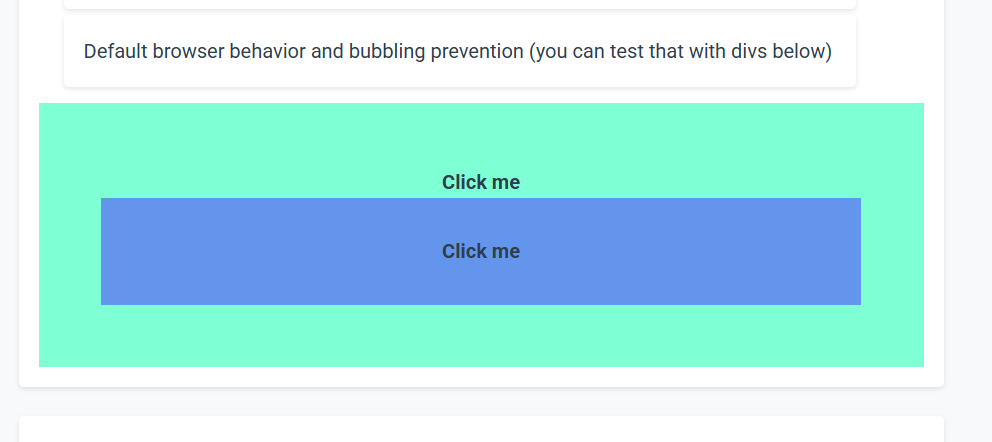

# FRONTEND FRAMEWORK 

Frontend framework is a framework built from scratch. It provides tools for DOM manipulation, reusable components, event handling, state management and routing.  
 This project consists of two directories  
 `framework`: Framework's code split into multiple files, and an importable version bundled into a single JavaScript file    
 `example`: Code for ToDo app, an example application made with the framework

## Table of Contents
- [Technologies used](#technologies-used)
- [Installation Instructions](#installation-instructions)
    - [Building and running the program](#building-and-running-the-program)
- [Example ToDo project](#example)
    - [Improvement ideas](#improvement-ideas)
- [Authors](#authors)

## Technologies Used

- Backend: 
    - Go Standard Library
- Frontend: 
    - JavaScript
    - HTML
    - CSS
- Visual Studio Code
- Linux Mint and WSL (Ubuntu)
- Version Control System (Git)
- Repository (Gitea)
- Gitea Projects for Task Management
- VCS Client (Bash)

## Installation Instructions

Clone the repository to your computer and change directory to it:

```console
git clone https://github.com/HennaVenho/frontend-framework.git
cd frontend-framework
```

### Building and Running the Program
---

Download necessary dependencies inside `framework/runtime` directory and build the framework:
```console 
npm install   
npm run build
```

You should see `dist` directory with `dot-js.js` now appear inside `framework/runtime`. That is the framework bundled up in one file, which you can import in your project to use the framework.    

To run the ToDo-program in `example` directory, run the following command in the root directory:  
```console
go run .
```
You can now open [localhost:56789](http://localhost:56789)

Read the [Framework README](./FRAMEWORK_README.md) for a **Getting started** guide to create your own program and **detailed explanation of each feature** of the framework

## Example ToDo-project:

The example project is a simple application to keep track of todo-tasks.  

**Active** page lets you add new todos, view a list of uncompleted tasks and mark them as completed  

**Completed** page displays a list of task that are marked as completed  

**About** page has a list of core capabilities of the framework. It also has a view to indicate the use of *bubbling prevention*.  



Both divs have an event handler. With bubbling enabled, clicking the inner div should also trigger the event handler of the outer div. But when bubbling is disabled, only the event handler of the div you clicked is invoked.  
If you want to test the functionality with bubbling enabled, search the following function from `framework/runtime/dist/dot-js.js` and comment out the row with `e.stopPropagation`.  
```javascript
function addEventListener(eventName, handler, el, hostComponent = null) {
    function boundHandler(e) {
        //e.stopPropagation(); //Comment out this line
        hostComponent
            ? handler.apply(hostComponent, arguments)
            : handler(arguments);
    }
    el.addEventListener(eventName, boundHandler);
    return boundHandler
}
```
### Improvement ideas

To test the framework yourself, you can try to implement adding **restore** and **delete** buttons to the completed items.

#### Restore
Add a button to the completed todo-item to revert the item back to **Active** page as an uncompleted todo.

#### Delete
Add a button to delete the completed todo-item from the **completed** page (and the whole app) 

Try to implement these ideas on your own first. If you want to check the way that we implemented these features, check them from ./example/todoapp_restore_delete.js.


## Authors
Mikko Venäläinen, Henna Venho, and Salla Ripatti  
