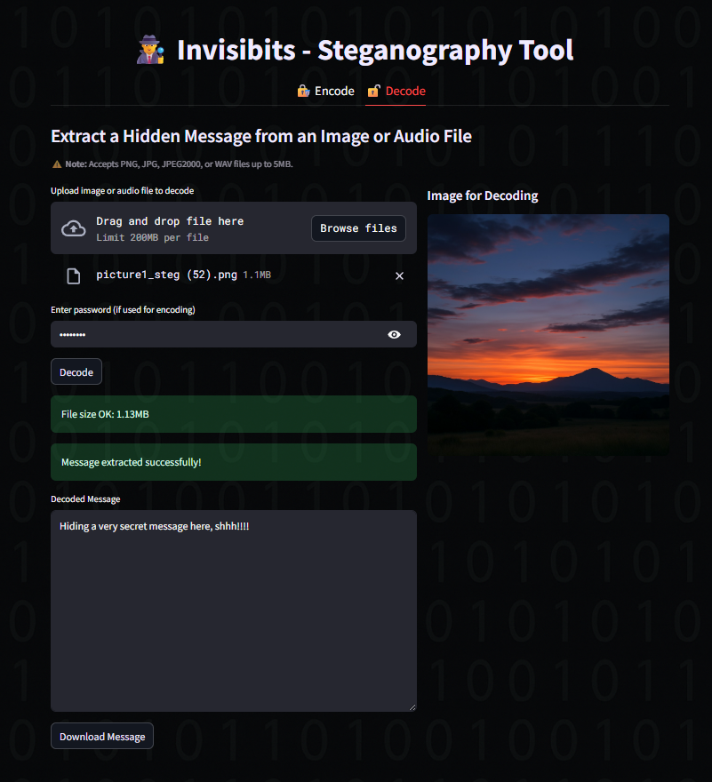

# InvisiBits - Steganography Tool :ghost:

## Overview :globe_with_meridians:

**InvisiBits** is a web application that allows users to encode text messages into images and audio files, and decode messages from steganographic images and audio files using the <a href="https://medium.com/@renantkn/lsb-steganography-hiding-a-message-in-the-pixels-of-an-image-4722a8567046">LSB (Least Significant Bit) technique</a>. The tool provides a user-friendly interface, and supports basic password-encryption and decryption for added security. Optional added compression with Zstd is also provided, in addition to optional error-correction with Reed-Solomon. 


## Table of Contents :book:
- [Overview](#overview-globe_with_meridians)
- [Technologies Used](#technologies-used-wrench)
- [Setup and Installation Instructions](#setup-and-installation-instructions-computer)
- [Functionality](#functionality-mag_right)
- [Usage Guide](#usage-guide-running)
- [Bonus Features](#bonus-features-gift)
- [Key Concepts](#key-concepts-key)
- [Notes](#notes-exclamation)
- [Example](#example-bulb)
- [Author](#author-construction_worker)


## Technologies Used :wrench:

- Python Virtual Environment
- Makefile for automating setup
- Frontend/UI: Streamlit (Python-based web app framework)
- Image processing: PIL (Pillow)
- Image pixel array manipulation: numpy
- Compression: Zstandard (Zstd)
- Security: 
    - Encryption/decryption: XOR (by default)
    - (Optional) AES encryption/decryption: cryptography
- Error Correction: Reed-Solomon via reedsolo
- For .wav audio steganography: wave (Python standard library)
- Visual Studio Code
- WSL (Ubuntu)
- Version Control System (Git)
- Repository (Gitea)
- VCS Client (Bash)


## Setup and Installation Instructions :computer:

### System Requirements

- Python 3.9 or higher
- `make` (for automating setup)
- A terminal or shell environment (bash, zsh, Git Bash, or WSL)


1. **Install Python, Pip and Make, if you need to**

**For Linux:** 
```console
sudo apt update
sudo apt install python3 python3-venv python3-pip make
``` 

**For macOS:**
- Install Python3 from <a href="https://www.python.org/downloads/">python.org</a>
- Make is usually pre-installed

**For Windows:**
- Install <a href="https://www.python.org/downloads/windows/">Python 3 for Windows</a>
- Use Git Bash, WSL, or PowerShell with Make installed
- Install Make e.g. via <a href="https://chocolatey.org/">choco</a> (`choco install make`)


2. **Clone the Repository and Navigate to It:**
```
git clone https://gitea.kood.tech/hennamariahelenavenho/invisibits.git
cd invisibits
```

3. **Run Setup and Launch the App:**

- Set up a virtual environment and dependencies (no need to run `source venv/bin/activate` manually – it's automated via `make`):
```console
make all
``` 

This should automatically offer to open a new tab on your default browser at: <a href="http://localhost:8501/">http://localhost:8501/</a>.

After the setup is done, please check [Usage Guide](#usage-guide) for how to run the Invisibits program.   


## Functionality :mag_right:

- Supported image formats: PNG, JPEG2000, JPEG, JPG
- Supported audio file format: WAV
- File size up to 5 MB supported.
- The message must consist of only ASCII characters. 
- The length of the embedded message is limited only by the dimensions of the image and the colour channels available, or the size of the audio file.
- (Optional) encryption with a password using XOR (AES-256 code is also provided).
- SHA-256 hash is used to verify message integrity after decoding, alerting the user if the message was corrupted or altered (e.g., due to incorrect password or lossy compression).
- Optional Reed-Solomon error-correction detect and correct possible corruption.
- Optional Zstd compression/decompression as a modern compression engine, chosen for its efficiency and performance. 


## Usage Guide :running:

The usage of the app UI should be pretty self-explanatory, but here are short instructions:

- After the set-up is run once (with `make all`), you can re-start the program from a terminal with:
```console
make run
```

- Open a new browser tab at path: <a href="http://localhost:8501/">http://localhost:8501/</a>.

**Encoding**:
- Upload a PNG, JPEG2000, or JPG image file, or a WAV audio file, with size up to 5 MB (larger files will not be accepted)
- Enter the message that you want to embed in the image or audio file (ASCII only)
- Optionally enter a password, if you want encryption (and remember to add the same password in decoding)
    - The default password-based encryption is XOR. Reviewers may test AES encryption by modifying the `_encrypt()` and `_decrypt()` methods in `messageprocessor.py` to use `_aes_encrypt()` and `_aes_decrypt()` instead.
- For images, choose the output format (PNG or JPEG2000 recommended, as regular JPEG will likely destroy the LSB data)
- Optionally you can choose to compress the message with Zstd
- Optionally you can add Reed-Solomon error correction, which may be slow for large messages
- Click "Encode"
- You can view the Original and Encoded Image one on top of the other on the page to compare them, or view and play the Original and Encoded Audio File to ensure the audio quality and playability
- Click "Download Encoded File" to download the processed image or audio file

**Decoding**:
- Upload a steganographic image or audio file, which you have encoded and downloaded from the program before
- Enter the password, if you used one in encoding
- Click "Decode"
- The UI will display the embedded message
- Click "Download Message" to download the decoded message as a text file


## Bonus Features :gift:

- The tool successfully detects hidden messages in steganographic images
- The tool successfully encodes and decodes messages in .wav audio files, and the audio files retain their quality and playability
- The text compression feature, using Zstd, allows for longer messages to be embedded compared to uncompressed text
- SHA-256 used for integrity checking
- Reed-Solomon used for optional error correction (RS(160, 112) i.e. 30% parity)
- AES-256 with small changes for proper and widely used encryption (XOR in use, but AES demonstrated as industry standard)
- JPEG2000 image format accepted as a bonus feature 


## Key Concepts :key:

<details id="steganography-and-its-relevance-to-digital-forensics">
<summary>Steganography and Its Relevance to Digital Forensics</summary>

- Steganography is a method of hiding data within other digital files so that the existence of the hidden content is not obvious. It can conceal text, images, or any file type within host media like images, audio, or videos, while keeping the host file functional and visually unchanged. This technique complicates digital forensic investigations because the hidden data doesn't appear separately — it's embedded. If no steganalysis is performed, crucial evidence might be missed.

</details>

<details id="least-significant-bit-lsb-technique">
<summary>Least Significant Bit (LSB) Technique</summary>

- The Least Significant Bit (LSB) technique hides message bits in the least significant bits of pixel values in an image. Each colour in an RGB image (Red, Green, Blue) is stored as an 8-bit number. Changing the last bit (which only changes the colour very slightly, e.g., from 240 to 241) is visually undetectable. LSB steganography can use one or more bits per channel, but using more than 1 bit risks creating visually perceptible changes.

</details>

<details id="difference-between-steganography-and-encryption">
<summary>Difference Between Steganography and Encryption</summary>

- Encryption protects the content of a message by converting it into unreadable ciphertext, but it is clearly visible and may draw suspicion. In contrast, steganography hides the very existence of a message. It makes no changes to the visible structure of the host file beyond imperceptible modifications, so the secret message is not obvious and does not attract attention.

</details>

<details id="efficiency-of-decoding-and-encoding-algorithms">
<summary>Efficiency of Decoding and Encoding Algorithms</summary>

- Encoding and decoding using LSB is fast and memory-efficient. Modulo operations or bitwise masks are simple and performant. The algorithm processes pixels linearly, making it close to O(n) in complexity. In-place modification of pixel arrays keeps memory usage low. However, LSB encoding is fragile: any transformation like compression, resizing, or filtering can destroy the hidden data. It is ideal for one-time embedding with minimal distortion.

</details>

<details id="password-based-encryption-method-used-for-encoding-and-decoding-the-hidden-message">
<summary>Password-based Encryption Method Used for Encoding and Decoding the Hidden Message</summary>

- InvisiBits supports password-based encryption using two alternative methods: a simpler XOR cipher (enabled by default), and a more secure AES-based system (available for real-world use).

#### XOR Encryption (Default)
- How it works: Each byte of the message is XORed (bitwise exclusive OR) with a repeating byte from the password.
- Why XOR?
    - It's fast, simple, and symmetric — the same operation is used to both encrypt and decrypt.
    - Easy to implement and explain.
    - Suitable for obscuring short messages from casual inspection.
- Limitations:
    - Not secure against brute-force or known-plaintext attacks.
    - Recommended only for educational use or very low-security scenarios.

#### AES Encryption (Optional)
- How it works:
    - Uses AES-256 in CBC (Cipher Block Chaining) mode, a widely accepted industry standard.
    - The password is converted into a cryptographic key using PBKDF2-HMAC-SHA256 with a randomly generated salt.
    - A random initialization vector (IV) is also used to prevent identical plaintexts from producing the same ciphertext.
    - The encrypted output includes: [salt][IV][ciphertext] — making it fully self-contained.
- Why AES?
    - AES is secure, widely used in everything from HTTPS to encrypted storage.
    - It provides strong protection when used with secure key derivation and padding.
    - Left in the tool to demonstrate how secure encryption could be added for production use.

</details>

<details id="compression-algorithm-used-and-its-efficiency">
<summary>Compression Algorithm Used and Its Efficiency</summary>

- InvisiBits uses **Zstandard (Zstd)**, a modern, high-performance lossless compression algorithm developed by Facebook. It was chosen for its balance of excellent compression ratio, fast execution time, and support for multi-threaded processing.

#### How Zstandard Works:

Zstd combines:
- LZ77-style dictionary compression (detects repeated sequences)
- Finite State Entropy (FSE) coding (a modern entropy coder similar to Huffman, but faster)

It compresses data in blocks, allowing both fast decompression and scalable multithreading.

#### Time Complexity:
- The compression and decompression both operate in linear time: O(n)
- It scales efficiently even on larger files, especially with multiple threads

#### Compression Ratio:
- On short messages, compression may increase size due to overhead metadata (headers, dictionaries).
- On repetitive or structured messages, Zstd achieves much better compression than older formats.
- Example:
    - "hello hello hello" → well compressed
    - "1234!@#$" → possibly larger after compression

That’s why users can toggle compression in the UI based on the message content.

#### Comparison to Other Algorithms:

| Algorithm   | Speed                 | Compression Ratio                  | Notes                           |
| ----------- | --------------------- | ---------------------------------- | ------------------------------- |
| **Zstd**    | Fast (multi-threaded) | Excellent on large/repetitive data | Used in this tool               |
| **Huffman** | Slower                | Moderate                           | Fixed coding tree, not adaptive |
| **LZW**     | Moderate              | Good on long/redundant input       | Used in GIF format              |


- **Huffman Coding**: Simple prefix-code method, slower and less effective for short or binary-like data.
- **LZW**: Builds a dictionary dynamically. Good general-purpose algorithm but less efficient than Zstd on short/modern inputs.
- **Zstd**: Outperforms both in most scenarios due to its adaptive modeling and multithreaded block-based design.

#### Why Zstd is Ideal for This Tool:
- Fast, modern, and works well even on mid-sized text messages
- Helps embed longer messages inside images or audio files
- Optional: users can disable it if embedding small, non-repetitive text

</details>

<details id="hashing-versus-reed-solomon-error-correction">
<summary>Hashing Versus Reed-Solomon Error Correction</summary>

- SHA-256 hashing is used to check message integrity. It is my main tool for detecting errors in password, corruption, or stego bit distortion.
- Optional Reed-Solomon error correction is available to help recover from bit errors that can occur during steganographic encoding or decoding — especially in formats like JPEG where lossy compression can damage the hidden message.
    - Reed-Solomon: 
        - Adds redundancy to each chunk of the message
        - Allows automatic recovery from a limited number of corrupted or flipped bits

#### How Reed-Solomon Error Correction and Hashing Differ:

| Feature                   | Hashing           | Reed-Solomon Error Correction         |
| ------------------------- | ----------------- | ------------------------------------- |
| Purpose                   | Detect corruption | Detect **and correct** corruption     |
| Can restore damaged data? | ❌ No              | ✅ Yes                                 |
| Error message on failure? | ✅ Yes             | ✅ Yes, or silently fixes minor damage |
| Used at                   | End of decoding   | During decoding                       |

They complement each other:
- Hashing tells you "something is wrong"
- Reed-Solomon tries to fix it automatically

</details>


## Notes :exclamation:

I used an extra image format, JPEG2000, in addition to the prescribed JPEG and PNG, owing to the fact that JPEG2000 is a newer version of JPEG which supports lossless compression. You cannot hide meaningful data using LSB to pixel data with normal JPEG, because normal JPEG destroys the LSB data written. JPEG compression is based on removing things human eyes cannot see the difference in, so it invalidates out attempt at hiding data exactly there in an image file.


## Example :bulb:

Here are visual representations of the InvisiBits tool in action:





## Author :construction_worker:
Henna Venho