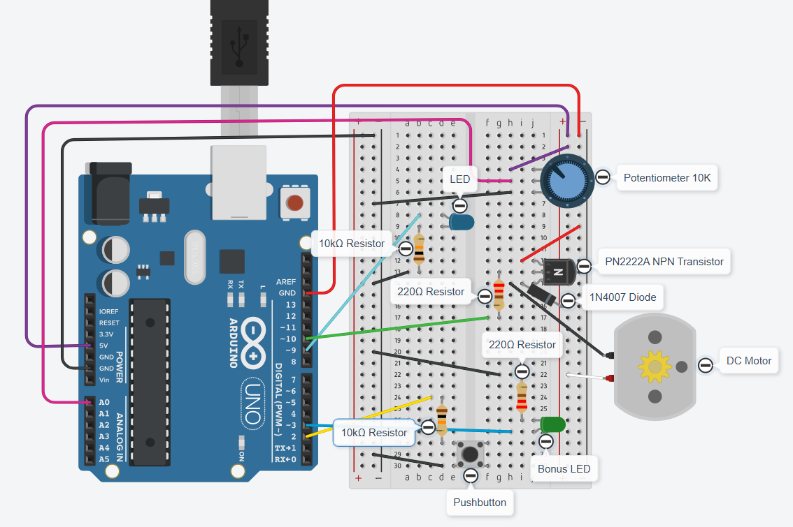

# 📍 Analogue & Digital I/O

## :earth_africa: Overview

This project demonstrates **how analogue and digital signals interact** on an Arduino-compatible microcontroller, using **direct register-level programming** (no Arduino libraries or C++).

There are two core input/output flows:

| Input Type     | Output Type               | Behaviour                                                      |
|----------------|---------------------------|----------------------------------------------------------------|
| Analogue Input | Digital Output            | Potentiometer controls the brightness of an LED                |
| Digital Input  | Analogue Output (via PWM) | Button cycles motor speed: 25% -> 50% -> 75% -> 100% -> OFF    |

These flows run **simultaneously and independently** — input on one side doesn't interfere with the other output. This separation is key to designing **stable embedded systems**.

#### What You'll Need: 

- 1× Arduino Pro Micro (ATmega32U4)
- 1× LED + 10kΩ resistor
- 1× Potentiometer
- 1× DC motor + transistor + diode + 220Ω resistor
- 1× Button + 10kΩ resistor
- (Bonus) 1× LED + 220Ω resistor

The full implementation uses **pure C** and **standard AVR tools** only.  

As a **bonus**, optional Arduino IDE sketches are available in `./bonus_scripts/` for testing your circuits during development. 

---

## :book: Table of Contents 
- [Overview](#earth_africa-overview)
- [Technologies Used](#wrench-technologies-used)
- [Setup Instructions](#jigsaw-setup-instructions)
- [Usage Guide](#rocket-usage-guide)
- [Bonus Features](#gift-bonus-features)
- [Key Concepts](#key-key-concepts)
- [Author](#female_detective-author)

---

## :wrench: Technologies Used 

This project is implemented in **pure C with AVR tools** — no Arduino IDE, libraries, or frameworks were used in the core logic. All functionality is implemented by **direct manipulation of microcontroller registers**.

Please see [Required Hardware](#required-hardware) for full details of physical components. 

### Toolchain

- **`avr-gcc`** – The AVR C compiler for compiling `main.c` into a `.hex` binary
- **`avr-libc`** – Standard C library for AVR microcontrollers (provides `<avr/io.h>`, `<util/delay.h>`, and other headers for low-level AVR hardware access)
- **`avrdude`** – Upload tool for flashing the compiled `.hex` file to the Arduino
- **`make`** – Build automation using a `Makefile`

### Development Environment

- **Windows 11** with **MSYS2 MinGW64 shell**  
    Enables use of Linux-style tools like `make` and Unix path conventions
- **Visual Studio Code**  
    Used for writing, organizing, and compiling C source files
- **Git + Gitea**  
    For version control and project collaboration
- **Arduino IDE (Bonus only)**  
    Used only to test basic circuits with example sketches (`bonus_scripts/`)

---

## :jigsaw: Setup Instructions

To run this project, you will:

1. Assemble the hardware
2. Build the circuit on a breadboard
3. Install the required AVR tools
4. Compile and flash the firmware to the Arduino Pro Micro

[A demonstration video](#project-demonstration-video) is also provided, along with breadboard diagrams and photos.

---

### Required Hardware

All parts listed below are typically included in standard Arduino starter kits.

#### Core Components

- **Arduino Pro Micro**  
  (ATmega32U4-based; 5V logic; USB-C or micro-USB depending on model)

- **USB Cable** for power and programming  
- **400-hole breadboard**  
- **Male-to-male jumper wires**

#### Inputs

- **1× Potentiometer** (10kΩ)  
    -> Used to control LED brightness via analogue input (A0)

- **1× Pushbutton**  
    -> Cycles motor speed on each press

- **1× 10kΩ resistor** 
    -> Used as pull-down resistor for the pushbutton

#### Outputs

- **1× LED** (any colour)  
- **1× 10kΩ resistor**  
    -> Current-limiting resistor for the LED

#### Motor Control

- **1× Small DC motor**  
    -> Used as the output controlled by the button

- **1× PN2222A NPN transistor**
    -> Acts as a switch to drive the motor using PWM

- **1× 220Ω resistor**
    -> Connected between Arduino PWM output and transistor base

- **1× 1N4007 diode**
    -> Placed across motor terminals to protect against back-EMF

#### Bonus Feature: Extra LED

- **1× LED** (any colour)  
- **1× 220Ω resistor**  
    -> Displays motor speed via brightness (bonus feature)

#### Optional (Debugging / Stability)

- Multimeter (for voltage or continuity checks)  
- Extra power rails or bus wires for neater layout

---

#### Notes

- ⚠️ Make sure all GND rails are **properly connected to Arduino GND**, but consider using **separate GND rails** for high-current and low-current components:

    - Connect LED, potentiometer, and button to one GND rail
    - Connect the **motor transistor emitter** to a separate GND rail
    - This can help isolate voltage fluctuations caused by motor current and avoid flickering or interference in the LED circuit.

- The DC motor should not be powered directly from an Arduino pin — the transistor switch setup allows safe control via PWM.

- For accurate analog readings, ensure stable power supply to potentiometer and good wiring practices (e.g. avoiding loose jumpers).

---

### Breadboard Circuit Overview

#### Pin Mapping Reference

- [Arduino Pro Micro Pinout (Joy-IT PDF)](https://joy-it.net/files/files/Produkte/ARD_Pro-Micro/ARD_Pro-Micro_Datasheet_2022-09-08.pdf)  
  *(Screenshot used in [arduino-pro-micro-pinout.png](images/reference/arduino-pro-micro-pinout.png))*

- [ATmega32U4 ↔ Arduino Pin Mapping (Official Arduino Docs)](https://docs.arduino.cc/retired/hacking/hardware/PinMapping32u4/)  
  *(Screenshot used in [atmega32u4-pin-mapping.png](images/reference/atmega32u4-pin-mapping.png))*

> 🧠 **Note**: Tinkercad was used to draw the circuit, which only offers Arduino Uno in its component list. Wiring shown corresponds to **Arduino Pro Micro**.

#### Circuit Diagram


- [Clean diagram version without notes](./images/circuits/circuit-diagram-clean.png)

> 🛠️ Created using [Tinkercad Circuits](https://www.tinkercad.com/circuits)

#### Real Photos of the Build

- [📸 Full Wiring from Above](./images/photos/pro-micro-circuit-1.jpeg)  
- [📸 Side View from Left](./images/photos/pro-micro-circuit-2.jpeg)  
- [📸 Side View from Right](./images/photos/pro-micro-circuit-3.jpeg)  

---

### How the Wiring Works

#### 1. Breadboard Basics

- Terminal strips: Horizontal connections (e.g. A1–E1)
- Power rails: Vertical connections for GND (–) and VCC (+)
- Central gap: Keeps IC pins separated

#### 2. Potentiometer -> LED (Analogue In -> Digital Out)

- Potentiometer:
    - Side 1 -> VCC
    - Side 2 -> GND
    - Middle (wiper) -> A0 (ADC input)

- LED:
    - Anode (long leg) -> PWM pin 9
    - Cathode (short leg) -> 10kΩ resistor -> GND

#### 3. Button -> Motor (Digital In -> Analogue/PWM Out via Transistor)

- Button has 2 pins (or 4, but 2 opposite pins are internally connected):
    - One side -> Pin 2 (digital input)
    - Other side -> GND
    - 10kΩ pull-up resistor between pin 2 and VCC to ensure the input isn't "floating" 
        - So: button unpressed = HIGH, pressed = LOW (logic inverted, but reliable)

- Motor (via PN2222A transistor):
    - A small DC motor needs **more current than the Pro Micro pin can safely supply**, so we must drive it using a **transistor switch** (PN2222A NPN transistor).
        - Motor + terminal -> VCC
        - Motor – terminal -> Collector of PN2222A
        - PN2222A Emitter -> GND
        - PN2222A Base -> Pin 10 (PWM) through 220Ω resistor
        - Diode (1N4007): Cathode -> VCC, Anode -> Collector
            -  Diode across motor terminals protects against back-EMF.

#### 4. Bonus LED

- Green LED to indicate motor speed:
  - Anode -> Pin 3
  - Cathode -> 220Ω resistor -> GND

> ✳️ Bonus LED toggled via `-DBONUS_LED_ENABLED` in Makefile

---

### Tool Installation

#### Windows (MSYS2)

1. Install [MSYS2](https://www.msys2.org/)

2. Open `MSYS2 MinGW64` (64-bit) shell

3. Update packages:
   ```bash
   pacman -Syu
   ```

4. Install required AVR tools:
    ```bash
    pacman -S mingw-w64-x86_64-avr-gcc mingw-w64-x86_64-avr-libc mingw-w64-x86_64-avrdude mingw-w64-x86_64-make
    ```

5. Add make alias (optional):
    ```bash
    echo "alias make='mingw32-make'" >> ~/.bashrc
    source ~/.bashrc
    ```

---

#### Linux (Debian/Ubuntu)

```bash
sudo apt update
sudo add-apt-repository universe
sudo apt install gcc-avr avr-libc avrdude make
```

✅ You now have everything to build and flash firmware!

---

### Compile and Flash

#### 1. Clone the Repository

```bash
git clone https://github.com/HennaVenho/io.git
cd io
```

#### 2. Edit `Makefile` If Needed

- Match your MCU (ATmega32U4), bootloader (`avr109`), and COM port (e.g. `COM8`)

#### 3. Build the Code

```bash
make
```

#### 4. Upload the `.hex` File to the Pro Micro

```bash
make flash
```
- Quickly double-tap the **reset pin** right after running the command to enter bootloader mode.
- The board enters bootloader mode for ~8 seconds
- `avrdude` connects and flashes your `.hex` file

[Here's a screenshot](images/screenshots/make-flash-successful.png) of what a successful `make flash` output looks like. 

#### 5. Clean up Build Artifacts (Optional)

```bash
make clean
```

After the setup is done, please check [Usage Guide](#running-usage-guide) for instructions on how to use the microcontroller.   

---

## :rocket: Usage Guide

Once the project is flashed to the Arduino Pro Micro and powered on:

---

### 1. Adjust the Potentiometer to Control LED Brightness

- The **blue LED** is connected to **Pin 9** and reflects the analogue value from the potentiometer (A0).
- Turn the potentiometer:
  - Fully left = LED OFF
  - Fully right = LED at full brightness
  - Values in between = proportional brightness via PWM

---

### 2. Press the Button to Cycle Motor Speeds

- The **pushbutton** is connected to **Pin 2** (digital input with pull-up).
- Each press advances the DC motor through these speed steps:

    | Press Count | Motor Speed | PWM Duty Cycle |
    |-------------|-------------|----------------|
    | 1st press   | 25%         | 64             |
    | 2nd press   | 50%         | 128            |
    | 3rd press   | 75%         | 192            |
    | 4th press   | 100%        | 255            |
    | 5th press   | OFF         | 0              |

    > The pattern loops continuously: after OFF, the next press sets 25% again.

---

### 3. Bonus LED: Visual Feedback for Motor Speed

- A **green LED** connected to **Pin 3** shows the current motor speed.
- Its brightness mirrors the motor's PWM duty cycle in real-time.
- This feature is **enabled by default**, but can be toggled off without changing any core logic.

To **disable** the bonus LED:

1. Open the `Makefile`
2. Comment out or remove the `-DBONUS_LED_ENABLED` flag:
   ```make
   # CFLAGS = -mmcu=$(MCU) -DF_CPU=$(F_CPU) -Os -Wall -DBONUS_LED_ENABLED
   CFLAGS = -mmcu=$(MCU) -DF_CPU=$(F_CPU) -Os -Wall
   ```
3. Recompile and flash the project using:
    ```bash
    make clean
    make flash
    ```

---

### Project Demonstration Video

🎥 A short demonstration video is available to verify full project functionality:

👉 [Watch the video on YouTube (Unlisted)](https://youtu.be/T9fSDPvxf00)

The video demonstrates:
- Hardware circuit running on Arduino Pro Micro (ATmega32U4)
- Analogue input (potentiometer) controlling LED brightness via PWM
- Digital input (button) cycling motor speed through PWM levels
- Both flows operating simultaneously and independently

---

## :gift: Bonus Features

- **Bonus LED:** A second LED (e.g. green) reflects motor speed by mirroring its PWM duty cycle. This provides intuitive visual feedback and showcases independent PWM signal generation alongside the core functionality.
    - The bonus feature is enabled by default and is **fully isolated**, so it doesn't interfere with the main input/output flows.

- **Arduino IDE Test Scripts:** A set of simple C++ sketches is provided in `./bonus_scripts/` to help test the circuits before flashing the full firmware. These can be used to validate individual subsystems (potentiometer, button, motor) using the Arduino IDE.

- **Demonstration Video:** A short video walkthrough is provided to show the working hardware setup and how each input/output behaves in real time. 
    - Link to the video: [Demo video on YouTube (Unlisted)](https://youtu.be/T9fSDPvxf00)

---

## :key: Key Concepts

<details id="difference-between-analogue-and-digital-signals-in-embedded-systems">
<summary>Difference Between Analogue and Digital Signals in Embedded Systems</summary>

- In embedded systems, signals are the primary way a microcontroller receives and sends data to the outside world. Signals can be either **digital** or **analogue**:

    - **Digital signals** have only two possible voltage states — `HIGH` (1) or `LOW` (0).  
        They are used for binary actions, such as detecting a button press or toggling a motor on/off.

    - **Analogue signals** vary continuously within a voltage range (e.g. 0 V -> 5 V).  
        They represent real-world, variable inputs such as light intensity or potentiometer position.

- In this project:
    - The **potentiometer** produces an *analogue* signal, converted to a digital value (0–1023) by the ADC.
    - The **pushbutton** produces a *digital* signal, read as either HIGH or LOW.

- Analogue signals allow more precise control, while digital signals are simpler and more robust against noise.

</details>


<details id="how-an-analogue-input-can-be-read-using-an-arduino-and-how-it-differs-from-a-digital-input">
<summary>How an Analogue Input Can Be Read Using an Arduino and How It Differs from a Digital Input</summary>

- An **analogue input** lets the microcontroller measure a continuously varying voltage (for example, the middle pin of a potentiometer).

    - The **ATmega32U4** chip on the Arduino Pro Micro includes a built-in **Analog-to-Digital Converter (ADC)** that translates that voltage (0 V -> 5 V) into a **10-bit digital value** between **0 and 1023**.

    - In my project, the potentiometer on **A0 (ADC7)** is read like this:
        ```c
        ADMUX = (1 << REFS0) | (channel & 0x07);  // Use AVCC (5 V) as reference, select channel
        ADCSRA |= (1 << ADSC);                    // Start ADC conversion
        while (ADCSRA & (1 << ADSC));             // Wait until finished
        return ADC;                               // Read 10-bit result (0–1023)
        ```
   
    - The higher the potentiometer voltage, the higher the ADC value, which I scale to 8-bit (0–255) to control LED brightness via PWM.

- A **digital input**, on the other hand, does not measure voltage levels continuously.
    - It simply detects whether the pin is **HIGH** (above a threshold, ≈3 V) or **LOW** (below ≈1.5 V).
    - No conversion is needed — the program just reads a single bit from the input register.

    - Example from my project:
        ```c
        if (PIND & (1 << PD1)) {
            // Button not pressed (input HIGH)
        } else {
            // Button pressed (input LOW, active-LOW logic)
        }
        ```

- **Summary:**

    | **Feature**     | **Analogue Input**                | **Digital Input**           |
    | --------------- | --------------------------------- | --------------------------- |
    | Voltage range   | 0–5 V (continuous)                | 0 V / 5 V (two levels)      |
    | Hardware used   | ADC (Analog-to-Digital Converter) | Digital I/O pin             |
    | Data format     | 10-bit (0–1023)                   | 1-bit (0 / 1)               |
    | Code Complexity | Uses registers (ADC)              | Simple bit-checking         |
    | Example use     | Potentiometer -> LED brightness   | Button -> motor speed steps |

</details>


<details id="how-a-digital-output-behaves-and-how-it-can-be-controlled-using-values-from-an-analogue-input">
<summary>How a Digital Output Behaves and How It Can Be Controlled Using Values from an Analogue Input</summary>

- A **digital output** pin can be either **HIGH (5 V)** or **LOW (0 V)**.
    - On its own, this means a device connected to that pin — such as an LED — can only be fully ON or fully OFF.

- However, using **Pulse Width Modulation (PWM)**, the microcontroller can switch the output between HIGH and LOW *very rapidly* (thousands of times per second).
    - By adjusting how long the pin stays HIGH during each cycle (the **duty cycle**), we can create the illusion of a continuously variable voltage.

- In this project:
    - The **LED on D9 (OC1A)** is a digital output controlled by **Timer1A**.
    - The **potentiometer on A0 (ADC7)** provides an analogue input between 0 V and 5 V.
    - The ADC converts that voltage to a value between **0–1023**, which is scaled down to **0–255** for the 8-bit PWM output.
    - The LED brightness then changes smoothly according to the potentiometer position.

    - Example code:
        ```c
        uint16_t adc_value = adc_read(7);   // Read potentiometer
        uint8_t brightness = adc_value / 4; // Convert 10-bit ADC to 8-bit PWM
        pwm_set_led_duty(brightness);       // Control LED brightness
        ```

    - Although the LED pin is toggling fully ON and OFF, the switching happens so fast that the human eye perceives it as a gradual brightness change — a digital signal creating an analogue-like effect.

</details>


<details id="how-pulse-width-modulation-PWM-can-be-used-to-simulate-analogue-output-using-digital-pins">
<summary>How Pulse Width Modulation (PWM) Can Be Used to Simulate Analogue Output Using Digital Pins</summary>

- **Pulse Width Modulation (PWM)** is a digital technique that simulates analogue behaviour by controlling how long a pin stays ON versus OFF within each cycle.

    - Because microcontroller pins can only output two voltages — **0 V (LOW)** or **5 V (HIGH)** — the idea is to switch them very fast and adjust the **duty cycle** (the percentage of time the signal stays HIGH).

    - The connected device responds to the *average* voltage over time:

        | **Duty Cycle** | **Behaviour**            | **Average Voltage (approx.)** |
        | -------------- | ------------------------ | ----------------------------- |
        | 0 %            | Always OFF               | 0 V                           |
        | 25 %           | ON for 1/4 of each cycle | 1.25 V                        |
        | 50 %           | ON half the time         | 2.5 V                         |
        | 100 %          | Always ON                | 5 V                           |

- In this project:
    - **Timer1A (D9 / OC1A)** generates PWM for the **LED**.
    - **Timer1B (D10 / OC1B)** generates PWM for the **DC motor**.
    - Both are set to **8-bit Fast PWM mode** with a **prescaler of 8**, giving a frequency of about **7.8 kHz** — high enough to avoid LED flicker and audible motor noise.

    - Example PWM setup in C:
        ```c
        TCCR1A = (1 << COM1A1) | (1 << COM1B1) | (1 << WGM10);  // Non-inverting Fast PWM
        TCCR1B = (1 << WGM12) | (1 << CS11);                    // Prescaler = 8
        OCR1A = brightness;  // LED brightness (0–255)
        OCR1B = speed;       // Motor speed (0–255)
        ```

- Even though the output pins are purely digital, this high-speed switching allows precise analogue-like control over brightness and speed — a core principle in embedded control systems.

</details>


<details id="analogue-input-controls-digital-output"> 
<summary>Analogue Input Controls a Digital Output</summary>

- This project demonstrates that an analogue input can meaningfully control a digital output.
    - The **potentiometer on A0 (ADC7)** provides a continuous voltage (0–5 V).
    - The **LED on D9 (OC1A)**, though digital, changes brightness smoothly because its PWM duty cycle follows the potentiometer's value in real time.

- When the potentiometer voltage increases, the ADC reading rises, the PWM duty cycle widens, and the LED's average light intensity increases proportionally.

- The result confirms that analogue input changes produce continuous and visible changes in the digital output's behaviour.

</details>


<details id="digital-input-controls-analogue-output"> 
<summary>Digital Input Controls an Analogue Output</summary>

- This project demonstrates how a **digital input** (a pushbutton) can control an **analogue-like output** (motor speed).
    - The pushbutton on **D2 (PD1)** acts as a digital input, read as HIGH or LOW.
    - Each press increases the motor's PWM duty cycle on **D10 (OC1B)** through a sequence of values: **25%, 50%, 75%, 100%, OFF**.
    - The motor's rotation speed changes smoothly between levels, proving the output is not simply toggled ON/OFF.

- Even though the button provides only two states, the code uses logic to step through multiple PWM duty cycles — achieving analogue-style speed control from a simple digital input.

</details>


<details id="simultaneous-io-flows"> 
<summary>Simultaneous Input and Output Flows</summary>

- This project processes two independent input/output flows at the same time:
    - **Analogue Input** -> **Digital Output**: Potentiometer controls LED brightness.
    - **Digital Input** -> **Analogue Output**: Button cycles motor speed through PWM levels.

- Both flows are handled in the same main loop without interference.

- Because PWM generation is managed by hardware timers, the microcontroller can continuously update outputs while still reading both inputs in real time.

- As a result, the LED and motor respond instantly and independently — demonstrating true simultaneous operation of analogue and digital I/O.

</details>


<details id="how-timers-or-interrupt-routines-help-handle-multiple-flows-in-real-time-systems">
<summary>How Timers or Interrupt Routines Help Handle Multiple Flows in Real-Time Systems</summary>

- **Timers** and **interrupts** are tools that allow microcontrollers to manage several tasks at once in real-time.

    - **Timers** count independently of the CPU and can trigger actions at precise intervals.
        - For example, in this project, **Timer1** continuously generates the PWM signals that control the LED brightness and motor speed.
        - This happens automatically in hardware while the main loop performs other tasks.

    - **Interrupts** let the microcontroller react immediately to events like a button press or data arrival, by pausing the main program and running a short *Interrupt Service Routine (ISR)*.
        - They are used when responses must happen faster than normal polling could achieve.

- In this project, **polling** was chosen instead of interrupts because:
    - The system is simple and human-controlled (no high-speed inputs).
    - The main loop runs quickly enough to check inputs in real time.
    - PWM generation is already handled by the hardware timer, leaving the CPU free for other tasks.

- This shows how hardware timers and efficient polling together can support simultaneous, real-time I/O flows without requiring interrupts.

</details>


<details id="pure-c-compilation"> 
<summary>Pure C Compilation and Build Process</summary>

- All core code is written in pure C and compiled directly using `avr-gcc` via a Makefile — no Arduino IDE or its high-level functions are used.
- The optional `/bonus_scripts/` folder contains separate `.ino` sketches only for circuit testing.

</details>


<details id="how-to-use-microcontroller-registers-to-configure-and-control-pin-modes-and-output-values">
<summary>How to Use Microcontroller Registers to Configure and Control Pin Modes and Output Values</summary>

- In pure C (without the Arduino IDE), each pin on a microcontroller is controlled using hardware **registers** instead of high-level functions like `pinMode()` or `digitalWrite()`.

- Each port (A, B, C, D...) has three main registers:

    | **Register** | **Purpose**                                                              | **Example**                                                    |
    | ------------ | ------------------------------------------------------------------------ | -------------------------------------------------------------- |
    | **DDRx**     | Data Direction Register — sets pin as input (0) or output (1)            | <code>DDRB &#124;= (1 << PB5);</code> -> set D9 as output      |
    | **PORTx**    | Data Register — writes HIGH/LOW to outputs or enables pull-ups on inputs | <code>PORTD &#124;= (1 << PD1);</code> -> enable pull-up on D2 |
    | **PINx**     | Input Register — reads current logic state of input pins                 | `if (PIND & (1 << PD1)) { ... }` -> read button state          |

- Example from this project:
    ```c
    DDRB |= (1 << PB5);    // Set LED pin (D9) as output
    DDRB |= (1 << PB6);    // Set motor pin (D10) as output
    DDRD &= ~(1 << PD1);   // Set button pin (D2) as input
    PORTD |= (1 << PD1);   // Enable internal pull-up resistor
    ```

- By manipulating these registers directly, the program controls the hardware at the **bit level** — giving full control over timing, performance, and electrical behaviour.

</details>


<details id="flashing-with-avrdude"> 
<summary>Flashing the Program to the Microcontroller Using Command-Line Tools</summary>

- This project is compiled and flashed entirely through the **command line** using the **AVR toolchain**:

    1. **Build Process**
        - Source files (`.c`) are compiled with `avr-gcc`.
        - Output is linked into `main.elf` and converted to `main.hex` using `avr-objcopy`.

    2. **Flashing**
        - The `.hex` file is uploaded using `avrdude`, the standard tool for programming AVR chips.
        - A simple Makefile command automates the process:
            ```bash
            make flash
            ```
            - This runs `avrdude` with the correct flags for the ATmega32U4 and COM port.

    3. **Verification**
        - The flashing process can be seen in action in the terminal screenshot:
            - 📸 [images/screenshots/make-flash-successful.png](images/screenshots/make-flash-successful.png)
        - The output confirms that the program was successfully written to flash memory.

- This approach demonstrates full use of low-level build and upload tools, without relying on the Arduino IDE.

</details>


<details id="how-to-find-and-use-the-datasheet-and-pinout-diagram-for-my-specific-arduino-board">
<summary>How to Find and Use the Datasheet and Pinout Diagram for My Specific Arduino Board</summary>

- To program the Arduino Pro Micro at the register level, it's essential to understand the hardware behind it — the **ATmega32U4** microcontroller.

    1. **Datasheet (Microchip ATmega32U4)**
        - Explains every internal peripheral: GPIO ports, ADC channels, timers, and PWM modes.
        - I used it to understand which registers to configure:
            - `ADMUX` and `ADCSRA` for the ADC
            - `TCCR1A`, `TCCR1B`, `OCR1A`, and `OCR1B` for PWM

        - Official Microchip document:
            - 🔗 <a href="https://ww1.microchip.com/downloads/en/DeviceDoc/Atmel-7766-8-bit-AVR-ATmega16U4-32U4_Datasheet.pdf">ATmega16U4/32U4 Datasheet (Microchip)</a>

    2. **Pinout Diagram (Arduino Pro Micro)**
        - Maps Arduino pin numbers (D2, D9, A0...) to microcontroller ports (PD1, PB5, PF7...).
        - Used to correctly connect the LED, motor, potentiometer, and button to their corresponding pins.
        - References:
            - 🔗 <a href="https://docs.arduino.cc/retired/hacking/hardware/PinMapping32u4/">Arduino Docs ATmega32U4-Arduino Pin Mapping</a>
            - 🔗 <a href="https://joy-it.net/files/files/Produkte/ARD_Pro-Micro/ARD_Pro-Micro_Datasheet_2022-09-08.pdf">Joy-IT Arduino Pro Micro Pinout PDF</a>

- **Examples from this project:**

    | **Arduino Pin** | **Microcontroller Pin** | **Function**           | **Register Used**       |
    | --------------- | ----------------------- | ---------------------- | ----------------------- |
    | D9              | PB5 / OC1A              | LED PWM output         | `DDRB`, `OCR1A`         |
    | D10             | PB6 / OC1B              | Motor PWM output       | `DDRB`, `OCR1B`         |
    | A0              | PF7 / ADC7              | Potentiometer input    | `ADMUX`, `ADC`          |
    | D2              | PD1                     | Button input (pull-up) | `DDRD`, `PORTD`, `PIND` |

- Using both the datasheet and pinout diagram together ensured all register settings matched the physical wiring on the board.

</details>


<details id="how-to-debounce-a-digital-input-and-why-it-is-necessary-in-embedded-systems">
<summary>How to Debounce a Digital Input and Why It Is Necessary in Embedded Systems</summary>

- When you press a mechanical button, the contacts do not switch instantly — they **bounce** several times in just a few milliseconds, creating multiple rapid HIGH/LOW transitions.
    - Without debouncing, the microcontroller might interpret one press as multiple inputs.

- **Debouncing** ensures that a single physical press registers only once.

    - Two common methods:
        - **Hardware debounce**: Add a resistor-capacitor (RC) filter to smooth the voltage signal.
        - **Software debounce**: Add a short delay or ignore repeated signals within a small time window (typically 10–50 ms).

    - In this project:
        - The **button on D2 (PD1)** uses **software debouncing**.
        - After detecting a press, the program waits **200 ms** before checking again:
            ```c
            _delay_ms(200); // Simple software debounce
            ```
        - This prevents false multiple triggers and ensures each button press advances the motor speed by one level.

</details>


<details id="bonus-features-and-optional-components"> 
<summary>Bonus Features and Optional Components</summary>

- This project includes a **bonus LED** feature that mirrors the motor's PWM duty cycle to provide visual feedback of motor speed.
    - It is controlled by a compile-time flag in the Makefile (`-DBONUS_LED_ENABLED`), allowing the project to be built with or without the extra feature without changing any core code.

- Additionally, optional **Arduino IDE test scripts** are provided in `/bonus_scripts/` for basic circuit validation.
    - These scripts were used only during development and are **separate from the required pure C implementation**.

</details>

---

## :female_detective: Author
Henna Venho
