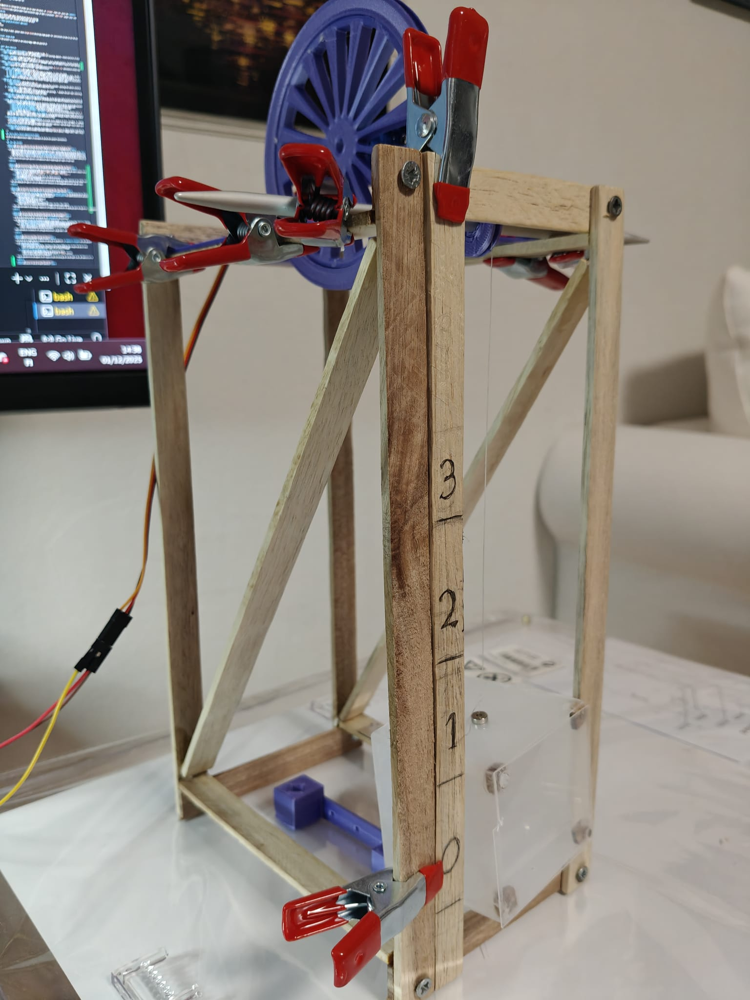
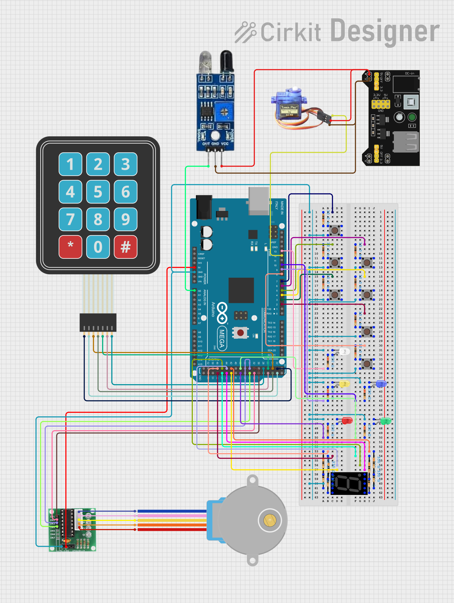
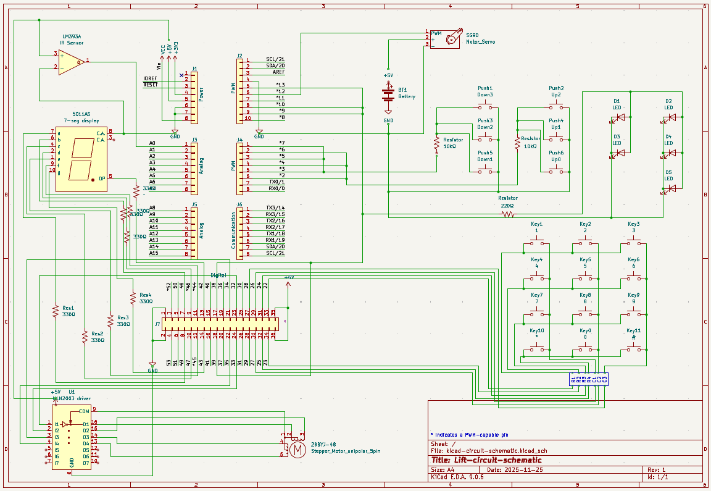
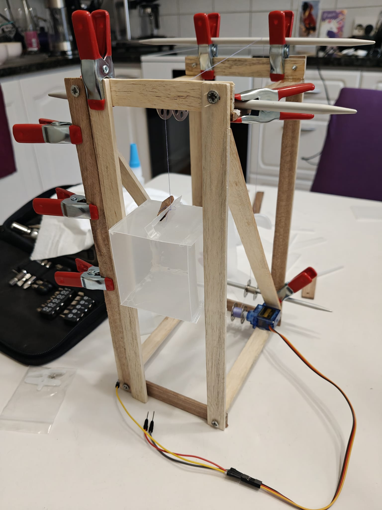
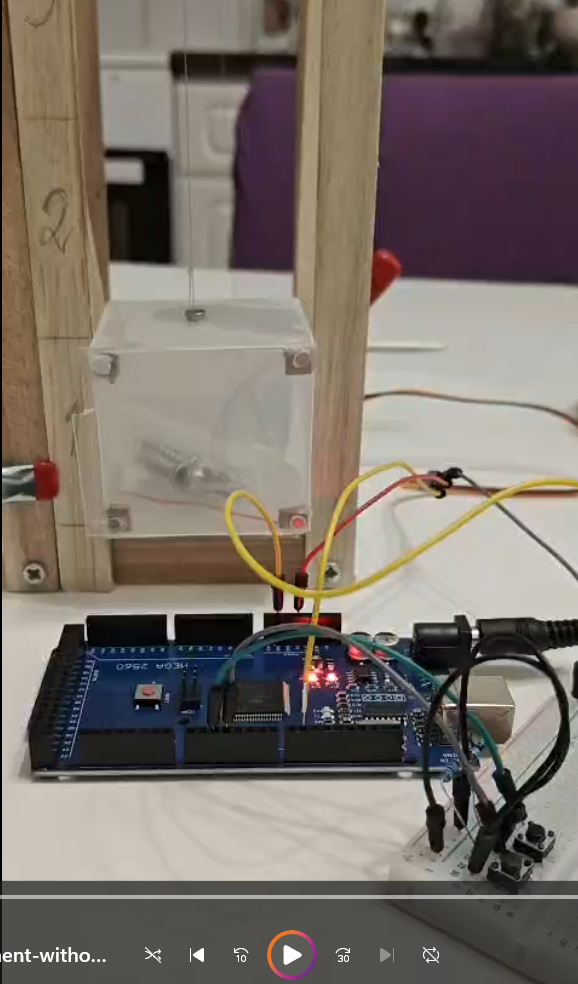
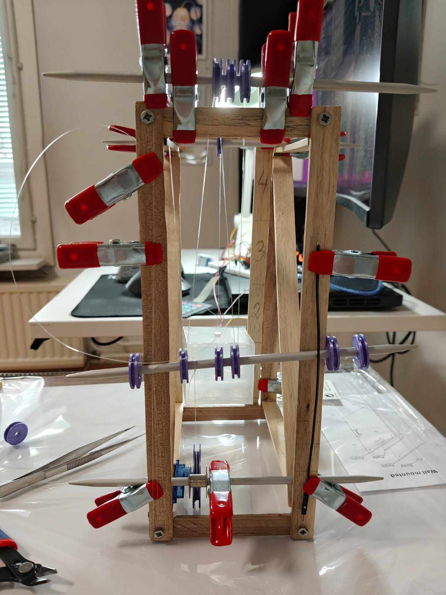
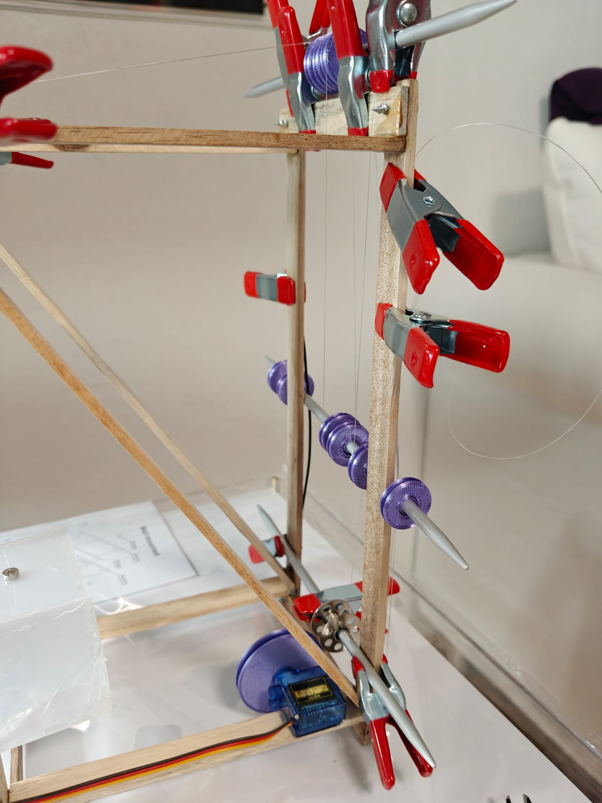
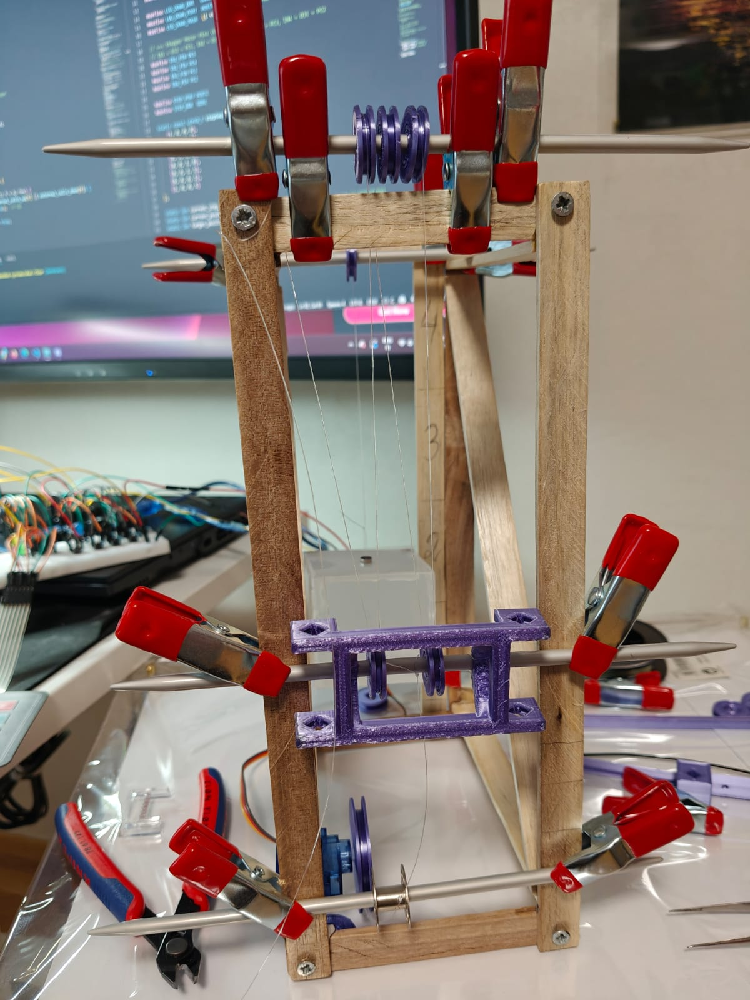
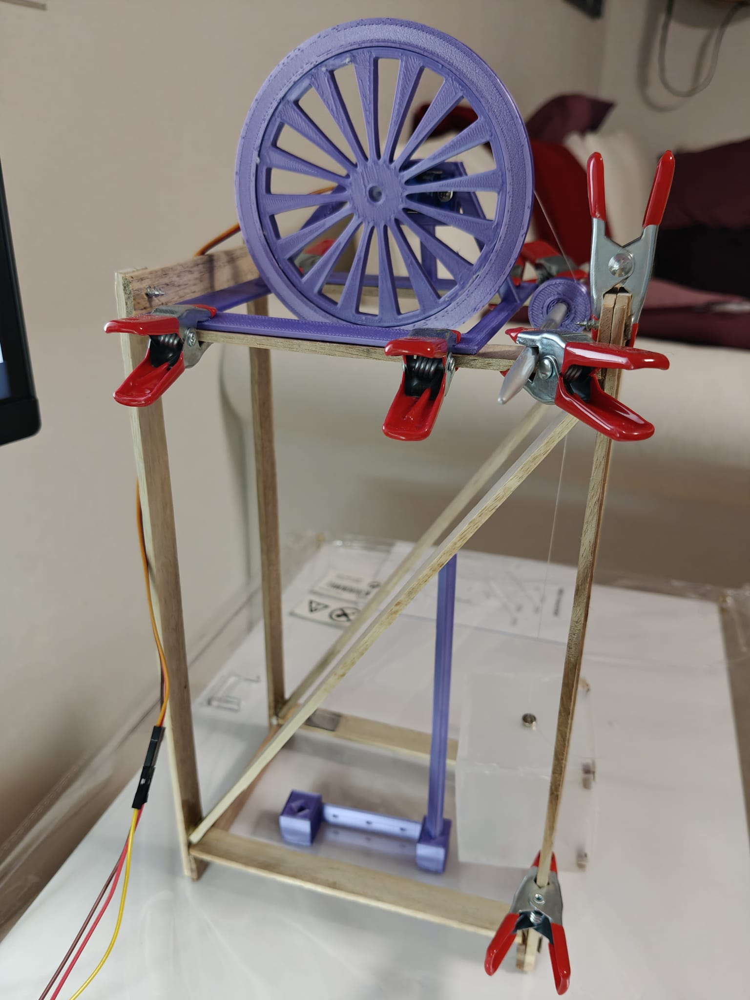
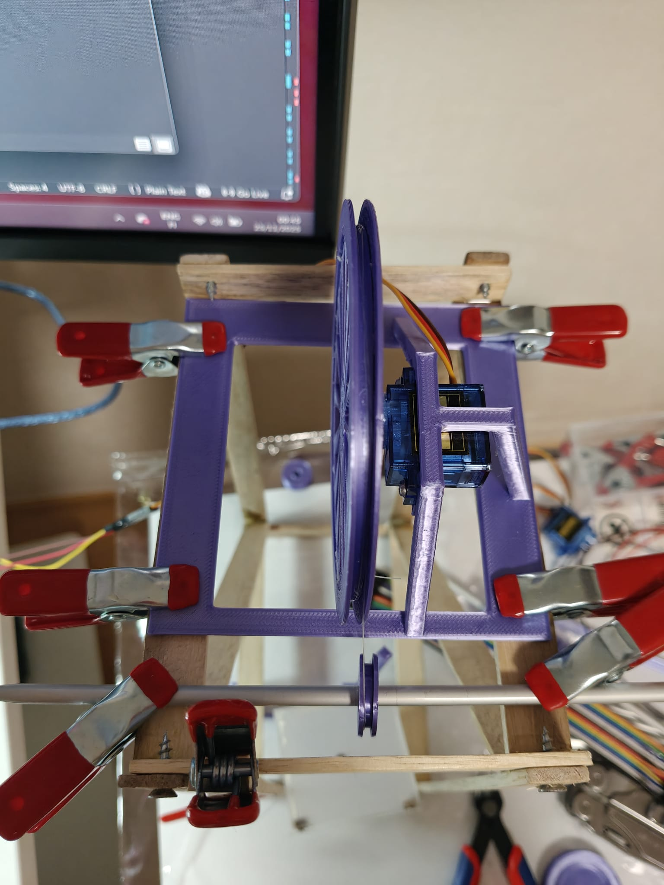

# ⬆️ Lift Control System (DTCM)

## :earth_africa: Overview

**Lift** is a fully functional scale model of a 4-floor lift system, controlled by a custom **Destination and Travel Control Module (DTCM)**. 

This project is engineered entirely in **pure C** on an **Arduino Mega 2560** microcontroller **ATmega2560**. The goal of the project is to mimic a real-world embedded control system: no Arduino libraries, just direct AVR register manipulation using `avr-gcc` and `avrdude`, ensuring precise timing and low-level hardware control without the overhead of the Arduino framework. The system implements industry-standard logic, including **directional priority scheduling** (*collective control*), allowing it to intelligently queue and sort requests from both inside the cabin and external landing buttons.

### Key Features

- **Smart Routing:** Optimizes travel by servicing requests in the current direction before reversing
- **Smooth Motion:** Custom servo acceleration/deceleration profiles for realistic movement
- **Real-time Feedback:** Features a stepper-motor floor dial, 7-segment display, and directional LEDs
- **Safety First:** Includes a mocked door safety loop with an **IR obstacle sensor**, emergency homing on power-up, and strict state machine locking
- **Advanced Modes:** Includes Fire (Emergency), VIP (Priority), and Demo modes

### :hammer_and_wrench: Physical Construction

The hardware is not just simulated on a breadboard but integrated into a custom-built physical tower:
- **Frame:** Hand-assembled wooden structural framework
- **Drive System:** A **custom 3D-printed pulley wheel** specifically designed to mount onto the SG90 servo, mechanically amplifying the servo's 180° range to cover the full hoistway height
- **Cabin:** A lightweight plastic cabin suspended by **fishing line**, utilizing a **magnetic coupling system** (internal and roof magnets) for easy detachment and smooth travel
<br>


---

## :book: Table of Contents 
- [Overview](#earth_africa-overview)
- [Technologies Used](#wrench-technologies-used)
- [System Architecture](#factory-system-architecture)
- [Setup Instructions](#jigsaw-setup-instructions)
- [Usage Guide](#rocket-usage-guide)
- [Bonus Features](#gift-bonus-features)
- [Project Demonstration Videos](#movie_camera-project-demonstration-videos)
- [Key Concepts](#key-key-concepts)
- [Author](#female_detective-author)

---

## :wrench: Technologies Used 

This project is engineered in **pure C** to run on bare-metal AVR hardware. No Arduino libraries (like `digitalWrite` or `Servo.h`) were used in the main firmware; all drivers were written from scratch using **direct register manipulation** for maximum performance and predictability.

### Toolchain

- **`avr-gcc`**: The cross-compiler used to build the C source files into machine code (`.hex` binary)
- **`avr-libc`**: Provides the standard C library for AVR, including `<avr/io.h>` for register definitions, `<util/delay.h>`, and `<avr/eeprom.h>` for non-volatile storage
- **`avrdude`**: The command-line utility for flashing the final `.hex` firmware onto the ATmega2560 via the bootloader
- **`make`**: Automates the build process, managing dependencies and compiler flags via a custom `Makefile`

### Development Environment

- **VS Code**: Primary editor for source code management
- **MSYS2 (MinGW64)**: Provides a Unix-like shell environment on Windows 11, enabling the use of standard GNU tools like `make` and `rm`
- **Git & Gitea**: Version control and repository hosting
- **Arduino IDE**: Used *only* for hardware validation sketches (`bonus_scripts/`) to test individual components before integration

### Documentation & Design

- **KiCad**: Used for an electrical schematic
- **Cirkit Designer**: Used for a pictorial wiring diagram

---

## :factory: System Architecture

The firmware uses a **layered modular architecture**. High-level modules handle decision-making and state management, while low-level drivers handle specific hardware registers. This separation of concerns makes the code easier to test, debug, and maintain.

### 1. Core Application Modules

| Module                | Responsibility |
| :---                  | :--- |
| **`lift.c`**          | **The Controller.** Implements the central Finite State Machine (FSM) and the directional priority scheduling algorithm. It coordinates all other modules to execute floor requests. |
| **`safety.c`**        | **Safety & Homing.** Manages the critical "Fail-Safe" logic. It monitors the door loop, locks movement during emergencies, and executes the Return-to-Home sequence on power-up to calibrate the system. |
| **`servo_control.c`** | **Physics Engine.** Calculates smooth acceleration/deceleration profiles and trajectory. It determines the required pulse width and delegates the actual register updates to `timers.c`. |
| **`bonus.c`**         | **Feature Management.** Handles logic for special operating modes (Fire, VIP, Demo) and generates the blink patterns for the Smart Status LED. |

### 2. Hardware Drivers (HAL)

| Module            | Responsibility |
| :---              | :--- |
| **`timers.c`**    | **PWM Generation.** Configures **Timer1** registers (`TCCR1A/B`, `ICR1`) to generate the precise 50Hz PWM signal required for the servo. |
| **`display.c`**   | **Stepper & LEDs.** Drivers for the ULN2003 stepper motor (floor indicator) and the directional LEDs. Maintains synchronization between the mechanical dial and the servo. |
| **`adc.c`**       | **Analog Input.** Configures the ADC registers to read the IR Obstacle Sensor (`A0`), converting voltage levels to digital obstruction signals. |
| **`keypad.c`**    | **Matrix Input.** Scans the 4x3 keypad by manipulating row/column ports to detect internal floor requests and bonus mode toggles. |
| **`buttons.c`**   | **Digital Input.** Handles the external landing buttons, including input pull-up configuration and edge-detection logic. |
| **`seven_seg.c`** | **GPIO Output.** Direct port manipulation (`PORTL`) to drive the 7-segment display for floor and mode feedback. |

### Logic Flow (The Game Loop)

The system runs on a **tick-based architecture** (~10ms cycle) defined in `main.c`. This non-blocking design allows the system to simultaneously:
1.  **Poll Inputs:** Scan the matrix keypad and debounce external buttons
2.  **Update Physics:** Advance the servo and stepper motor by small increments
3.  **Check Safety:** Monitor the IR Obstacle Sensor and Door Timer
4.  **Process Logic:** Execute the Lift State Machine to decide the next action

### Finite State Machine (FSM)

 The system transitions between five distinct states to ensure safe operation:
- `LIFT_IDLE`: Stationary, waiting for requests
- `LIFT_MOVING_UP` / `LIFT_MOVING_DOWN`: In transit; servicing calls in the current direction
- `LIFT_DOORS_OPEN`: Holding at a floor (timer-based). Movement is mechanically interlocked
- `LIFT_EMERGENCY`: Locked state (Fire Mode). Forces return to Floor 0 and refuses all input until reset

---

## :jigsaw: Setup Instructions

To run this project, you will:

1. Assemble the hardware components
2. Build the circuit on a breadboard following the schematic
3. Install the required AVR toolchain
4. Compile and flash the firmware to the **Arduino Mega 2560**

---

### Required Hardware

Most of the components used in this project can typically be found in standard Arduino starter kits, although some may need to be acquired separately.

#### Core Components

- **Microcontroller:** Arduino Mega 2560 (ATmega2560)
- **Actuators:**
    - 1x SG90 Micro Servo (Lift motor)
    - 1x 28BYJ-48 Stepper Motor + ULN2003 Driver (Floor indicator)
- **Inputs:**
    - 1x 4x3 Matrix Keypad (Internal controls)
    - 7x Tactile Pushbuttons (External floor calls + Test button) with 7 x 10kΩ resistors
    - 1x LM393 IR Reflection Sensor (2-30cm) (Door safety obstacle detection)
- **Displays & Indicators:**
    - 1x Single Digit 7-Segment Display (5011AS Common-Cathode) with 8 x 330Ω resistors
    - 5x LEDs (Blue, Yellow, Green, Red, White) with 5 x 220Ω resistors
- **Power:**
    - 1x MB102 Breadboard Power Supply (Recommended for Servo/Stepper stability)
    - Jumper wires and Breadboards

---

### Wiring & Schematics

To replicate this project, follow the wiring diagrams below.

#### 1. Pictorial Diagram

A visual guide using life-like components, ideal for breadboarding.
<br>


#### 2. Electrical Schematic (KiCad)

The formal schematic showing precise connections and pin labels.
<br>


#### 3. Pinout Reference

Refer to these diagrams for the specific pin locations on the Arduino Mega 2560.
- [Arduino Mega 2560 Pinout - View 1](docs/references/arduino-mega2560-full-pinout-1.png)
- [Arduino Mega 2560 Pinout - View 2](docs/references/arduino-mega2560-full-pinout-2.png)

---

### Tool Installation

To compile the "Pure C" code, you need the AVR-GCC compiler and AVRDUDE uploader.

#### Windows (via MSYS2)

1. Install [MSYS2](https://www.msys2.org/)
2. Open the `MSYS2 MinGW64` terminal
3. Install the toolchain:
   ```bash
   pacman -S mingw-w64-x86_64-avr-gcc mingw-w64-x86_64-avr-libc mingw-w64-x86_64-avrdude mingw-w64-x86_64-make
   ```
4. Add make alias (optional):
    ```bash
    echo "alias make='mingw32-make'" >> ~/.bashrc
    source ~/.bashrc
    ```

#### Linux (Debian/Ubuntu)

```bash
sudo apt update
sudo apt install gcc-avr avr-libc avrdude make
```

---

### Compile and Flash

#### 1. Clone the Repository

```bash
git clone https://github.com/HennaVenho/lift.git
cd lift
```

#### 2. Configure `Makefile` (If Needed)

The default `Makefile` is set up for the **Arduino Mega 2560** on Windows (`COM10`).
- Open `Makefile` and check the `PORT` variable.
- On Windows, check Device Manager for your COM port (e.g. `COM3`).
- On Linux/Mac, it will look like `/dev/ttyUSB0` or `/dev/ttyACM0`.

By default the Makefile uses `avrdude` from your PATH. 
- If you prefer to use the Arduino IDE's avrdude on Windows, uncomment the example in the Makefile and adjust the path.

Bonus features are also included in the build by default.
- You can easily comment out any of the features in the Makefile. 

#### 3. Build the Firmware

Compile the source code into a `.hex` file:
```bash
make
```

#### 4. Upload to Arduino

Connect your Arduino Mega via USB and run:
```bash
make flash
```

*Note: The Makefile is configured to prompt you to reset the board. If `avrdude` times out, press the **RESET** button on the Arduino immediately after running the command to enter the bootloader.*

[Here's a screenshot](docs/images/screenshots/successful-flashing.png) of what a successful `make flash` looks like. 

#### 5. Verify

- The White Status LED (D13) should blink twice on startup.
- The Servo will move to the last known floor (or Floor 0).
- The Stepper motor will unwind to calibrate the dial.

#### 6. Clean up Build Artifacts (Optional)

```bash
make clean
```

---

## :rocket: Usage Guide

Once the firmware is flashed and the system is powered on, the DTCM takes control.

### 1. Startup & Calibration (Homing)

Upon resetting or powering up the Arduino Mega, the system enters a mandatory **Safety Homing Mode**:
1.  The White Status LED (D13) blinks twice.
2.  The lift automatically travels to **Floor 0** (if not already there) to calibrate its position.
3.  The Stepper Motor unwinds to align the floor dial.
4.  **Wait for the Green "Door Closed" LED** to light up before pressing buttons.

### 2. Standard Operation

- **Calling the Lift (External):** Press the **UP** or **DOWN** buttons on the breadboard corresponding to your floor.
    - *Note:* The lift uses **Directional Priority**. If the lift is moving UP, it will ignore DOWN calls until it finishes its upward journey.
- **Inside the Cabin (Internal):** Use the **Matrix Keypad (0–3)** to select your destination.
- **Door Safety:**
    - **Green LED ON:** Doors closed. Lift is safe to move.
    - **Red LED ON:** Doors open. Lift is stationary.
    - **IR Sensor:** Waving your hand in front of the sensor while the Red LED is on will reset the timer, keeping the doors open.

### 3. Controls Cheat Sheet

Use the Matrix Keypad to access standard and bonus functions:

| Key         | Function          | Description                                      |
| :---:       | :---              | :---                                             |
| **`0`–`3`** | **Floor Request** | Move to specific floor                           |
| **`*`**     | **Door Open**     | Hold door open (extend timer) or open from idle  |
| **`#`**     | **Door Close**    | Close door immediately (skip timer)              |
| **`6`**     | **Demo Mode**     | Toggles Auto-Cycle (`0` → `3` → `0` loop)        |
| **`7`**     | **VIP Mode**      | Toggles Priority Mode (External buttons ignored) |
| **`8`**     | **All Clear**     | **RESET.** Clears modes, queues, and errors      |
| **`9`**     | **Fire Mode**     | Forces Emergency Return to Floor 0               |

### 4. Understanding the Indicators

The system provides real-time feedback through multiple displays:

| Component             | Indication |
| :---                  | :--- |
| **7-Segment Display** | Shows **Current Floor** when idle, or **Target Floor** when moving. <br> Special Codes: `F` (Fire), `P` (Priority/VIP), `d` (Demo). |
| **Stepper Dial**      | Analog indicator showing the physical position of the cabin between floors. |
| **Blue LED**          | Lift is moving **UP**. |
| **Yellow LED**        | Lift is moving **DOWN**. |
| **White LED (D13)**   | **System Status Heartbeat:** <br> • **OFF:** Normal Operation <br> • **Solid ON:** Obstruction Detected (IR) <br> • **Fast Strobe:** Fire Mode <br> • **Slow Pulse:** VIP Mode <br> • **Double Blink:** Demo Mode |

---

## :gift: Bonus Features

This project exceeds the core requirements by implementing **10 bonus features**, toggled via compile-time flags (`-D FEATURE_...`) in the Makefile.

### 1. Advanced Operating Modes
- **Fire / Emergency Evacuation Mode**
    - **Function:** Immediately cancels all requests, drives directly to Floor 0, and locks doors open. The lift refuses to move until the mode is reset.
    - **Why:** Simulates mandatory building safety codes (Phase 1 Fire Recall).
- **Priority / VIP Mode**
    - **Function:** Ignores all external hall calls; the lift only responds to the internal keypad.
    - **Why:** Simulates "Service Mode" (for movers) or "VIP Mode" often found in hotels.
- **Demo / Auto-Cycle Mode**
    - **Function:** Automatically cycles `0 -> 3 -> 0` continuously without user input.
    - **Why:** Demonstrates the system mechanics and stepper synchronization hands-free.

### 2. All Clear / Reset Modes
- **Function:** Resume normal operation after Fire Mode or VIP Mode, or clear call queue
- **Why:** Resets everything, cancels all requests, and prevents the system from getting stuck in special modes.

### 3. Manual Door Control
- **"Door Close Now" (`#`)**: Bypasses the standard wait timer for efficiency.
- **"Door Open" (`*`)**: Extends the wait timer or re-opens doors from idle, simulating the "Hold Open" button.

### 4. Optical Door Safety
- **Hardware:** IR Reflection Sensor (2-30 cm).
- **Logic:** If an obstacle is detected (Active LOW signal) while the door timer is running, the timer is reset. The lift refuses to close doors until the path is clear.
- **Concept:** Models the "Safety Edge" or Light Curtain found in every modern lift.

### 5. Smart Status Indicator
- **Hardware:** Utilizes the onboard D13 LED (White).
- **Logic:** Since modes like VIP or Fire are internal software states, this LED uses distinct **blink patterns** (Heartbeat, Strobe, Double-Blink) to communicate the exact system state to the technician without needing a serial monitor.

### 6. Seven Segment Display
- **Hardware:** 5011AS Common-Cathode Display.
- **Driver:** Implemented via direct **Port Manipulation** (`PORTL = ...`) for maximum efficiency.
- **Function:** Displays Floor Number, Mode Characters (`F`, `P`, `d`), and updates instantly to show the **Target Floor** when movement begins.

### 7. Arduino IDE Test Sketches
- **Location:** [`bonus_scripts/`](./bonus_scripts/)
- **Purpose:** A suite of isolated C++ sketches to validate individual subsystems (Servo, Stepper, Keypad) before flashing the main C firmware.

--- 

## :movie_camera: Project Demonstration Videos

A set of short demonstration videos is available to verify full project functionality (uploaded unlisted to YouTube):

| Video                                                         | Description |
| :---                                                          | :--- |
| **[1. System Overview (The Tour)](https://youtube.com/shorts/f_hqK4o5zik?feature=share)** | Introduces the project and shows the custom construction and wiring. |
| **[2. Startup & Safety (Homing)](https://youtube.com/shorts/9Lq5lGCGZLk?feature=share)**  | Demonstrates the mandatory Homing Sequence and EEPROM persistence on power-up. |
| **[3. Smooth Movement (Physics)](https://youtube.com/shorts/XRvvoq2PPM0?feature=share)**  | Shows the Physics Engine (acceleration/deceleration) and Stepper synchronization. |
| **[4. The Algorithm (Logic)](https://youtube.com/shorts/mCyrNJ27dug?feature=share)**      | Verifies Directional Priority logic (ignoring wrong-way calls). |
| **[5. Architecture & Interlocks (Stress Test)](https://youtube.com/shorts/mfGTMcd0l9w?feature=share)** | Demonstrates Non-Blocking input and the Door Safety Interlock (IR Sensor). |
| **[6. Bonus Features (Modes)](https://youtu.be/441mZwgbslw)**  | Showcasing Bonuses like Demo, Fire, and VIP Modes, and the Smart Status LED. |

---

## :key: Key Concepts

<details id="how-floor-requests-are-stored-processed-and-prioritized-within-the-dtcm-system">
<summary>How Floor Requests Are Stored, Processed, and Prioritized Within the DTCM System</summary>

- The DTCM (Destination and Travel Control Module) implements a **Collective Control Algorithm**. Requests are stored in **SRAM** (volatile memory) using three boolean arrays:
    - `internal_calls[4]` (Cabin buttons)
    - `external_calls_up[4]` (Hall Up buttons)
    - `external_calls_down[4]` (Hall Down buttons)

- **The Scheduling Logic:**
    1.  **Current Direction:** If moving UP, the scheduler loops through floors *above* the current position.
    2.  **Selective Stopping:** It stops ONLY if there is a matching request:
        - `internal_calls[i]` (Someone inside wants to get off)
        - `external_calls_up[i]` (Someone outside wants to go UP)
        - `external_calls_down[3]` (Special case: Top floor down call is treated as an end-of-line stop)
    3.  **Dynamic Intercepts:** Unlike basic lifts that lock in a destination upon departure, this system scans the request arrays **continuously during movement** (every 10ms). If a passenger presses a button for a floor the lift is currently approaching, the system immediately updates the target to stop there ("Intercept"), preventing the user from having to wait for the return trip.
    4.  **Reversal:** It only reverses direction when there are no more requests ahead in the current direction.
    5.  **Efficiency:** This logic prevents the "piston effect" (e.g. going 0->3->0->2) and ensures the lift services all passengers in one direction before switching.

</details>


</details>


<details id="position-tracking-and-persistence">
<summary>Control: Position Tracking & Persistence (EEPROM)</summary>

- Since standard hobby servos do not provide position feedback (Open Loop control), the "DTCM" must maintain a strict internal model of the lift's location.

- **1. Distinct Positions (PWM Mapping)**
    - The four floors are mapped to precise timer values in `servo_control.c`:
        - **Floor 0:** 544 µs (0°)
        - **Floor 1:** 1162 µs (60°)
        - **Floor 2:** 1781 µs (120°)
        - **Floor 3:** 2400 µs (180°)
    - By writing these values to the **Timer1 Output Compare Register (`OCR1B`)**, the system guarantees the lift reaches four physically distinguishable heights.

- **2. "Known at All Times" (Persistence)**
    - To satisfy the requirement that position is known even after power loss, I utilized the ATmega2560's **EEPROM**:
        - **Write:** Whenever the lift arrives at a floor, `eeprom_update_byte()` saves the floor index.
        - **Read:** On startup, `lift_init()` reads this byte.
        - **Result:** The system initializes its internal state *and* the servo PWM signal to match the last known physical location. This prevents the servo from violently "snapping" to a default zero position on boot, ensuring safety and mechanical stability.

</details>


<details id="servo-physics-engine-and-smooth-movement">
<summary>Control: Servo Physics Engine & Smooth Movement</summary>

- To satisfy the requirements for **controlled directional movement** and **smooth acceleration**, I implemented a custom motion controller in `servo_control.c`.

- **1. Directional Control**
    - The system compares `current_pwm_us` vs `target_pwm_us`.
        - If `current < target`, it increments the pulse (Moves UP).
        - If `current > target`, it decrements the pulse (Moves DOWN).
    - This ensures the lift physically travels through all intermediate points rather than snapping to the destination.

- **2. Trapezoidal Velocity Profile (Smoothness)**
    - To simulate inertia and prevent mechanical jerking, the speed of the servo updates dynamically every 10ms tick:
        - **Cruise Phase:** When far from the target (`> RAMP_DIST`), the servo moves at `SPEED_MAX` (Cruise Speed, 24µs/tick).
        - **Deceleration Phase:** As the lift enters the braking zone (within 200µs of target), the speed is linearly reduced to `SPEED_MIN` (8µs/tick).
        - **Micro-Stepping:** The pulse width is updated in small increments (e.g. +8µs to +24µs per tick) rather than one large jump.

- **Formula used:**
    ```c
    current_speed = SPEED_MIN + ((dist * (SPEED_MAX - SPEED_MIN)) / RAMP_DIST);
    ```
    - This results in a realistic "Ease-Out" motion profile that protects the mechanical pulley system.

</details>


<details id="input-handling-internal-and-external-requests">
<summary>Input Handling: Internal & External Requests</summary>

- The system handles two distinct types of user input, both processed within the 10ms "Game Loop" to ensure responsiveness.

- **1. Internal Requests (Cabin Panel)**
    - **Hardware:** A 4x3 Matrix Keypad simulating the buttons inside the lift.
    - **Driver (`keypad.c`):** The `keypad_scan()` function drives rows LOW one by one and reads columns to detect pressed keys. It uses edge detection (`previous_keys[]`) so holding a button doesn't trigger multiple requests.
    - **Routing:** Valid key presses call `request_internal_floor(floor)`, which sets a flag in the `internal_calls[]` array. These requests are "Direction Agnostic" — if the floor is ahead, the lift stops; if behind, it queues the stop for the return trip.

- **2. External Requests (Hall Buttons)**
    - **Hardware:** 6 individual tactile pushbuttons representing UP/DOWN calls at each floor.
    - **Driver (`buttons.c`):** These inputs are read directly using bitmasks (e.g. `PINE & (1 << PE4)`).
    - **Routing:** Presses call `request_external_floor(floor, direction)`. Unlike internal calls, these are sorted into specific arrays: `external_calls_up[]` or `external_calls_down[]`.
    - **Directional Logic:** This allows the "Smart Routing" algorithm to ignore a DOWN call while the lift is travelling UP, storing it safely until the lift reverses direction.

</details>


<details id="non-blocking-architecture-concurrency">
<summary>Architecture: Non-Blocking I/O & Concurrency</summary>

- To satisfy the requirement that "The system can accept new requests while the lift is moving," I avoided blocking functions like `delay()` inside the movement logic.

- **The "Game Loop" Approach:**
    - The system utilizes a central loop in `main.c` that ticks at **100Hz (10ms intervals)**.
        1.  **Input Polling:** In every tick, the system scans the matrix keypad and external buttons. If a button is pressed, the request is immediately added to the queue arrays in SRAM.
        2.  **Incremental Movement:** The servo driver (`servo_control.c`) does not contain a `for` loop to complete a movement. Instead, it advances the pulse width by a tiny increment (e.g. +20µs) and returns control to `main`.

- **Result:**
    - The microcontroller essentially "multitasks." It can detect a button press at *t=500ms* even while the lift is in the middle of traveling between Floor 1 and Floor 2.

</details>


<details id="stepper-motor-display-synchronization">
<summary>Output: Stepper Motor Display Synchronization & Half-Stepping</summary>

- To satisfy the requirement for a "fluid" floor indicator that points "between floors," I implemented a real-time synchronization system between the Servo (Actuator) and the Stepper (Display).

- **1. The Coupling Strategy**
    - Instead of sending a separate "Go to Floor 2" command to the stepper, the system treats the stepper as a **slave** to the servo's position.
        - Every 10ms tick, `lift.c` reads the current Servo Pulse Width (e.g. `1162µs`).
        - It maps this value linearly to the Stepper's range (`0–2100 steps`) using the formula:
        $$TargetSteps = \frac{(CurrentPWM - ServoMinPWM) \times TotalSteps}{TotalServoPWM}$$
        - This guarantees the dial always reflects the *actual* physical location of the cabin, including acceleration and deceleration.

- **2. Fluidity via Half-Stepping**
    - To make the movement smooth, I utilized an **8-step Half-Stepping sequence** in `display.c`.
        - **Full-Step:** Energizes 1 coil at a time (Jerky, 2048 steps/rev).
        - **Half-Step:** Alternates between 1 and 2 coils (Smooth, 4096 steps/rev).
    - This doubles the resolution, allowing the needle to sweep gracefully across the dial without visible "ticking."

</details>


<details id="visual-feedback-directional-indicators">
<summary>Output: Directional Indicators (LEDs)</summary>

- To provide clear user feedback on the lift's status, I implemented directional indicators using direct port manipulation.

- **1. State-Driven Logic**
    - The LEDs are not toggled manually by button presses. Instead, they are bound to the **Lift State Machine** in `lift.c`.
        - `LIFT_MOVING_UP` -> Triggers Blue LED.
        - `LIFT_MOVING_DOWN` -> Triggers Yellow LED.
        - `LIFT_IDLE` / `DOORS_OPEN` -> Extinguishes both.

- **2. Hardware Driver**
    - In `display.c`, `led_display_set_direction()` manages the specific bits (`PB4` for Up, `PH6` for Down). This abstraction ensures that if the pin mapping changes, the core logic remains untouched.

</details>


<details id="startup-calibration-homing">
<summary>Safety: Startup Calibration (Homing)</summary>

- To satisfy the requirement for a "Return-Home function triggered on power-up," I implemented a blocking calibration routine in `safety.c`.

- **The Boot Sequence:**
    1.  **Initialization:** `lift_init()` restores the last known floor from EEPROM so the servo logic matches the physical reality.
    2.  **Homing:** Before entering the main control loop, `main()` calls `safety_run_homing_sequence()`.
    3.  **Execution:** This function overrides all inputs and commands the lift to **Floor 0**.
        ```c
        void safety_run_homing_sequence(void) {
            lift_move_to_floor(0);
            while (lift_movement_pending) {
                lift_tick_logic(); // Animate movement
                _delay_ms(10);
            }
        }
        ```
- **Why this matters:** This ensures the lift always starts in a deterministic state (Ground Floor, Doors Closed, Stepper Zeroed) regardless of how it was powered down, preventing logical drifts over time.

</details>


<details id="door-interlock-constraint">
<summary>Safety: Door Interlock Architecture</summary>

- To satisfy the requirement that "The lift cannot move unless the 'doors closed' indicator is active," I implemented a centralized safety check in `safety.c` that acts as a gatekeeper for all motion.

- **1. The "Safe" Flag**
    - The system maintains a private boolean `doors_are_closed`.
        - **False (Red LED):** Doors are open, opening, or the system is in Emergency mode.
        - **True (Green LED):** Doors are fully closed and locked.

- **2. The Gatekeeper**
    - Every request to move the servo must pass through `lift_move_to_floor()`. The very first line of this function checks the safety flag:
        ```c
        if (!safety_check_doors_closed()) return;
        ```
    - This ensures that no matter what the scheduler requests, the physical layer will strictly refuse to power the servo if the safety constraints are not met.

</details>


<details id="how-microcontroller-registers-were-configured-and-used-to-manage-io-and-timers">
<summary>Hardware: Register Configuration (I/O & Timers)</summary>

- I bypassed Arduino abstractions to control the AVR hardware directly using memory-mapped registers:

- **1. General Purpose I/O (GPIO)**
    - **Direction:** Used `DDRx` registers (e.g. `DDRE`) to define pins as Input (0) or Output (1).
    - **Configuration:** Used `PORTx` registers to enable internal pull-up resistors for inputs (`PORTE |= MASK`).
    - **Output:** Wrote directly to `PORTx` (e.g. `PORTL = value`) to drive the 7-segment display efficiently.
    - **Input:** Read from `PINx` registers using bitmasks to detect button states.

- **2. Timer Registers**
    - **Control:** Configured `TCCR1A` and `TCCR1B` to set Waveform Generation Mode (Fast PWM) and Clock Prescalers.
    - **Timing:** Set `ICR1` to define the PWM frequency (50Hz) and wrote to `OCR1B` to set the duty cycle (servo position).

</details>


<details id="use-of-timers-or-interrupt-routines-in-coordinating-lift-logic-and-io">
<summary>Timing: Hardware PWM vs. Logic Coordination</summary>

- The system uses two distinct timing strategies to coordinate high-speed signals and high-level logic:

- **1. Hardware Timer (Signal Generation)**
    - **Role:** Generates the precise PWM signal for the SG90 Servo.
    - **Mechanism:** The ATmega2560's **Timer1** runs in the background. Once configured in `timers.c`, it toggles Pin 12 (PB6) automatically without CPU intervention. This ensures the servo signal is jitter-free even if the main code is busy.

- **2. Software Timer (Logic Coordination)**
    - **Role:** Coordinates the Finite State Machine, ramping physics, and button debouncing.
    - **Mechanism:** A **10ms Tick** strategy in `main.c`.
        - The main loop executes one cycle of logic and then waits (`_delay_ms(10)`).
        - This creates a deterministic time base: 100 ticks = 1 second.
        - **Why:** This avoids the complexity and race conditions of Interrupt Service Routines (ISRs) while keeping the system responsive enough for human interaction.

</details>


<details id="how-to-find-and-use-the-datasheet-and-pinout-for-atmega2560">
<summary>Documentation: Using Datasheets & Pin Mapping</summary>

- Developing in pure C requires translating physical board labels into chip-level register operations. I used two primary resources:

- **1. The Pinout Diagram (The Map)**
    - First, I used the pinout to translate the Arduino PCB labels into ATmega2560 Port/Bit coordinates.
        - **Resource:** [Arduino Mega 2560 Rev3 Pinout](https://docs.arduino.cc/resources/pinouts/A000067-full-pinout.pdf)
        - **Usage:**
            - I needed to connect the Servo to a PWM-capable pin.
            - Looking at the diagram, **"Digital Pin 12"** is mapped to **"PB6"**.
            - The label **"OC1B"** on that pin indicated it is the output for **Timer1, Channel B**.

- **2. The Datasheet (The Manual)**
    - Once I knew the pin was `PB6` / `OC1B`, I used the datasheet to determine *how* to control it.
        - **Resource:** [ATmega2560 Datasheet (Microchip)](https://ww1.microchip.com/downloads/aemDocuments/documents/OTH/ProductDocuments/DataSheets/ATmega640-1280-1281-2560-2561-Datasheet-DS40002211A.pdf)
        - **Usage:**
            - **I/O Configuration:** Checked the *I/O-Ports* chapter to understand `DDRB` (Direction) and `PORTB` (Output/Pull-up).
            - **Timer Setup:** Checked the *16-bit Timer/Counter1* chapter. I found the `TCCR1A` register definition to locate the `COM1B1` bit, which connects the internal timer to the physical pin `PB6`.

- **Result:**
    - This workflow allowed me to write:
        ```c
        DDRB |= (1 << PB6); // Set direction
        TCCR1A |= (1 << COM1B1); // Connect Timer1 to Pin
        ```
    - Without this mapping, it would be impossible to configure the correct registers.

</details>


<details id="debounce-strategy-used-for-button-inputs">
<summary>Reliability: Button Debouncing Strategy</summary>

- Mechanical switches vibrate ("bounce") for several milliseconds when pressed, which can generate false multiple signals. To ensure reliability, I implemented a **Software State Machine Debounce** across all inputs.

- **1. The Sampling Filter**
    - Since mechanical bounce typically settles within 5ms, the system's **10ms Game Loop** acts as a natural low-pass filter. By sampling inputs only once per loop cycle, high-frequency contact noise is automatically ignored.

- **2. Edge Detection (State Memory)**
    - Both `buttons.c` (external) and `keypad.c` (internal) utilize `static` arrays to store the history of every switch.
        - **Logic:** `if (current == PRESSED && previous == RELEASED)`
        - **Result:** This creates a **Rising Edge Trigger**. The system registers an event only at the exact moment of activation. Holding a button down does not re-trigger the request, protecting the queue from duplicate commands.

</details>


<details id="engineering-prcess-and-the-evolution-of-the-drive-wheel-mechanism">
<summary>Engineering Process: Evolution of the Drive Wheel Mechanism</summary>

- To achieve the required 4-floor travel distance, as well as smooth lift movement, using a standard 180° hobby servo, I iterated through several mechanical designs.

- **Prototype V1: Direct Drive (Small Radius)**
    - **Design:** The cabin was suspended by thread running through simple bobbins, driven directly by the servo horn.
    - **Failure Mode:** Insufficient travel. As seen in the clip below, 180° of rotation provided less than 2cm of vertical travel.
    <br>
    
    <br>
    <a href="docs/videos/2-lift-video-first-version-movement-without-pulleys.mp4">
    
    </a>

- **Prototype V2: Compound Pulley System**
    - **Design:** I attempted to multiply the travel distance using a complex block-and-tackle system made from 3D-printed wheels and knitting needles. The servo moved a central carriage, which pulled the lift line through multiple redirection points.
    - **Failure Mode:** Excessive friction and mechanical loss. The resistance was so high that the servo stalled and eventually geared out (broke). The system was too complex to maintain tension.
    <br>
    
    

- **Prototype V3: Stabilized Carriage**
    - **Design:** Added a cradle to stabilize the central knitting needle mechanism to reduce friction.
    - **Failure Mode:** While more stable, the movement remained inconsistent ("rattling") due to the non-linear forces in the fishing line.
    <br>
    

- **Final Version: Large Radius Direct Drive**
    - **Design:** I realized the simplest solution was to increase the drive radius. A large custom wheel that mounts around the servo was designed and 3D-printed.
    - **Success:** This increased the arc length per degree of rotation, allowing the cabin to cover the full hoistway within the servo's natural 180° range without the friction of pulleys.
    <br>
    
    

</details>

---

## :female_detective: Author
Henna Venho
