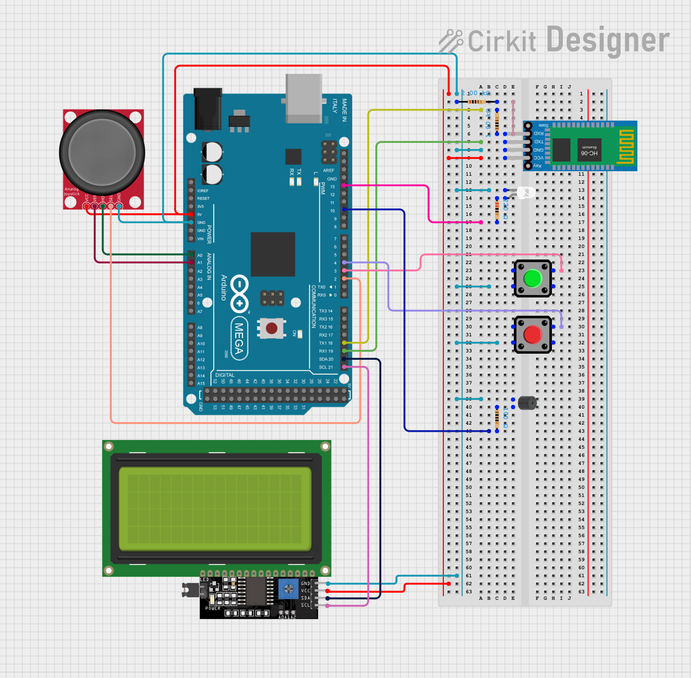
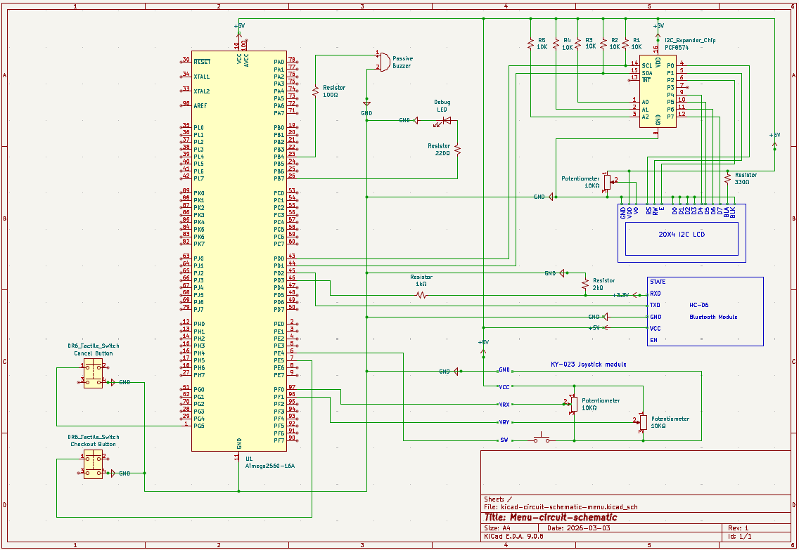

# 🧁 Menu: Bluetooth-Powered Ordering System

## :earth_africa: Overview

**Menu** is a full-stack embedded solution featuring two-way communication between a wireless customer terminal and a desktop kitchen management interface. Developed as a high-performance alternative to traditional table service, the system enables real-time order processing and remote menu management using **Bluetooth Classic**.

The project is engineered with a focus on **bare-metal AVR firmware** (C) running on **Arduino ATmega2560 microcontroller**, and a responsive **event-driven GUI** (Python/Tkinter), with background serial I/O (pyserial), ensuring a seamless bridge between low-level hardware and high-level software.

### Technical Highlights

- **Bare-Metal Firmware:** Written in **Pure C**, the firmware utilises direct register manipulation for UART, I2C, and ADC peripherals to ensure predictable, real-time performance.
- **Two-Way Synchronisation:** Real-time synchronisation allows kitchen staff to update prices, add items, or modify categories, with changes reflected immediately on the customer LCD (or via a brief SYNC lock screen during bulk operations).
- **Data Integrity & Persistence:** Implements an **EEPROM-backed resend queue** for orders. Orders are persisted on the terminal until the shop GUI confirms receipt with `RECV:OK`, preventing order loss during disconnects or power cycles. Orders are stored in a compact fixed-size format to fit EEPROM limits (see [Fail-Safe Handshake](#8-fail-safe-handshake) below).
- **Advanced UX/UI:**
    - **Customer:** Category-based browsing, user-friendly notifications, automated word-wrapping for long item names, and custom syllables splitting (tilde-handling) for the 20x4 LCD.
    - **Staff:** A multi-threaded Python GUI with support for **Order Status Management** (Received, Accepted, Completed), as well as **Bulk Price Adjustments**, **Menu Backups**, **Full Menu Upload**, and a persistent **Order History** stored in JSON.
- **Bonus "Rickroll" Discount Logic:** A sophisticated easter egg that detects discounted orders (≥€100), applies a -10% calculation, and triggers a specialised Rickroll buzzer melody when the kitchen marks the order as ready (`RDY`), instead of the usual fanfare.

### The Architecture in Action

The system transforms the café experience into a digital workflow: customers navigate a 60-item menu via a physical joystick and buttons on the **ATmega2560** device, while kitchen staff oversee the entire operation from a central dashboard, managing everything from item availability to customer notifications.

See [Project Demonstration Videos](#movie_camera-project-demonstration-videos) for links to view the demo videos for this project.

---

## :book: Table of Contents 
- [Overview](#earth_africa-overview)
- [Technologies Used](#wrench-technologies-used)
- [System Architecture](#factory-system-architecture)
- [Setup Instructions](#jigsaw-setup-instructions)
- [Usage Guide](#rocket-usage-guide)
- [Bonus Features](#gift-bonus-features)
- [Project Demonstration Videos](#movie_camera-project-demonstration-videos)
- [Key Concepts](#key-key-concepts)
- [Author](#female_detective-author)

---

## :wrench: Technologies Used 

This project is engineered in **pure C** to run on bare-metal AVR hardware. No Arduino-specific libraries or high-level abstractions (like `digitalWrite`) are used in the firmware; all drivers were written from scratch using **direct register manipulation** to ensure cycle-accurate timing and optimised resource management.

### Toolchain

- **`avr-gcc`**: Cross-compiler that builds the C source files into AVR machine code (`.elf` and `.hex` artifacts)
- **`avr-libc`**: AVR-specific C standard library, providing:
    - `<avr/io.h>` for direct access to MCU-specific registers and bit definitions  
    - `<avr/eeprom.h>` for accessing on-chip EEPROM for persistent storage of menu items and the order fail-safe queue
    - `<avr/interrupt.h>` for defining Interrupt Service Routines (`ISR()`) used by **USART1 RX** (Bluetooth receive buffering)
    - `<util/delay.h>` for cycle-accurate software delays required by the LCD initialisation and buzzer timing
    - `<util/setbaud.h>` to compute **USART baud rate register values** (UBRRx) at compile time from `F_CPU` and the configured **UART baud rate**
- **`avrdude`**: Command-line utility for flashing the final `.hex` firmware to the ATmega2560 via the Arduino bootloader using the `wiring` protocol
- **`make`**: Automates the compilation and linking process via a custom `Makefile`, ensuring efficient builds and dependency tracking

### On-Chip Peripherals & Hardware Interfacing

All peripherals are driven via a custom low-level driver layer:

- **USART0 (USB Debug):** TX-only output for diagnostics (`printf` redirected via `stdout`)
- **USART1 (Bluetooth Classic / HC-06):** Bidirectional serial link. RX is interrupt-driven into a ring buffer to avoid data loss while the main loop is busy; TX is blocking/polling (short bursts only)
- **I2C (TWI):** A custom-written **Two-Wire Interface** driver providing start/stop/write primitives to communicate with the 20x4 LCD via a PCF8574 I/O expander
- **ADC (Analog-to-Digital Converter):** Reads the analog VRx/VRy signals from the joystick to enable 4-way menu navigation
- **GPIO & Timers:** Direct port manipulation for the passive buzzer (PWM-like sound generation), joystick button, and secondary action/cancel buttons

### Python Shop Interface

The kitchen management software is a multi-threaded desktop application built with:

- **Python 3:** The core language used for business logic and order parsing
- **`tkinter` & `ttk`:** For the themed, multi-tabbed Graphical User Interface
- **`pyserial`:** Handles the serial stream between the PC and the Bluetooth-connected Arduino
- **Standard Library Modules:**
    - **`threading`:** Prevents GUI freezing by handling serial I/O in a background thread
    - **`multiprocessing`:** Used to safely probe Bluetooth/serial ports with a timeout (prevents Tkinter from freezing if a COM port blocks on open)
    - **`json`:** Manages data persistence for order history and user theme preferences
    - **`os` & `sys`:** For path management across the project structure and clean application shutdown
    - **`datetime`:** Provides precise timestamps for incoming and completed orders

### Development & Design

- **Visual Studio Code:** Primary IDE for C and Python development
- **MSYS2 (MinGW64):** Provides the GNU toolchain environment on Windows
- **KiCad:** Used for the formal electrical schematic design
- **Cirkit Designer:** Used for the pictorial breadboard wiring diagram
- **Git & Gitea:** Version control and repository hosting
- **Arduino IDE:** Used *only* for quick hardware validation sketches, found at (`bonus_scripts/`), to test individual sensors and modules before integrating them into the pure-C firmware

---

## :factory: System Architecture

**Menu** is built as a modular, three-layer system designed for reliability and real-time responsiveness:

1. **Hardware Layer** – Physical terminal consisting of an ATmega2560, 20x4 I2C LCD, analog joystick, two buttons, and HC-06 Bluetooth module
2. **Firmware Layer (Pure C)** – Bare-metal drivers and a robust state machine managing the menu database and order queue
3. **Shop Interface (Python)** – A multi-threaded GUI for kitchen staff to receive orders and manage the hardware menu remotely

### High-Level Block Diagram

```text
+-----------------------------------+                 +-----------------------------------+
|       Python Shop GUI (PC)        |   BT Classic    |     ATmega2560 (Firmware)         |
|  - gui.py (Main UI & Logic)       | <-------------> |  - system.c (State Machine)       |
|  - sync_manager.py (Bulk Sync)    |      USART1     |  - protocol.c (Command Parser)    |
|  - comms.py (Background Reader)   |                 |  - menu.c (EEPROM Manager)        |
+-----------------------------------+                 +-----------------------------------+
                                                                |
                                                                | I2C / ADC / GPIO
                                                                v
                                                      +-----------------------------------+
                                                      |      Customer Interface           |
                                                      |  - 20x4 I2C LCD (Menu Display)    |
                                                      |  - KY-023 Joystick (Navigation)   |
                                                      |  - Action/Back Buttons            |
                                                      |  - Passive Buzzer (Audio Cues)    |
                                                      +-----------------------------------+
```

### Firmware Structure (C on ATmega2560)

#### **Core Logic & State Management**

- **`main.c`** – Entry point: Initialises hardware peripherals, enables global interrupts, and runs the main execution loop
- **`system.c` / `system.h`** – Central State Machine: Manages transitions between 7 states (**Welcome**, **Category Select**, **Browse**, **Quantity Select**, **Checkout**, **Confirm Send**, **Confirm Clear**)
- **`ui.c` / `ui.h`** – High-level UI Controller: Logic for drawing specific screens, including category counts, word-wrapping for long names, and SYNC status overlays
- **`cart.c` / `cart.h`** – Shopping cart logic: Calculates totals, manages quantities, and handles the 10% discount math (for totals > €100)

#### **Data Persistence & Communication**

- **`menu.c` / `menu.h`** – EEPROM Database: Stores up to 60 menu items and an EEPROM **ring buffer** for pending orders used by the reliable handshake (fixed-size slots)
- **`protocol.c` / `protocol.h`** – Command Parser: Handles bidirectional commands including `REQ`, `ADD`, `UPD`, `DEL`, `WIPE`, `ACC`, `RDY`, and `ORD:`
- **`uart.c` / `uart.h`** – Serial drivers: **USART0** TX-only for USB debug (`printf` via `stdout`), and **USART1** for Bluetooth (RX interrupt -> ring buffer, TX polling)

#### **Hardware Drivers & Utilities**

- **`lcd.c` / `lcd.h`** – Low-level LCD Driver: Manages I2C-based 4-bit nibble transmission and specialised character printing
- **`i2c.c` / `i2c.h`** – TWI (Two-Wire Interface) / I2C (Inter-Integrated Circuit) Driver: Provides blocking primitives for the I2C bus signaling (START, STOP, Write, Read)
- **`inputs.c` / `inputs.h`** – Interface Driver: Reads analog joystick signals and provides debounced button actions
- **`audio.c` / `audio.h`** – Sound Engine: Frequency-based note generation for the "Order Ready" fanfare and "Rickroll" melody
- **`definitions.h`** – Hardware Blueprint: Centralised configuration for F_CPU, BAUD_RATE, pin mappings, and ADC thresholds

### Shop Interface Structure (Python)

#### **Main Application & GUI**

- **`main.py`** – Entry Point: Initialises the Tkinter root and manages the main application lifecycle and signal handling
- **`gui.py`** – UI Framework: Implements the multi-tabbed interface for order processing, menu management, and real-time status updates
- **`dialogs.py`** – Themed Popups: Custom modal windows for item editing, confirmations, and specialised multi-choice alerts
- **`theme_engine.py`** – Visual Styles: Dynamically applies colour palettes for Light and Dark modes across all Tkinter widgets

#### **Synchronisation & Data**

- **`sync_manager.py`** – Hardware Coordinator: Manages threaded sequences for full hardware refreshes, bulk price adjustments, and menu backups
- **`storage.py`** – Persistence Layer: Manages the lifecycle of `orders_history.json` and user preference settings
- **`comms.py`** – Serial Manager: Encapsulates `pyserial` logic in a background thread for non-blocking hardware communication
- **`config.py`** – Global Configuration: Centralised window settings, protocol command definitions, and theme colour constants
- **`utils.py`** – Shared helpers: Centralises currency formatting and order total calculations

#### **Auxiliary Tools**

- **`tools/format_menu.py`** – Pre-processor: Converts raw `menu.txt` into the formatted `menu_cleaned.txt` required for hardware uploads
- **`tools/upload_menu.py`** – Uploader: Low-level serial logic for pushing formatted menu items to the Arduino EEPROM
- **`tools/wipe_arduino.py`** – Maintenance Script: Standalone console tool to manually clear the Arduino's EEPROM and reset queue pointers

---

## :jigsaw: Setup Instructions

To run this project, you will:

1. Assemble the hardware components
2. Wire the system according to the provided schematics
3. Install the AVR development toolchain (`avr-gcc`, `avrdude`, `make`)
4. Compile and flash the firmware to the **Arduino Mega 2560**
5. Set up a Python virtual environment and install dependencies for the Shop Interface

---

### Required Hardware

The Customer Interface targets the **ATmega2560** and utilises standard modules for navigation and feedback

#### **Core Components**

- **1x Arduino Mega 2560**
- **1x 20x4 I2C LCD Display** (with PCF8574 expander)
- **1x HC-06 Bluetooth Classic Module**
- **1x Analog Joystick (KY-023)**
- **2x Tactile Pushbuttons** - Action and Back buttons
- **1x Passive Buzzer** (piezo buzzer)
- **1x Debug LED** – any colour
- **Resistors**  
    - Voltage divider resistors for HC-06 Bluetooth Classic Module RX pin 3.3 V logic (e.g. 1 kΩ / 2 kΩ)
    - 1× resistor for buzzer (e.g. 100 Ω in series)  
    - 1× resistor for debug LED (e.g. 220 Ω)  
- **Breadboard** and **jumper wires**

---

### Wiring & Schematics

Follow the diagrams in the `docs/circuits/` directory to replicate the build.

#### **1. Pictorial Diagram**

A breadboard-style view for quick assembly:
<br>


#### **2. Electrical Schematic (KiCad)**

A formal schematic showing precise pin-to-pin register mappings:
<br>


#### **3. Pinout Reference**

For exact pin locations on the Arduino Mega 2560, you can refer to:
- [Arduino Mega 2560 Pinout - View 1](docs/references/arduino-mega2560-full-pinout-1.png)
- [Arduino Mega 2560 Pinout - View 2](docs/references/arduino-mega2560-full-pinout-2.png)

---

### Tool Installation

To compile the pure C firmware, you need the AVR-GCC compiler and AVRDUDE uploader.

#### **Windows (via MSYS2 / MinGW64)**

1. Install [MSYS2](https://www.msys2.org/)
2. Open the `MSYS2 MinGW64` terminal
3. Update MSYS2 first (to prevent "package not found" issues):
    ```bash
    pacman -Syu
    ```
    (Then close/reopen terminal if MSYS2 asks.)
4. Install the AVR toolchain:
    ```bash
    pacman -S mingw-w64-x86_64-avr-gcc mingw-w64-x86_64-avr-libc mingw-w64-x86_64-avrdude mingw-w64-x86_64-make
    ```
5. (Optional) Add an alias to use `make` instead of `mingw32-make`:
    ```bash
    echo "alias make='mingw32-make'" >> ~/.bashrc
    source ~/.bashrc
    ```
    Restart terminal. 

#### **Linux (Debian/Ubuntu)**

```bash
sudo apt update
sudo apt install gcc-avr avr-libc avrdude make
```

---

### Compile and Flash the Firmware

#### **1. Clone the Repository**

```bash
git clone https://github.com/HennaVenho/menu.git
cd menu
```

#### **2. Configure `Makefile` (if needed)**

The default `Makefile` is set up for:
- **MCU**: `atmega2560`
- **Programmer**: `wiring` (Arduino bootloader)
- **PORT**: `COM10` (Windows example)
    - Linux: usually `/dev/ttyACM0` (Arduino USB serial) or `/dev/ttyUSB0`

#### **3. Build the Firmware**

Compile the source code into an `.elf` and `.hex` file:
```bash
make
```
This automates the build process:
- Compiles `src/*.c` files into object files in the `build/` directory
- Links objects into `menu.elf`
- Generates `menu.hex` for the uploader

#### **4. Upload to Arduino**

Connect the Mega 2560 via USB and run:
```bash
make flash
```

The `flash` target will:
- Ask you to **reset the board** to enter the bootloader
- Call `avrdude` to write `menu.hex` to the ATmega2560

#### Troubleshooting
If `avrdude` times out, press the **RESET** button on the Mega immediately after running `make flash` and retry.

On Linux (Debian/Ubuntu), if `avrdude` fails with permission errors, add your user to the `dialout` group and log out/in.
```bash
sudo usermod -aG dialout $USER
# log out and back in
```

You can see an example of a successful flash in:
[docs/screenshots/successful-flash.png](docs/screenshots/successful-flash.png).

#### **5. Clean up Build Artifacts (Optional)**

```bash
make clean
```
This removes `build/`, `.elf`, and `.hex` files if you want a fresh rebuild.

---

### Python Setup (Shop Interface)

Python 3.12+ is required to run the GUI application in `software/`.

#### **Install Python on Windows**

1. Download the latest Python 3.12+ installer from the official website
2. In the installer:
    - ✅ Check **"Add python.exe to PATH"**
    - Choose **"Customise installation"** and keep the defaults
    - (Optional) ✅ **Install for all users**
3. After installation, open a new **Command Prompt** or **MSYS2 MinGW64** terminal and check:
    ```bash
    python --version
    ```
    You should see something like: `Python 3.12.x`.

If you installed Python while VS Code was open, restart VS Code so the terminal picks up the updated `PATH`.

#### **Python on Linux (Debian/Ubuntu)**

Most modern distributions already include Python 3, but you can ensure it is installed and add the tools needed for virtual environments:
```bash
sudo apt update
sudo apt install python3 python3-venv python3-pip python3-tk
```

Verify the version:
```bash
python3 --version
```

#### **Create Virtual Environment and Install Dependencies**

From the project root:

```bash
# Windows
python -m venv .venv

# Linux
python3 -m venv .venv
```

Activate the virtual environment:

- **Windows (PowerShell / Command Prompt):**
    ```bash
    .venv\Scripts\activate
    ```
- **MSYS2 MinGW64 / bash on Windows:**
    ```bash
    source .venv/Scripts/activate
    ```
- **Linux (bash / zsh):**
    ```bash
    source .venv/bin/activate
    ```

Install required packages:
```bash
pip install -r software/requirements.txt
```

To exit the virtual environment later:
```bash
deactivate
```

---

### Bluetooth Classic Setup (HC-06)

Before running the Shop GUI, pair the HC-06 module with your computer and select the created serial port.

**Windows**

1. Open **Settings -> Bluetooth & devices -> Add device -> Bluetooth**.
2. Select the HC-06 device (often shown as "HC-06").
3. When asked for a PIN, try **1234** (sometimes **0000**).
4. After pairing, find the COM port:
    - **Device Manager -> Ports (COM & LPT)** → look for "Standard Serial over Bluetooth link"
    -  Note the COM number (e.g. `COM6`) and select it in the GUI.

**Linux (Debian/Ubuntu)**

1. Pair the device using your desktop Bluetooth settings (or `bluetoothctl`).
2. Create/bind an RFCOMM serial device (often `/dev/rfcomm0`) *if your distro does not expose one automatically*.
3. Select the serial device in the GUI:
    - Common device names: `/dev/rfcomm0`, `/dev/ttyACM0`, `/dev/ttyUSB0`
4. If you get "permission denied" opening the device, add your user to the `dialout` group and log out/in.

---

## :rocket: Usage Guide

The **Menu** system is designed for two-way interaction between the customer terminal and the kitchen management software. Ensure the hardware is powered on and the Shop Interface is connected before starting operations.

### Customer Interface (Firmware) Usage

The Customer Interface utilises a 20x4 I2C LCD, a 4-way analog joystick with a "Select" click, and two dedicated tactile buttons: **Action/Checkout** and **Back/Cancel**.

#### 1. Welcome & Navigation

The device initialises on a Welcome screen. Press the **Joystick Select button** to open the menu and start browsing menu categories. Throughout the interface, the **Back/Cancel** button returns you to the previous screen.

#### 2. Category Selection

Browse unique menu categories stored in EEPROM using **Joystick Up/Down**. The screen displays the category name and the number of items available within it. Press **Select** to enter or **Back** to exit.
```text
  --- CATEGORIES ---
  > Hot Drinks
    [12 Items]      ^v
  SEL=Open   BACK=Exit
```

#### 3. Browsing Items

Within a category Browse view, use **Joystick Up/Down** to cycle through items. Each screen displays the category header, the item name (with automated word-wrapping), the Item ID, and the unit price.
```text
Hot Drinks: 
The Exhibitor's
Espresso
#1   EUR 2.80     ^v
```

#### 4. Quantity Selection

Click the **Joystick Select button** on any item to set a quantity. Use **Joystick Up/Right** to increase, or **Down/Left** to decrease quantity (0–99). The subtotal updates in real-time. Click **Select** again to save to your cart.
```text
Tropical Instal-
lation Smoothie
     -  03  +
Sub: EUR 15.00
```

#### 5. Checkout & Review

Press the **Action/Checkout Button** at any time to enter the Checkout view to review your order. Here you can scroll through your selected items and see the running total.
```text
2x The Exhibitor's
Espresso
Item: EUR 5.60
Tot: EUR 8.80   ^v
```

- **Reward Logic:** If the raw total reaches **€100.00**, a reward notification appears.
    ```text
       *** REWARD ***
      10% OFF APPLIED!
    ```

- **Discounted View:** The Checkout screen will then display the final price after the **10% discount** has been applied.
    ```text
    99x Tropical Instal-
    lation Smoothie
    Item: EUR 495.00
    -10% EUR 445.50   ^v
    ```

#### 6. Confirming the Order

From the Checkout screen, press the **Action/Checkout Button**. The system will request a final confirmation before initiating the Bluetooth transmission, and giving the LCD user a "Sending Order" notification.
```
    SEND ORDER?

Action: YES (Send)
Cancel: NO (Back)
```

#### 7. Clearing or Editing the Cart

The system allows for both individual item and bulk cart management:
- **Individual Edit:** Navigate to an item in the Checkout view and click **Joystick Select** to change its quantity. Setting an item to **00** pcs removes it from the cart.
- **Bulk Clear:** Press the **Cancel Button** in the Checkout view to wipe the entire cart. A confirmation screen prevents accidental deletions.
    ```text
        CLEAR CART?

    Action: YES (Delete)
    Cancel: NO (Keep)
    ```

#### 8. Fail-Safe Handshake

The firmware implements a **Reliable Handshake** for orders. If the Shop GUI is offline, the Arduino saves each order to a non-volatile **EEPROM ring buffer**, and retries transmission approximately every 5 seconds until it receives a `RECV:OK` acknowledgment.

To fit the limited EEPROM space, queued orders are stored in a compact fixed-size format:

- **15 bytes per queued order**, supporting **up to 7 unique items** per order (ID + quantity pairs + a discount flag)
- **Queue size: 10 slots** (effective capacity **9** because one slot is reserved to distinguish full vs empty in a ring buffer)

---

### Shop/Kitchen Interface (Software) Usage

The Shop Interface is the central menu management hub, providing real-time order processing and non-volatile menu storage control.

#### 1. Starting the Application

With your virtual environment active and the Arduino powered on (and connected via USB for debug prints), run the application from the project root:
```bash
python software/main.py      # On Windows
python3 software/main.py     # On Linux
```

#### 2. Connection & Personalisation

1. **Bluetooth Link:** Select the designated **COM Port** and click **Connect**. The "LED" indicator turns green when the Bluetooth serial port is connected.
2. **Auto-Sync:** Upon connection, the app automatically triggers a `REQ` command to pull the latest menu items and any pending "fail-safe" orders from the Arduino EEPROM.
3. **UI Themes:** Toggle between **Light** and **Dark** modes. The `OrderStorage` module automatically persists your preference in `settings.json`.

#### 3. Managing Incoming Orders

- **Real-time Alerts:** New orders appear instantly in the **Incoming Orders** tab with a timestamp and order number.
- **Order Details:** Select an order to see the full breakdown in the **Selected Order Breakdown** panel.
- **Workflow:** 
    - Click **Accept Order** to notify the customer (Order number appears on their LCD).
    - Click **Mark Ready** when finished to trigger the customer terminal's audio fanfare and "Order Ready" visual.

#### 4. Order History

- **History Management:** Completed orders move to the **Order History** tab.
- **Search & Maintenance:** Use the search bar to filter by Item, Total, discount, or Timestamp. Use **Clear History** to wipe logs; this provides an optional prompt to reset the global order counter to 1.

#### 5. Menu Manager Tools

The **Menu Manager** tab provides control over the items stored in the Arduino's EEPROM. When the application syncs menu items from the hardware at app connection, all items in the current menu are listed here. The list can be sorted by any column, and **Search Menu** bar allows filtering by ID, Category, or Name. 

- **Sync Menu:** Force a fresh download of all items from the Arduino EEPROM.
- **Edit/Add/Delete:** Select an item in the Menu Manager to modify it (change names, prices, or categories). Changes are sent instantly to the hardware via the `UPD:`, `ADD:`, or `DEL:` protocol commands.
- **Bulk Adjust:** Use this to increase or decrease all menu prices simultaneously by a percentage (e.g. `10` for +10%, or `-5` for -5%).
- **Wipe Hardware** button wipes the full menu from EEPROM.
- **Backup/Refresh:** Use **Backup Menu** to save the current hardware state to a `.txt` file. Use **Refresh Hardware** to wipe and re-upload an entire menu from a backup or the standard `menu.txt`.

#### 6. Developer & Maintenance Tools (Console)

For advanced maintenance or troubleshooting without the GUI, several standalone scripts are available in `software/tools/`:

| Script | Command | Purpose |
| --- | --- | --- |
| **Wipe** | `python software/tools/wipe_arduino.py` | Forces a factory reset of the EEPROM. |
| **Format** | `python software/tools/format_menu.py` | Sanitises `menu.txt` into the required `menu_cleaned.txt`. |
| **Upload** | `python software/tools/upload_menu.py` | A CLI-based bulk uploader for menu items. |

---

## :gift: Bonus Features

This project implements several advanced features that significantly exceed the Minimum Viable Product (MVP) requirements, focusing on system reliability, user experience, and professional data management.

#### 1. Adaptive Audio Feedback (Advanced Buzzer Implementation)

This system implements a dynamic audio engine capable of playing complex, multi-note sequences.

- **Context-Aware Melodies:** The firmware distinguishes between standard and discounted orders, triggering different sequential melodies stored as frequency arrays in `audio.c`.
	- **The Standard Fanfare:** A triumphant, multi-note "Tadadatattadaa" sequence that plays when a regular order is marked as ready.
	- **The "Rickroll" Easter Egg:** Orders qualifying for the 10% reward (orders over €100.00) trigger a more complex melody — the first two lines of the chorus of Rick Astley's *"Never Gonna Give You Up"*.
- **Technical Execution:** This implementation utilises precise software-timed PWM (Pulse Width Modulation) and sequential frequency mapping. By manually toggling the GPIO pins with microsecond accuracy, the system achieves high-quality melodic playback without requiring dedicated hardware timer peripherals.

### 2. Robust Data Persistence & Reliable Messaging

- **Persistent EEPROM Order Queue:** Orders are written to an EEPROM ring buffer and resent until the Python GUI acknowledges receipt (`RECV:OK`). This prevents lost orders during connectivity drops or resets. (Queued orders use a compact fixed-size format to fit EEPROM constraints.)
- **JSON-Backed History:** The Python application persists all active and completed orders to `orders_history.json`. This ensures the kitchen never loses its "to-do" list, or history, if the application is restarted.
- **Smart Order ID Management:** When clearing history, the system intelligently calculates the next Order ID to avoid collisions with unfinished active orders.

### 3. Advanced Financial & Bulk Logic

- **Dynamic Discount Engine:** The system automatically detects orders exceeding **€100.00** and applies a **10% discount**.
	- **Hardware:** Displays a special `*** REWARD ***` screen and the discounted total on the LCD.
	- **Software:** Visualised with a ✨ symbol in the GUI and detailed breakdowns in the history logs.
- **Bulk Price Adjustment:** A centralised logic tool allows the shop manager to increase or decrease the entire menu's pricing by a percentage (e.g. +10% for inflation or -5% for a sale) with a single command.
- **One-Source-of-Truth Sync:** The Python app can "Backup" the hardware's current state to a `.txt` file (`menu_backup.txt` by default), or "Refresh" the hardware by wiping and re-uploading a full menu, either from the original raw `menu.txt`, or from a previously saved backup.

### 4. Enhanced User Experience (UX)

#### Customer Terminal

- **Categorised Browsing:** Items are grouped into folders (e.g. Hot Drinks, Sides) with real-time item counts per category on the LCD.
- **Remote Item Updates:** If a price or name is changed in the Python GUI, the customer's LCD receives a real-time notification (e.g. *"Item Updated by Staff"*, or *"Item in Cart was Removed by Staff!"*). Full menu sync and bulk price update also produce user-friendly blocking messages (e.g. *"Updating Prices... / Cart will be Cleared / Please Wait... / Thank You!"*). 
- **Intentional Action Confirmations:** Critical actions are protected by "Send Order?" and "Clear Cart?" confirmation screens to ensure user intent and prevent accidental data loss.
- **LCD Name Split Marker:** The optional `~` marker forces a clean split for long words on the 20×4 LCD (shown as a hyphen). The Python GUI strips `~` and displays the normal name.

#### Shop/Kitchen Interface

- **Persistent Theme Engine:** Support for **Light and Dark modes**, with user preferences saved in `settings.json`.
- **Safety Overlays:** A modal "Syncing" overlay in the Python GUI prevents user interaction during sensitive EEPROM write operations to avoid data corruption.
- **Advanced Searching:** Full-text search bars implemented for both the Menu Manager and Order History (searchable by ID, Name, Category, Price, or even the ✨ discount symbol, or the word *'discount'*).
- **Connection Status "LED" and timer:** A dynamic UI element providing instant visual feedback on the Bluetooth link status, and how long the connection has been running.
- **Resilient Bluetooth Port Connect:** Prevents "Not Responding" freezes on problematic COM ports by probing port-open asynchronously with a timeout and showing a clean error if the selected port is wrong.

### 5. Developer Tooling & Validation

- **Modular Validation Sketches:** Located in [`bonus_scripts/`](./bonus_scripts/), these isolated C++ sketches were used to validate components (Bluetooth, LCD, Joystick, and Buzzer) and wiring before the final implementation in pure C.
- **CLI Maintenance Tools:** Standalone console scripts provided for headless maintenance:
	- `format_menu.py`: Sanitises raw text into protocol-ready data.
	- `wipe_arduino.py`: Emergency factory reset of terminal memory.
	- `upload_menu.py`: High-speed bulk menu uploader.

--- 

## :movie_camera: Project Demonstration Videos

A set of demonstration videos is available to verify full project functionality (uploaded unlisted to YouTube):

| Video | Description |
| --- | --- |
| **1. [Intro + Hardware + Architecture + Bluetooth Basics](<https://youtu.be/4QMySl4tr-0>)** | Quick overview of the system, hardware prototype, circuit context, high-level architecture, and Bluetooth Classic / SPP basics. |
| **2. [Customer Terminal UI: Navigation + Categories + Browsing + Name Handling](<https://youtu.be/YzNAbMeiar8>)** | Demonstrates customer-side navigation flow: welcome -> categories -> browsing items, including LCD-friendly name wrapping and `~` split marker behaviour. |
| **3. [Customer Terminal UI: Quantity + Cart Behaviour + Checkout Summary](<https://youtu.be/JbZqGJqfZTY>)** | Demonstrates selecting quantities, adding/removing items to cart, and the checkout/review screen showing item subtotals and cart total. |
| **4. [Shop GUI Connect + `REQ`/`ITEM` Menu Sync + Real-Time Orders](<https://youtu.be/uqkzQKw3WGU>)** | Shows Bluetooth connection from the GUI, automatic menu sync (`REQ` then streamed `ITEM:` lines), and orders appearing in the GUI without delay. |
| **5. [Order Status: `ACC` Accept + `RDY` Ready + LCD Notifications + Melody](<https://youtube.com/shorts/MDRrSpmJVGM>)** | Demonstrates staff accepting and completing orders (`ACC`, `RDY`), with customer terminal visual notifications including order number and the multi-note "order ready" tune. |
| **6. [Menu Management: Add/Edit/Delete + Reflected on LCD + Bulk Price Update UX](<https://youtu.be/9C5eOakrB5Y>)** | Demonstrates staff menu management tools (add/edit/delete, bulk adjust) and how updates propagate to the customer terminal with clear UI feedback. |
| **7. [Fail-Safe Handshake: Offline Orders + EEPROM Resend Queue](<https://youtube.com/shorts/LdU66gf1LNA>)** | Demonstrates reliability: placing orders while the GUI is offline, EEPROM-backed resend queue behaviour, and receipt confirmation via `RECV:OK` after reconnect. |
| **8. [Bonus Features & Tooling](<https://youtu.be/UtKTJ0Onax4>)** | Demonstrates bonus features: discount + ✨ UI, Rickroll melody path, dark/light theme persistence, order history + filtering, maintenance tools (wipe/refresh/backup), and resilient Bluetooth port connect handling. |

---

## :key: Key Concepts

<details id="basic-principles-of-bluetooth-classic-communication">
<summary>Basic Principles of Bluetooth Classic Communication</summary>

- Bluetooth Classic is a wireless technology designed for continuous, short-range data streaming.

    - **Radio Frequency:** It operates in the 2.4 GHz ISM (Industrial, Scientific, and Medical) band using Frequency Hopping Spread Spectrum (FHSS) to reduce interference from other wireless devices.
    - **Piconets & Pairing:** Communication occurs in a "Piconet" where one device acts as a master and others as slaves. A secure "pairing" process must occur before data can be exchanged.
    - **Serial Port Profile (SPP):** For this project, Bluetooth Classic is used to emulate a standard RS-232 serial connection. This allows the Arduino and Python to communicate as if they were connected by a physical cable, despite being wireless.
    - **Streaming vs. Packets:** Unlike Bluetooth Low Energy (BLE) which is optimised for small, bursty data to save power, Bluetooth Classic is better suited for the constant data flow required for real-time menu syncing and order updates.

</details>

<details id="how-i-implemented-bluetooth-classic-communication-in-my-menu-ordering-system">
<summary>How I Implemented Bluetooth Classic Communication in My Menu Ordering System</summary>

- The implementation bridges an 8-bit microcontroller (AVR) with a high-level Python environment using the HC-06 Bluetooth module.

    - **Hardware Interface (Arduino):** The HC-06 is connected to the Arduino Mega 2560's `USART1` hardware serial port. An interrupt-driven UART driver was written to handle incoming data. When a byte arrives, an Interrupt Service Routine (ISR) stores it in a 128-byte ring buffer to prevent data loss while the CPU is busy with other tasks.
    - **Software Interface (Python):** The Python side uses the `pyserial` library to open the Bluetooth COM port. To keep the user interface responsive, the serial communication is handled in a separate background thread (`_read_loop`). This thread constantly listens for new lines and passes them to the main GUI thread via a callback function.
    - **Data Integrity:** Because wireless serial data can sometimes arrive in fragments, the implementation uses newline characters (`\n`) as "packet terminators." The Arduino and Python both buffer incoming characters until a full line is received before attempting to parse the command.

</details>

<details id="chosen-communication-protocol-between-the-customer-and-shop-interfaces">
<summary>Chosen Communication Protocol Between the Customer and Shop Interfaces</summary>

- A custom, human-readable **ASCII, line-based** protocol was designed for Bluetooth serial (SPP). Each message is **newline-terminated**, making it easy to debug with any serial terminal and simple to parse on both AVR firmware and Python.

    ### Core Message Flow (Lifecycle)
    - **Menu sync (GUI -> Terminal):** GUI sends `REQ` -> terminal streams menu items as `ITEM:...` lines
    - **Order delivery (Terminal -> GUI):** terminal sends `ORD:...` -> GUI immediately acknowledges with `RECV:OK`
    - **Order status control (GUI -> Terminal):** staff actions send `ACC:<id>` (accepted) and `RDY:<id>|<flag>` (ready + melody flag)

    ### Message Structure
    - **Command prefixes:** Messages start with a short prefix + colon (e.g. `ORD:`, `ITEM:`, `ACC:`, `RDY:`). Some commands are prefix-only lines (e.g. `REQ`)
    - **Delimiters:** Fields are separated using:
        - Pipes `|` between major fields
        - Commas `,` inside compact lists  
        Examples:
        - `ITEM:ID|PriceCents|Category|Name` (menu item)
        - `ORD:ID,Qty|ID,Qty|DiscountFlag` (order payload)

    ### Reliable Handshake (Orders)
    - To prevent lost orders, the terminal treats an order as "delivered" only after explicit acknowledgment:
        - When the terminal sends `ORD:...`, it also saves the packed order into a non-volatile **EEPROM resend queue** and starts a resend timer (~5 seconds).
        - The order is removed from EEPROM only after the GUI replies `RECV:OK`.
        - *(Implementation note: queued orders use a compact fixed-size format — 15 bytes per order, up to 7 unique items.)*

    ### State Control During Bulk Operations
    - Commands like `SYNC:ON` / `SYNC:OFF` and `SYNC:PRICES` temporarily lock the customer UI during sensitive EEPROM write operations (full menu upload / bulk price updates), preventing user input while data is being rewritten.


</details>

---

## :female_detective: Author
Henna Venho
