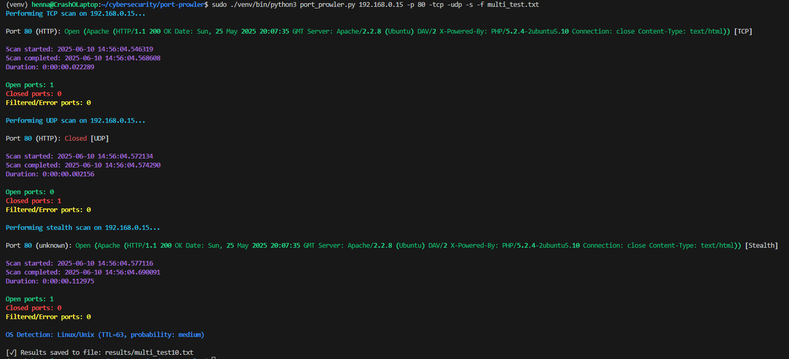

# Port Prowler 🕷️

## Overview :globe_with_meridians:

Port Prowler is a CLI tool that can scan specified ports on a target IP address, determining their state (open, closed, or filtered). The tool supports various scanning methods (TCP, UDP, and SYN Stealth scans) and allows for flexible port selection. Multiple scan protocols can be run simultaneously, and multi-threading ensures good performance. The tool provides coloured output in the console, and optionally saving scan results to a TXT file. 


## Table of Contents :book:
- [Overview](#overview-globe_with_meridians)
- [Technologies Used](#technologies-used-wrench)
- [Setup and Installation Instructions](#setup-and-installation-instructions-computer)
- [Testing Lab Setup: Metasploitable 2 in VirtualBox](#testing-lab-setup-metasploitable-2-in-virtualbox-mouse)
- [Functionality](#functionality-mag_right)
- [Usage Guide](#usage-guide-running)
- [Bonus Features](#bonus-features-gift)
- [Key Concepts](#key-concepts-key)
- [Example](#example-bulb)
- [Author](#author-construction_worker)


## Technologies Used :wrench:

- Python 3 Virtual Environment
- Visual Studio Code
- WSL (Ubuntu)
- Version Control System (Git)
- Repository (Gitea)
- Scapy, Rich
- VCS Client (Bash)
- Nmap (for comparison only)
- Metasploitable 2 and VirtualBox


## Setup and Installation Instructions :computer:

1. **Install Python and Pip**

The program is written in Python, so please ensure you have Python installed, or download it from <a href="https://www.python.org/downloads/">python.org</a>, OR for Linux, you can run the command: 
```console
sudo apt install python3 python3-pip python3-venv
``` 

2. **Clone the repository to your computer and change directory to it:**
```console
git clone https://gitea.kood.tech/hennamariahelenavenho/port-prowler.git
cd port-prowler
```

3. **Create a Virtual Environment:**
```console
python3 -m venv venv
``` 

4. **Activate the Virtual Environment:**

- WSL/Linux/macOS:
```console
source venv/bin/activate
```

- Windows (PowerShell):
```console
venv\Scripts\Activate
```

5. **Install Dependencies:**
```console
pip install -r requirements.txt
```

6. **(Optional) Select the Python Interpreter in VS Code:**

- Press `Ctrl+Shift+P`, search `Python: Select Interpreter` 
- Choose: `.venv/bin/python` (or `.venv\Scripts\python.exe`)


## Testing Lab Setup: Metasploitable 2 in VirtualBox :mouse:

1. **Install VirtualBox**

- Download from <a href="https://www.virtualbox.org">https://www.virtualbox.org</a>

2. **Download Metasploitable 2**

- From <a href="https://sourceforge.net/projects/metasploitable/">https://sourceforge.net/projects/metasploitable/</a>

3. **Import into VirtualBox**

- Extract the Metasploitable 2 ZIP to a safe folder (e.g. `C:/VMs/Metasploitable2/`)

- In VirtualBox: 
    - Click New 
        - Name it e.g. `Metasploitable 2`
        - Choose: 
            - Type: Linux 
            - Subtype and version: Ubuntu (32-bit)
    - Set Memory Size: 
        - Set RAM to 1024 MB or 2048 MB (Metasploitable doesn't need much)
    - In the "Hard Disk" screen:
        - Select **Use an existing virtual hard disk file**
        - Click the 📂 icon and browse to the `Metasploitable.vmdk` file you just extracted
        - Select it, then click **Create**

4. **Network Configuration (required!)**

- Go to VirtualBox Settings → Network
- Set Adapter 1 to:
    - ✅ Enable Network Adapter
    - Attached to: Bridged Adapter
    - Name: your active internet adapter (e.g. Wi-Fi)

5. **Start Metasploitable 2** 

- Login with:
```console
Username: msfadmin
Password: msfadmin
```

- Find the IP address:
```console
ifconfig
```

- Look for the `inet` line under `eth0`, e.g.:
```console 
inet 192.168.0.15
```

6. From  your WSL or Linux terminal, verify connection:
```console
ping <metasploitable_ip>
```
If successful, you can now run scans with the Metasploitable IP.


After the setup is done, please check [Usage Guide](#usage-guide-running) for how to run the program.   


## Functionality :mag_right:

- Supports TCP connect scan, UDP scan, and SYN-based stealth scan
- Accepts single ports, multiple ports, and ranges
- Allows scanning multiple protocols simultaneously
- Coloured console output
- Saves results to a TXT file (auto-versioned if file exists)
- OS detection using ICMP TTL (with sudo)
- Multi-threaded port scanning for performance


## Usage Guide :running:

For Usage Guide, run: 
```console
python3 port_prowler.py --help
```

You can optionally save all scan results to a TXT file by using flag: `-f filename.txt`, and the TXT files will be stored under `results/` directory.

Run TCP scan:
```console
python3 port_prowler.py <metasploitable2_ip> -p 80,443,8080 -tcp -f scan_results_tcp.txt
```

UDP scanning should always be run with root (superuser) privileges for best accuracy, due to ICMP response handling. 
Run UDP scan:
```console
sudo ./venv/bin/python3 port_prowler.py <metasploitable2_ip> -p 53,67,68,69,123,161,500,520,1900,5353 -udp -f scan_results_udp.txt
```

Stealth scan (Scapy's SYN scan) requires root privileges. 
Run Stealth scan:
```console
sudo ./venv/bin/python3 port_prowler.py <metasploitable2_ip> -p 80,443 -s -f scan_results_stealth.txt
```

You can also run multiple protocols (`-tcp`, `-udp` and `-s`) simultaneously: 
```console
sudo ./venv/bin/python3 port_prowler.py <metasploitable2_ip> -p 80 -udp -tcp -s -f multi_test.txt
```

### Compare with Nmap :rocket:

Install Nmap: 
```console
sudo apt install nmap
```

Nmap TCP scan:
```console
nmap -p 80,443,8080 -v -sT <metasploitable2_ip>
```

Nmap UDP scan (requires root privileges): 
```console
sudo nmap -p 80,443,8080 -v -sU <metasploitable2_ip>
```

Nmap Stealth scan (requires root privileges): 
```console
sudo nmap -p 80,443 -v -sS <metasploitable2_ip>
```

### UFW Firewall Testing (Remote Scan Mode) :fire:

Some review questions require comparing Port Prowler's results against Nmap while UFW (Uncomplicated Firewall) is enabled on the Metasploitable 2 VM.

- **Important**: This test must be done from outside the VM — not by running the scan from inside Metasploitable.

- ✅ The goal is to verify how Port Prowler and Nmap behave when the firewall filters remote traffic.


Enable UFW on Metasploitable 2 (inside the **Metasploitable 2 VM terminal**):
```console
sudo ufw enable
```
You may see a warning that the connection might break — this is okay, since you're scanning from a different system, not via SSH.

You can optionally explicitly deny/block common ports used for testing, as a more controlled method:
```console
sudo ufw deny 80
sudo ufw deny 443
sudo ufw deny 8080
```

(Optional) check rules:
```console
sudo ufw status verbose
```

Then perform scans remotely from **your WSL or host system** using both Port Prowler and Nmap, and compare results when UFW is enabled.

Run Port Prowler:
```console
sudo ./venv/bin/python3 port_prowler.py <metasploitable_ip> -p 80,443,8080 -tcp
```

And compare with Nmap (use `-Pn` flag because UFW blocks ICMP ping requests and Nmap won't scan unless we tell it to assume the host is up):
```console
nmap -p 80,443,8080 -v -Pn <metasploitable_ip>
```

Repeat the same for stealth scan:
```console
sudo ./venv/bin/python3 port_prowler.py <metasploitable_ip> -p 80,443,8080 -s
```

Compare with Nmap stealth scan (requires root privileges):
```console
sudo nmap -p 80,443,8080 -v -sS <metasploitable_ip>
```

After the UFW comparison tests, disable UFW again to keep VM as "unmodified" as possible:
```console
sudo ufw disable
```


## Bonus Features :gift:

- Common service identification (e.g. HTTP, FTP, or SSH)
- Version detection via banner grabbing (e.g. Apache, OpenSSH)
- OS (Operating System) fingerprinting via TTL (Time to Live)
- Multi-threaded port scanning
- Multiple scan types supported together
- Cases where some ports are closed or filtered during parallel scanning handled correctly
- Enhanced data visualization in the console with `rich.console`
- `.gitignore` results directory to exclude results from version control, ensuring the data is never accidentally uploaded


## Key Concepts :key:

<details id="computer-port-and-its-role-in-networking">
<summary>Computer Port and Its Role in Networking</summary>

-  A computer port is a virtual point where network connections start and end. Ports help differentiate multiple services running on the same IP address — for example, HTTP typically runs on port 80, and SSH on port 22. Ports allow computers to manage multiple connections simultaneously and are key to how network communication works.

</details>

<details id="network-topology-and-open-ports-in-cybersecurity">
<summary>Network Topology and Open Ports in Cybersecurity</summary>

-  Network topology is the structure of how devices and systems are connected, such as mesh, star, bus, ring, tree, or hybrid configurations. Understanding the topology and which ports are open on systems helps cybersecurity professionals identify potential entry points for attackers, monitor traffic paths, and detect misconfigured or vulnerable services.

</details>

<details id="purpose-and-functionality-of-a-port-scanning-tool-like-nmap">
<summary>Purpose and Functionality of a Port Scanning Tool like Nmap</summary>

-  Port scanners like Nmap are used to identify which ports on a device are open, closed, or filtered. This reveals which services a machine is running and how it may be accessed. Security experts use port scanning to audit systems, while attackers may use it to find vulnerabilities.

</details>

<details id="how-tcp-protocol-works-and-how-it-is-used-in-port-scanning">
<summary>How TCP Protocol Works and How It Is Used in Port Scanning</summary>

-  TCP (Transmission Control Protocol) is a connection-oriented protocol that requires a three-way handshake (SYN → SYN-ACK → ACK) before data is exchanged. In port scanning, a TCP connect scan completes this handshake to confirm whether a port is open. If the connection is refused, the port is closed; if there's no response or a reset, the port may be filtered.

</details>

<details id="how-udp-protocol-works-and-how-it-is-used-in-port-scanning">
<summary>How UDP Protocol Works and How It Is Used in Port Scanning</summary>

-  UDP (User Datagram Protocol) is a connectionless protocol that sends data without a handshake. It is faster but less reliable than TCP. In port scanning, a UDP packet is sent to the target port. If a reply is received, the port is open; if an ICMP (Internet Control Message Protocol) "port unreachable" message comes back, it's closed. No response may mean the port is open or filtered.

</details>

<details id="which-stealth-scanning-technique-is-used-and-how">
<summary>Which Stealth Scanning Technique is Used and How</summary>

-  This tool uses a SYN scan for stealth scanning. It sends a SYN packet to the target port but doesn't complete the handshake. If the target replies with SYN-ACK, the port is open. If it replies with RST, the port is closed. No response or ICMP error implies filtering. This method is stealthy because it avoids fully opening a connection.

</details>

<details id="differences-between-tcp-udp-and-stealth-scans">
<summary>Differences Between TCP, UDP, and Stealth Scans</summary>

| Scan Type     | Protocol | Behaviour                                   | Typical Use                     |
| ------------- | -------- | ------------------------------------------- | ------------------------------- |
| TCP Connect   | TCP      | Full 3-way handshake (SYN-SYN/ACK-ACK)      | Precise but detectable          |
| UDP Scan      | UDP      | No handshake, relies on timeouts            | Fast, stealthier, less accurate |
| Stealth (SYN) | TCP      | Half-open, sends SYN, waits for SYN-ACK/RST | Quick, harder to detect         |


</details>


## Example :bulb:

Here is a visual of the Port Prowler tool in action:




## Author :construction_worker:
Henna Venho