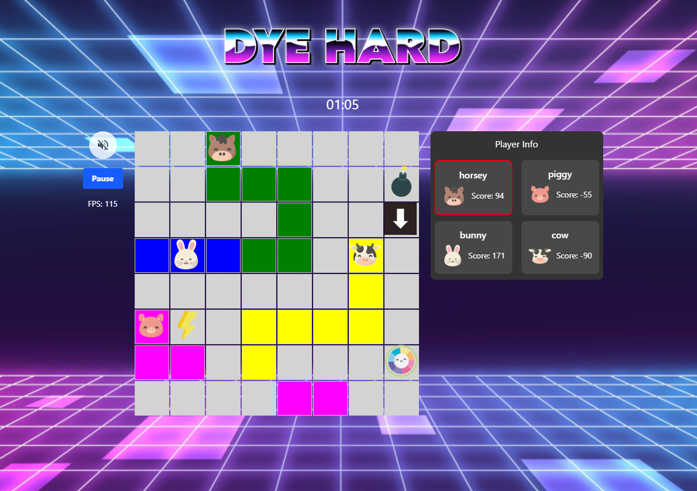

# DyeHard

DyeHard is a multi-player web-game where players score points by moving onto squares changing them to their respective colour. To bank these points, the player must collect a scorewheel power-up.


## Table of Contents
- [Technologies Used](#technologies-used)
- [Installation Instructions](#installation-instructions)
    - [Building and Running the Program with Tunneling](#building-and-running-the-program-with-tunneling)
- [Game play](#game-play)
    - [Scorewheel](#scorewheel)
    - [Bomb](#bomb)
    - [Lightning](#lightning)
    - [Arrow](#arrow)


## Technologies Used

- Backend: 
    - Node.JS
- Frontend: 
    - React
    - HTML
    - CSS
    - TailwindCSS
- Socket.IO for Real-Time Functionalities
- Ngrok/Tunnelmole to Access the Program on All Networks
- Audacity for Audio Editing
- GIMP for Image Editing
- Visual Studio Code
- Linux Mint and WSL (Ubuntu)
- Version Control System (Git)
- Repository (Gitea)
- Gitea Projects for Task Management
- VCS Client (Bash)
- Several Browsers for Testing


## Installation Instructions

Clone the repository to your computer and change directory to it:

```
git clone https://github.com/HennaVenho/web-game.git
cd web-game
```  

You can then **install dependencies** and **build the frontend server** with a setup script. From the `root` directory run the command 
```console
node setup.js
```   
After set up is done, start the server in `root` directory:  
```console
npm start
```   


## Settings Change if You're Using Chrome

[Chrome settings: chrome://flags/#enable-speculative-service-workers](chrome://flags/#enable-speculative-service-workers)

- Switch Prerendering > disabled


### Running the Program with Tunneling

You can then use your preferred method for localhost tunneling. For example  
- [ngrok](https://ngrok.com/downloads) (you need to create an account to use ngrok) and run the following command in a new terminal  
```console
ngrok http 56789
```
You will then receive forwarding URL in the terminal that you can use to open the game.


## Game Play

The goal of DyeHard is to score the most points in the given time. Game provides four types of power-ups.


### Scorewheel
  
Scorewheel transfers all the tiles of your respective colour to points. The scoring system is cumulatively increasing so that you receive 1 point for the first square, 2 points for the second square, 3 points for the third square etc.   
For example if you have 10 colored squares before gathering scorewheel, you will receive 55 points. 


### Bomb
  
Bomb decreases your points by 100. The explosion affects all the adjacent squares of the bomb.


### Lightning
  
Lightning gives you an energy boost for 10 seconds, making you move quicker.


### Arrow
  
Arrow paints the rest of the row/column with your colour.


## Example

Here is a visual of the DyeHard multi-player game in action:




## Credits

- background.png image: <a href="http://www.freepik.com">Designed by Freepik</a>


## Authors
Salla Ripatti, Mikko Venäläinen, and Henna Venho