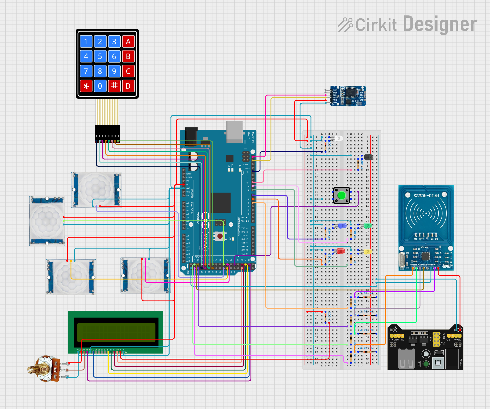
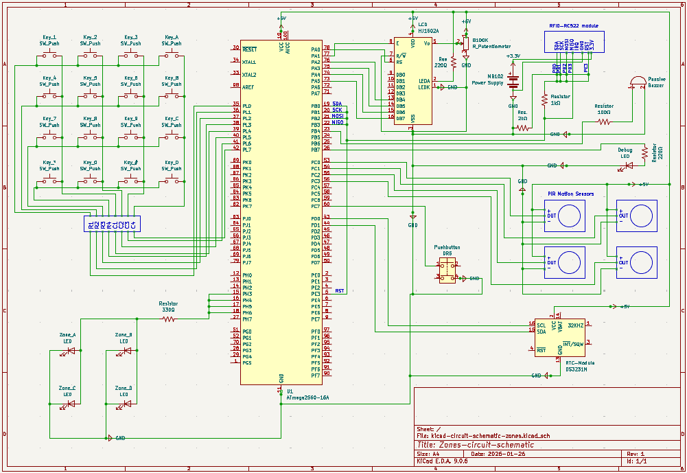
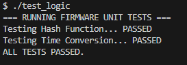
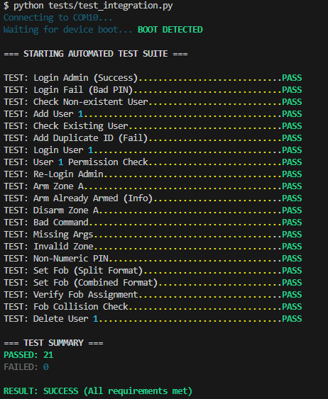

# 📢 Zones

## :earth_africa: Overview

**Zones** is a modular, four-zone security alarm system engineered for the **ATmega2560 (Arduino Mega)**. It acts as a proof-of-concept **Alarm Control Module (ACM)** for an art gallery, where each exhibition area (Zones **A–D**) can be armed or disarmed, monitored, and logged independently.

The project is implemented in **pure C with AVR-GCC** (no Arduino core), using direct register access and custom drivers for all peripherals. Day-to-day operation happens on the device itself via keypad and LCD, while a separate **Python USB CLI** provides remote management, diagnostics, and long-term log collection.

### :star: Key Features

- **Bare-Metal Firmware**
    - Direct register-level drivers for **GPIO, UART, SPI, I2C, timers, buzzer and LCD**
    - All functionality implemented in **plain C** for the ATmega2560 (no Arduino helper APIs)

- **Four Independent Zones (A–D)**
    - One **PIR motion sensor per zone**
    - Dedicated **zone LEDs** on the front panel to visually indicate which zones are in alarm state
    - Compact zone status line on the LCD (A–D, armed/disarmed) always visible in idle mode, and triggered zones (A–D) blinking if they enter alarm state

- **On-Device User Interface**
    - **16×2 LCD + matrix keypad** for:
        - PIN login
        - Arming/disarming individual zones
        - Viewing recent events log
        - Viewing current room temperature
    - Alarm view shows which zones are triggered and guides the user to enter a PIN and press the physical **Cancel** button.

- **Authentication & Security**
    - Supports authentication via **4-digit PIN** (keypad), or **RFID key fob** (RC522 reader)
    - PINs are **hashed before storage** in EEPROM
    - **Lockout after 3 failed PIN attempts**; requires an admin-level override (`UNLOCK`) to restore normal operation

- **Timekeeping & Logging**
    - **DS3231 RTC** provides date/time for all events, as well as temperature readings as a bonus feature.
    - A non-volatile **circular event log** in EEPROM (last 100 events) records:
        - Zone armed / disarmed
        - Alarm triggers
        - Alarm cancellations
    - Logs can be browsed on the LCD from the **View Logs** menu.

- **Python USB Companion App**
    - Cross-platform **CLI** that connects over USB serial
    - Supports all remote commands: user management (`ADD`, `DEL`, `SET_FOB`), zone control (`ARM`, `DISARM`, `ARMALL`, `DISARMALL`), status, time, temperature, and log operations
    - Streams firmware event messages and mirrors them into a local **`history.log`** file with chronologically sorted, human-readable entries (effectively unlimited history on the PC)
    - Masks PINs and RFID UIDs in normal mode to avoid leaking sensitive data on screen

Together, these components form a complete end-to-end system: low-level embedded firmware, real-time zone monitoring with persistent logs, a clear on-device UI, and a USB-connected desktop tool for administration and auditing.

See [Project Demonstration Videos](#movie_camera-project-demonstration-videos) for links to view the demo videos for this project.

---

## :book: Table of Contents 
- [Overview](#earth_africa-overview)
- [Technologies Used](#wrench-technologies-used)
- [System Architecture](#factory-system-architecture)
- [Setup Instructions](#jigsaw-setup-instructions)
- [Usage Guide](#rocket-usage-guide)
- [Bonus Features](#gift-bonus-features)
- [Project Demonstration Videos](#movie_camera-project-demonstration-videos)
- [Key Concepts](#key-key-concepts)
- [Author](#female_detective-author)

---

## :wrench: Technologies Used 

This project is engineered in **pure C** to run on bare-metal AVR hardware. No Arduino libraries (like `digitalWrite`) are used in the main firmware; all drivers were written from scratch using **direct register manipulation** for predictable timing and full control over the peripherals.

### Toolchain

- **`avr-gcc`**: Cross-compiler that builds the C source files into AVR machine code (`.elf` and `.hex`)
- **`avr-libc`**: AVR-specific C standard library, providing:
    - `<avr/io.h>` for MCU register and bit definitions  
    - `<avr/eeprom.h>` for accessing on-chip EEPROM  
    - `<avr/interrupt.h>` for interrupt vector and `ISR()` support  
    - `<util/delay.h>` for cycle-accurate software delays  
    - `<util/setbaud.h>` to compute UART baud rate register values based on `F_CPU` and desired baud
- **`avrdude`**: Command-line tool used to flash the final `.hex` firmware to the ATmega2560 via the Arduino bootloader (using the `wiring` protocol)
- **`make`**: Automates the build: compiles all sources under `src/`, links them, and generates the HEX file via a custom `Makefile`

### On-Chip Peripherals & Buses

All of the following are driven directly via registers (no high-level Arduino wrappers):

- **UART0**: Serial link to the host PC for the USB companion app and debug output
- **I²C (TWI)**: Communicates with the **DS3231 RTC** to read/write time and temperature
- **SPI**: Communicates with the **RC522 RFID reader** for card/fob detection and UID transfer
- **Timers & GPIO**: Used for the passive buzzer, keypad scanning, LED control, and general digital I/O

### Development Environment

- **Visual Studio Code**: Primary editor for firmware, Python tools, and documentation
- **MSYS2 (MinGW64)**: Unix-like shell and GNU toolchain on Windows 11 (provides `make`, `rm`, etc.)
- **Git & Gitea**: Version control and repository hosting
- **Arduino IDE**: Used *only* for quick hardware validation sketches, found at (`bonus_scripts/`), to test individual sensors and modules before integrating them into the pure-C firmware

### Documentation & Design

- **KiCad**: Used to draw the electrical schematic of the system
- **Cirkit Designer**: Used for the pictorial wiring diagram showing breadboard and cable connections

### Python Companion App

- **Python 3**, with:
    - **`pyserial`** for USB serial communication with the firmware
    - **`rich`** for coloured CLI output, tables, and prompts
    - Standard modules like `argparse`, `threading`, and `datetime` for argument parsing, concurrency, and time handling

---

## :factory: System Architecture

Zones is built as a small multi-layer system:

1. **Hardware layer** – Sensors, indicators and modules wired to the ATmega2560 
2. **Firmware layer (pure C)** – Bare-metal drivers and the alarm "brain" running on the Arduino Mega  
3. **Desktop tools (Python)** – A USB CLI for configuration, diagnostics and extended logging

### High-Level Block Diagram

```text
+-----------------------------+      USB / UART0       +-----------------------------+
|      Python CLI (PC)        | <--------------------> |   ATmega2560 (Firmware)     |
|  - cli.py (ZoneAlarmClient) |                        |  - system.c (state machine) |
|  - ui.py (Rich TUI)         |                        |  - ui.c (LCD views)         |
|  - parsers.py (logs)        |                        |  - drivers (UART/I2C/SPI/   |
+-----------------------------+                        |    LCD/keypad/buzzer/etc.)  |
                                                       +-----------------------------+
                                                                 |
                                                                 | GPIO / I2C / SPI
                                                                 v
                                                       +-----------------------------+
                                                       |    Sensors & Peripherals    |
                                                       |    - 4x PIR (Zones A–D)     |
                                                       |    - Zone LEDs & buzzer     |
                                                       |    - LCD & keypad           |
                                                       |    - Pushbutton (Cancel)    |
                                                       |    - DS3231 RTC             |
                                                       |    - RC522 RFID reader      |
                                                       +-----------------------------+
```

### Firmware Structure (C on ATmega2560)

- **Core Logic**
    - `main.c` – Initialises UART (Universal Asynchronous Receiver/Transmitter) and the system, enables interrupts, and calls `system_run()` in a loop
    - `system.c` / `system.h` – Central state machine and alarm logic:
        - Handles modes: **Idle**, **Menu**, **Alarm**, **View Logs**, **View Temp**
        - Monitors PIRs and the Cancel button; manages zone arm/disarm state and trigger latching
        - Implements PIN login, lockout after 3 failed attempts, and auto-logout based on RTC time

- **User Interface**
    - `ui.c` / `ui.h` – Draws high-level screens on the LCD:
        - Idle view (zone A–D status + time / "Enter PIN" prompt)
        - Main menu, alarm screen, log viewer, and temperature screen
        - Login greeting using the user's name from EEPROM
    - `lcd.c` / `lcd.h` – Low-level 4-bit driver for the 16×2 LCD (initialisation, commands, characters) using direct `PORTA` access
    - `keypad.c` / `keypad.h` – Matrix keypad scanner that drives rows, reads columns, debounces, and returns a single key (`0–9`, `A–D`, `*`, `#`)

- **Peripherals & Buses**
    - `uart.c` / `uart.h` – Interrupt-driven UART0 driver with an RX ring buffer:
        - RX ISR (Receive Interrupt Service Routine) fills the buffer
        - Non-blocking functions to check and read received bytes
        - Used both for the Python command protocol and debug messages
    - `i2c.c` / `i2c.h` + `rtc.c` / `rtc.h` – I²C (Inter-Integrated Circuit) master and DS3231 RTC driver:
        - Set/get time and date
        - Read on-board temperature
        - Handles BCD (Binary-Coded Decimal) <-> decimal conversion internally
    - `spi.c` / `spi.h` + `rc522.c` / `rc522.h` – SPI (Serial Peripheral Interface) master and MFRC522 driver:
        - Low-level register access over SPI
        - Initialisation, timer setup, antenna on/off
        - Card polling, anticollision, and UID reading for RFID fobs/cards
    - `buzzer.c` / `buzzer.h` – Timer-based PWM (Pulse Width Modulation) control of the passive buzzer:
        - Continuous tone for alarm
        - Short key-click beeps and error tones

- **Persistence & Commands**
    - `eeprom.c` / `eeprom.h` – Manages all EEPROM-backed data:
        - User records (ID, hashed PIN, optional RFID UID, short name)
        - Zone armed/disarmed bitmask and triggered-zones bitmask
        - Circular event log with RTC timestamps
    - `command_dispatcher.c` / `command_dispatcher.h` + `command_handlers.c` / `command_handlers.h` – UART command layer:
        - Parses incoming text commands (`LOGIN`, `ADD`, `DEL`, `ARM`, `DISARM`, `ARMALL`, `DISARMALL`, `SET_FOB`, `TIME`, `TEMP`, `STATUS`, `UNLOCK`, etc.)
        - Validates arguments and calls into `system.c` and `eeprom.c`
        - Sends responses like `OK`, `Fail`, `Err: ...`, `STATUS: ...`, and `EVT:...` back over UART

- **Utility Helpers (`utils.c / utils.h`)**
    - `utils_hash_string()` – DJB2 hash used for PIN hashing before storage
    - `utils_get_current_seconds()` – Converts RTC minutes/seconds to "seconds within the hour" for simple timeout calculations

### Python Companion CLI (PC Side)

- **`cli.py`** – Main CLI application:
    - Implements `ZoneAlarmClient`:
        - Opens the serial port, performs `LOGIN`, and runs an initial `DUMP_LOGS` sync
        - Starts a background reader thread that processes incoming lines and signals when a command's response is complete
        - Provides an interactive command loop for high-level commands (`USERS`, `ADD`, `DEL`, `SET_FOB`, `ARM`, `DISARM`, `LOGS`, `HISTORY`, `CLEAR_HISTORY`, `TIME`, `TEMP`, `STATUS`, `UNLOCK`, etc.)
        - Handles safety prompts (e.g. check before `DEL`) and interactive resolution of `USER_EXISTS`, `FOB_EXISTS`, and `FOB_TAKEN` situations
- **`parsers.py`**
    - Parses firmware `EVT:...` lines into human-readable strings with `[DD/MM/YY HH:MM:SS]` timestamps
    - Masks PINs and RFID UIDs in normal mode before displaying text
    - Reads/writes the local `history.log` file, deduplicates events during sync, and returns entries in chronological order
- **`ui.py`**
    - Uses **Rich** to render:
        - A help table of supported commands
        - Coloured, formatted output for alarms, errors, status lines, and info messages
    - Provides login prompts, "new RFID fob detected" messages, and paginated viewing of `history.log`
- **`config.py`**
    - Central configuration:
        - Serial port (`PORT`), baud rate (`BAUD_RATE`), and `LOG_FILE` path
    - Exposes a shared Rich `Console` instance and a `threading.Event` (`command_complete`) used for sync between the background reader thread and the main CLI loop

---

## :jigsaw: Setup Instructions

To run this project, you will:

1. Assemble the hardware on a breadboard
2. Wire all components according to the schematic
3. Install the AVR toolchain (`avr-gcc`, `avrdude`, `make`)
4. Compile and flash the firmware to the **Arduino Mega 2560**
5. Install Python 3.12+ and the required Python packages
6. Run the companion CLI tool over USB

---

### Required Hardware

This project targets the **Arduino Mega 2560** and uses common Arduino starter kit parts plus a few standard modules.

#### Core Components

- **1x Arduino Mega 2560**
- **4x PIR motion sensors** (HC-SR501 or similar) – one per zone (A–D)
- **1x 16x2 character LCD** (HJ1602A or compatible, HD44780-style, 4-bit mode)
    - With **1x Potentiometer** (B100K variable resistor) to adjust LCD contract
- **1x 4x4 Matrix keypad** (16-key)
- **1x Pushbutton** – Alarm Cancel button
- **1x Passive buzzer** (piezo buzzer)
- **4x LEDs** for zone status
    - Zone A: Red  
    - Zone B: Blue  
    - Zone C: Yellow  
    - Zone D: Green
- **1x Debug LED** (on D13) – any colour
- **1x DS3231 RTC module** (I²C)
- **1x RC522 RFID reader module** (SPI)
- **Resistors**  
    - 4× current-limiting resistors for zone LEDs (e.g. 330 Ω)  
    - 1× resistor for debug LED (e.g. 220 Ω)  
    - 1× resistor for buzzer (e.g. 100 Ω in series)  
    - Voltage divider resistors for RC522 3.3 V logic (e.g. 1 kΩ / 2 kΩ on SDA, SCK, MOSI, RST)
- **Breadboard** and **jumper wires**
- **USB cable** for connecting the Mega to the PC

Optional but recommended:

- External 3.3V/5V power supply: MB102 Breadboard Power Supply module used in this wiring to power the RC522 separately with 3.3V

---

### Wiring & Schematics

To replicate this project, follow the wiring diagrams in the `docs/` directory.

#### 1. Pictorial Diagram

A breadboard-style view with life-like components, ideal while wiring:
<br>


#### 2. Electrical Schematic (KiCad)

A formal schematic showing precise connections and pin labels:
<br>


#### 3. Pinout Reference

For exact pin locations on the Arduino Mega 2560, you can refer to:
- [Arduino Mega 2560 Pinout - View 1](docs/references/arduino-mega2560-full-pinout-1.png)
- [Arduino Mega 2560 Pinout - View 2](docs/references/arduino-mega2560-full-pinout-2.png)

---

### Tool Installation

To compile the pure C firmware, you need the AVR-GCC compiler and AVRDUDE uploader.

#### Windows (via MSYS2 / MinGW64)

1. Install [MSYS2](https://www.msys2.org/)
2. Open the `MSYS2 MinGW64` terminal
3. Install the AVR toolchain:
    ```bash
    pacman -S mingw-w64-x86_64-avr-gcc mingw-w64-x86_64-avr-libc mingw-w64-x86_64-avrdude mingw-w64-x86_64-make
    ```
4. (Optional) Add a `make` alias so you can just type `make`:
    ```bash
    echo "alias make='mingw32-make'" >> ~/.bashrc
    source ~/.bashrc
    ```
5. (Optional) Run the C unit tests for firmware logic (in VS Code MINGW64 terminal):
    ```bash
    gcc -o test_logic tests/test_firmware_logic.c -Iinclude
    ./test_logic
    ```

#### Linux (Debian/Ubuntu)

```bash
sudo apt update
sudo apt install gcc-avr avr-libc avrdude make
```

---

### Compile and Flash the Firmware

#### 1. Clone the Repository

```bash
git clone https://github.com/HennaVenho/zones.git
cd zones
```

#### 2. Configure `Makefile` (if needed)

The default `Makefile` is set up for:
- **MCU**: `atmega2560`
- **Programmer**: `wiring` (Arduino bootloader)
- **PORT**: `COM10` (Windows example)

Check and edit:
- On **Windows**: open **Device Manager** and verify which COM port your Mega uses (e.g. `COM3`, `COM7`), then update the `PORT` line in `Makefile`
- On **Linux**: `PORT` usually looks like `/dev/ttyUSB0` or `/dev/ttyACM0`

#### 3. Build the Firmware

Compile the source code into an `.elf` and `.hex` file:
```bash
make
```
This will:
- Compile all `src/*.c` into object files under `build/`
- Link them into `zones.elf`
- Generate `zones.hex` for flashing

#### 4. Upload to Arduino

Connect your Arduino Mega via USB and run:
```bash
make flash
```

The `flash` target will:
- Ask you to **reset the board** to enter the bootloader
- Call `avrdude` to write `zones.hex` to the ATmega2560

If `avrdude` times out, press the **RESET** button on the Mega immediately after running `make flash`.

You can see an example of a successful flash in:
[docs/screenshots/successful-flash.png](docs/screenshots/successful-flash.png).

#### 5. Clean up Build Artifacts (Optional)

```bash
make clean
```
This removes `build/`, `.elf`, and `.hex` files if you want a fresh rebuild.

---

### Python Setup (Companion CLI)

Python 3.12+ is required to run the USB companion application in `tools/`.

#### Install Python on Windows

1. Download the latest Python 3.12+ installer from the official website
2. In the installer:
    - ✅ Check **"Add python.exe to PATH"**
    - Choose **"Customise installation"** and keep the defaults
    - (Optional) ✅ **Install for all users**
3. After installation, open a new **Command Prompt** or **MSYS2 MinGW64** terminal and check:
    ```bash
    python --version
    ```
    You should see something like: `Python 3.12.x`.

If you installed Python while VS Code was open, restart VS Code so the terminal picks up the updated `PATH`.

#### Python on Linux (Debian/Ubuntu)

Most modern distributions already include Python 3, but you can ensure it is installed and add the tools needed for virtual environments:
```bash
sudo apt update
sudo apt install python3 python3-venv python3-pip
```

Verify the version:
```bash
python3 --version
```

#### Create Virtual Environment and Install Dependencies

From the project root:

- **Windows:**
    ```bash
    python -m venv .venv
    ```
- **Linux:**
    ```bash
    python3 -m venv .venv
    ```

Activate the virtual environment:

- **Windows (PowerShell / Command Prompt):**
    ```bash
    .venv\Scripts\activate
    ```
- **MSYS2 MinGW64 / bash on Windows:**
    ```bash
    source .venv/Scripts/activate
    ```
- **Linux (bash / zsh):**
    ```bash
    source .venv/bin/activate
    ```

Install the required packages:
```bash
pip install -r tools/requirements.txt
```

To exit the virtual environment later:
```bash
deactivate
```

#### Run the CLI Application

With the virtual environment active and the Arduino Mega connected:
```bash
python tools/cli.py      # On Windows
python3 tools/cli.py     # On Linux
```

Optional Development Mode (shows PINs and raw protocol data):
```bash
python tools/cli.py --dev      # Windows
python3 tools/cli.py --dev     # Linux
```

This opens the interactive **Zone Alarm CLI**, connects over UART, performs login, syncs the event history, and then lets you send commands (`USERS`, `ADD`, `ARM`, `LOGS`, `HISTORY`, etc.) to exercise the firmware remotely.

---

## :rocket: Usage Guide

Once the firmware is flashed, the system is powered on, and the companion app is ready, you can use the system from:

- the **physical interface** (keypad, LCD, LEDs, buzzer, PIRs, RFID), and  
- the **Python USB companion CLI** on your PC

### Firmware Usage (Keypad, LCD, LEDs, Buzzer & RFID Reader)

#### 1. Boot & Idle Screen

- During `make flash` / reset, the **debug LED (D13)** blinks briefly as a boot indicator
- On a normal clean startup (no active alarm stored), the LCD shows:
    ```text
    System Init OK
    ```
    for about one second, then switches to **Idle**.

- In **Idle** state, the LCD shows:
    - **Line 1 – Zone states (armed/disarmed):**
        ```text
        A:- B:+ C:- D:+
        ```
        where `+` = armed, `-` = disarmed

    - **Line 2 – Time / instruction / PIN entry:**
        - If idle, it alternates between:
            ```text
            DD/MM HH:MM:SS
            ```
            and
            ```text
            Enter PIN + #  
            ```
        - If the user is typing a PIN, it shows:
            ```text
            PIN: ****
            ```      
            with one `*` per digit

- If the system is in **alarm persisted from EEPROM**, it boots directly into Alarm state with siren and alarm screen (see below).

#### 2. Logging In

Login is required for arming/disarming and viewing logs/temperature.

Supported methods:
- **Keypad PIN login**
    - Enter a **4-digit PIN** on the keypad and press `#`
    - The buzzer gives a short "key click" beep for each key (unless already in Alarm)
    - The LCD shows the PIN as `*` characters on the second line
    - On success:
        - Failed-attempt counter resets
        - The LCD briefly shows:
            ```text
            Hello <username>
            ```
        - Then the **Main Menu** is displayed

- **RFID fob login**
    - Present a configured RFID fob to the RC522 reader
    - If the UID matches a stored user, the system logs that user in and goes straight to the **Main Menu** with the same greeting
    - PIN login remains available as a fallback

> **Note:** In **Alarm state**, entering a correct PIN and pressing `#` does *not* log in. Instead, the LCD reminds the user to use PIN and the physical Cancel button (see "Cancelling an Alarm" below).

#### 3. Main Menu & Navigation

When logged in, the **Main Menu** shows:
```text
A-D:Zone 5:Logs
0:Temp *:Logout
```
From here:
- **Zone control – `A`, `B`, `C`, `D`**
    - Press `A`, `B`, `C`, or `D` to **toggle** the corresponding zone:
        - If disarmed -> becomes armed
        - If armed -> becomes disarmed
    - The LCD briefly shows:
        ```text
        Zone A:
        ARMED
        ```
        or
        ```text
        Zone A:
        DISARMED
        ```
    - After 1 second, it returns to the Main Menu
    - The Idle screen (when logged out) always shows the current armed/disarmed status for all zones

- **View logs – `5`**
    - Press `5` to enter the **Log Viewer**
    - First, a short instruction screen:
        ```text
        Scroll Logs:
        2:UP 8:DN *:Back
        ```
    - Then the latest log entry is shown, e.g.:
        ```text
        26/01 18:35
        Disarm Zn A U3
        ```
        - `Zn` = Zone (A–D)
        - `U3` = User ID 3
    - Controls in Log Viewer:
        - `2` -> move to **newer** entry (UP)
        - `8` -> move to **older** entry (DOWN)
        - `*` -> back to Main Menu
    - The EEPROM log buffer stores the **most recent 100 events**

- **Temperature – `0`**
    - Press `0` to show the **room temperature**:
        ```text
        Temp: 22.75C
        *:Back
        ```
    - The reading comes from the DS3231's internal sensor with **0.25 °C resolution**
    - In the temperature view:
        - `*` -> back to Main Menu
        - Any other key -> refresh temperature reading

- **Back / Logout – `*`**
    - In **Logs** or **Temperature** views: `*` goes back to the previous menu
    - In the **Main Menu**: `*` logs the user out and returns to Idle
    - An **auto-logout** happens after ~20 seconds of inactivity in Menu/Logs/Temp:
        - The PIN buffer is cleared
        - A short `"Auto Logout"` message is shown

#### 4. Lockout on Repeated Invalid PINs

- If a wrong PIN is entered in Idle/Alarm state:
    - The LCD shows:
        ```text
        Invalid PIN!
        ```
    - The failed-attempt counter increments

- After **3 consecutive invalid PIN attempts**:
    - The system enters a **lockout** state:
        - The buzzer emits a long beep
        - Keypad input is disabled
        - The debug LED blinks repeatedly to indicate lockout
        - The Idle screen shows:
            ```text
            A:- B:- C:- D:-   (example)
            SYSTEM LOCKED!
            ```
    - The lockout can only be cleared using the **`UNLOCK` command** from the companion CLI with the **Admin (User 0) PIN**.

#### 5. Alarm Behaviour & Cancelling

- When a **PIR sensor** in an armed zone detects motion:
    - That zone's bit in the **global trigger mask** is latched (e.g. Zone B)
    - An **Alarm Triggered** event is logged to EEPROM and sent over UART
    - If this is the first trigger:
        - The system enters **Alarm state**
        - The buzzer runs in continuous **siren mode**
        - The LCD shows an alarm summary, where the triggered zone (B) is flashing, e.g.:
            ```text
            ALARM: - B - -     
            PIN then Cancel
            ```
        - The **zone LEDs** for all triggered zones flash on/off
        - The **debug LED** also flashes

- Additional zones can trigger while already in alarm. Their LEDs and LCD letters will be included on the next blink update.

- **Cancelling an alarm (local):**
    1. Enter a **valid PIN** on the keypad
    2. Press the **physical Cancel pushbutton**

    If the PIN belongs to a user:
    - `system_cancel_alarm()` is called
    - The buzzer turns off
    - The **global trigger mask** is reset (clearing all latching alarm bits; zones remain armed)
    - An **Alarm Cancelled** event is logged with the user ID
    - The LCD shows for a moment:
        ```text
        Alarm Silenced
        By User X
        ```
    - The system returns to Idle, and the user can log in again if needed.

---

### Companion USB App Usage (Python CLI)

> **Note:** The CLI requires a USB connection to the Arduino Mega and uses the serial protocol implemented in the firmware.

Start the app from the project root (with your virtualenv active):
```bash
python tools/cli.py    # Windows
python3 tools/cli.py   # Linux
```

#### 1. Login Flow

- On startup, the CLI:
    1. Connects to the configured serial port
    2. Prompts for **User ID** and **PIN** (with the PIN hidden)
    3. Sends a `LOGIN <id> <pin>` command to the device
- You can type `exit` at either prompt to quit immediately
- On successful login, the CLI prints a confirmation and performs a **log sync** (see below), then displays the **command help table**.

#### 2. Command Help Table

At any time, you can type:
```bash
HELP
```
to view the full command table:

```text
                                        Zone Alarm System Commands                                          
╭───────────────┬───────────────────┬───────────────────────────────────────────────────────────────────────╮
│ Command       │ Arguments         │ Description                                                           │
├───────────────┼───────────────────┼───────────────────────────────────────────────────────────────────────┤
│ HELP          │                   │ Print Command Help Table                                              │
│ USERS         │                   │ List All Users (masked PINs)                                          │
│ ADD           │ <id> <pin> <name> │ Add/Update User (ID: 0-3, PIN: 4 digits, Name: 1-10 chars, no spaces) │
│ DEL           │ <id>              │ Delete User by ID                                                     │
│ SET_FOB       │ <id> <uid>        │ Set RFID Fob for User | 00 00 00 00 to Remove                         │
│ ARM           │ <zone> <pin>      │ Arm Zone (A-D)                                                        │
│ DISARM        │ <zone> <pin>      │ Disarm Zone (A-D)                                                     │
│ ARMALL        │ <pin>             │ Arm ALL Zones                                                         │
│ DISARMALL     │ <pin>             │ Disarm ALL Zones                                                      │
│ CANCEL        │ <pin>             │ Silence Alarm                                                         │
│ LOGS          │                   │ View Recent Events from Arduino Buffer                                │
│ CLEAR_LOGS    │                   │ Wipe Arduino Events Buffer                                            │
│ HISTORY       │                   │ View Local History File                                               │
│ CLEAR_HISTORY │                   │ Wipe Local History File                                               │
│ TIME          │ [d m y h m s]     │ No Args: Read System Time | Args: Set Time                            │
│ TEMP          │                   │ Show Room Temperature                                                 │
│ STATUS        │                   │ Show Current Zone States                                              │
│ UNLOCK        │ <admin_pin>       │ Admin Override: Reset Lockout (Requires Admin User 0 PIN)             │
│ EXIT          │                   │ Close Application                                                     │
╰───────────────┴───────────────────┴───────────────────────────────────────────────────────────────────────╯
```

#### 3. Notable Behaviours & Safety Features

- **Event Sync (`DUMP_LOGS` -> `history.log`)**
    - After login, the CLI automatically:
        - Requests a dump of stored events from the Arduino
        - Converts each `EVT:...` line into a human-readable string
        - Deduplicates against the existing `history.log`
    - This means events that happened while the app was *not* running are still captured on the PC once you reconnect.

- **Local history viewer (`HISTORY`)**
    - `HISTORY` displays the local `history.log` in chronological order.
    - Entries are shown in batches of **50 newest at a time**.
    - After each batch, the user is asked whether to show the previous 50 until the user reaches the oldest event.

- **User & RFID management**
    - `USERS`, `ADD`, `DEL` manage users 0–3 and their PINs.
    - `SET_FOB` assigns or removes an RFID fob for a user.
    - When an **unknown RFID tag** is detected on the hardware side while the CLI is running, the firmware sends its UID and the CLI shows:
        ```text
        >> New RFID Fob Detected: AA BB CC DD
        (Use 'SET_FOB <id> <uid>' to assign)
        ```

- **Lockout & override (`UNLOCK`)**
    - If the firmware enters **lockout** after three wrong PIN attempts, the keypad is disabled.
    - From the CLI, an Admin (user 0) can call:
        ```bash
        UNLOCK <admin_pin>
        ```
    - On success, the lockout state is cleared and the keypad/LCD become usable again.

- **Zone control and alarm cancel**
    - `ARM`, `DISARM` mirror the on-device zone toggling, but via USB and separate commands.
    - `ARMALL`, `DISARMALL` are convenience bonus features with which all zones can be armed or disarmed at the same time.
    - `CANCEL <pin>` remotely silences an active alarm using a valid PIN, logging the cancellation event as usual.

- **Destructive operations with confirmation**
    - `CLEAR_LOGS` (wipe device EEPROM event buffer), and `CLEAR_HISTORY` (wipe local `history.log`) both:
        - Show a clear warning
        - Require a **"y/n" confirmation** before proceeding

- **Sensitive data masking**
    - In normal mode, the CLI masks sensitive data before printing:
        - PINs and PIN arguments are replaced with `****`.
        - RFID UIDs in `SET_FOB` commands are masked.
    - `--dev` mode disables masking so you can see raw protocol lines for debugging:
        ```bash
        python tools/cli.py --dev
        ```

---

### Tests Provided

This repository includes tests for both the firmware-side logic and the Python integration.

#### 1. Firmware Unit Tests (C) 

```bash
gcc -o test_logic tests/test_firmware_logic.c -Iinclude
./test_logic
```
These tests: [`tests/test_firmware_logic.c`](./tests/test_firmware_logic.c)
- Mock the RTC (`rtc_get_time`) to provide a fixed time
- Verify:
    - `utils_hash_string()` – determinism and basic correctness of the DJB2 hash used for PIN hashing
    - `utils_get_current_seconds()` – correct conversion from minutes/seconds to "seconds within the hour"
- Example output (screenshot):  
      

#### 2. Automated Integration Test Suite (Python)

```bash
python tests/test_integration.py    # Windows
python3 tests/test_integration.py   # Linux
```
This script: [`tests/test_integration.py`](./tests/test_integration.py)
- Connects to the Arduino over serial
- Logs in as Admin using a known PIN
- Exercises all major protocol commands:
    - User management (`ADD`, `DEL`, `CHECK`, permissions)
    - Zone control (`ARM`, `DISARM`, invalid zone handling)
    - Error cases (bad commands, missing arguments, invalid PIN formats)
    - RFID management (`SET_FOB`, collision detection, `-f` force flag)
- Asserts that each step returns an expected substring
- Prints a coloured **PASS/FAIL summary** at the end using the Rich library
- Example output (screenshot):  
      

#### 3. Manual Connection Test Helper (Python)

```bash
python tests/test_connection.py    # Windows
python3 tests/test_connection.py   # Linux
```
This small helper: [`tests/test_connection.py`](./tests/test_connection.py)
- was used during development to:
    - Open a serial connection to the Arduino
    - Send commands interactively from the keyboard
    - Read and print responses continuously in a background thread

It's useful if you want to manually poke the firmware outside of the main CLI and see raw serial behaviour.

---

## :gift: Bonus Features

This project includes several features that go beyond the core assignment requirements and extend usability, security, and testability, without changing the default expected behaviour.

- **On-Device UI Polish & Feedback**
    - Consistent user feedback: 
        - Keypad key presses (outside ALARM state) produce a short "key-click" beep on the buzzer for tactile feedback.
        - PIN entry on the LCD is masked with `*` characters, one per keypress, so the user can see *how many* digits they entered without revealing the actual PIN.
    - Clear keypad menu layout with consistent navigation: `A–D` for zones, `5` for logs, `0` for temperature, `*` as a universal *Back/Logout* key
    - Idle screen shows a compact zone overview on the top row and cycles between real-time clock and login instructions on the bottom row.
    - Alarm screen highlights only the triggered zones (A–D) and provides clear instructions: `PIN then Cancel`.
    - Logs view shows timestamp + compact description (`Disarm Zn A U3`) with user always included for traceability, and navigation is intuitive with `2` = newer, `8` = older, `*` = back.
    - Temperature view (`0` in menu) shows `Temp: XX.XXC` with `*` as back, and any other key to refresh the reading.

- **USB Companion App – UX & Safety Improvements**
    - Uses the Python `rich` library for colour-coded output and readable help tables 
    - Accepts **case-insensitive commands** (`arm a 1234` and `ARM A 1234` both work), making it more forgiving and user-friendly
    - Enhanced user management:
        - Each user has an ID, PIN and a short `name` field
        - PINs and RFID fob UIDs are masked in normal mode (only "has fob / no fob" is shown).
    - Global `ARMALL` and `DISARMALL` commands to arm or disarm all zones in one step
    - Safety prompts before destructive actions:
        - Deleting a user (`DEL`) performs a background existence check and asks for confirmation.
        - Clearing logs and local history prompt the user to confirm before wiping data.

- **RFID Integration with Secure Handling**
    - Supports **RC522** RFID key fobs as an alternative to PIN login and keypad control
    - `SET_FOB <id> <uid>` command assigns a 4-byte fob UID; using UID `00 00 00 00` removes the fob from a user.
    - Supports both spaced (`11 22 33 44`) and combined (`11223344`) formats
    - The firmware only prints raw `RFID: XX XX XX XX` UIDs for *unknown* tags; assigned fobs are always masked in normal app mode.
    - The companion app highlights new/unknown fobs and guides the user to assign them.

- **Persistence & Extended History**
    - All critical state is stored in EEPROM and restored on startup:
        - Users (IDs, hashed PINs, names, fob IDs)
        - Zone armed/disarmed states
        - Triggered-zone mask (so an active alarm survives a power-cycle)
        - Up to 100 recent events in a circular log
    - The Python app maintains an extended `history.log`:
        - Events are appended live while the app runs.
        - On startup, it performs a `DUMP_LOGS` sync, merges any missing events, and deduplicates them.
        - The `HISTORY` command paginates this file on the PC, while `LOGS` shows the EEPROM log.
    - `CLEAR_LOGS` wipes only the Arduino's EEPROM log; `CLEAR_HISTORY` wipes only the PC-side file.

- **Security Enhancements Beyond Core Requirements**
    - PINs are never stored in plaintext: a DJB2-style 32-bit hash is written to EEPROM instead of the raw PIN.
    - The USB companion app itself requires a valid `LOGIN <id> <pin>` before any commands are accepted (default admin: ID `0`, PIN `1234`, stored as a hash).
    - By default, all sensitive fields (PINs, hashes, fob UIDs) are masked in app output; a dedicated `--dev` mode shows raw protocol lines for debugging when explicitly requested.
    - The app protects against accidental overwrites:
        - If the firmware reports `Err: User exists`, `Err: Fob exists`, or `Err: Fob used`, the CLI asks for confirmation.
        - Only if the operator agrees does it resend the command with a `-f` force flag to explicitly allow an overwrite on the firmware side.

- **Bonus Room Temperature Display**
    - Uses the DS3231's internal temperature sensor and registers (0x11–0x12) to read ambient temperature
    - The firmware converts the raw register values into a Celsius value with 0.25 °C steps and:
        - Shows it on the LCD from the Main Menu via the `0` key, e.g. `Temp: 22.75C`
        - Allows refreshing the reading with any non-`*` key; `*` returns to the menu
    - The companion app exposes the same reading via the `TEMP` command.

- **Testing & Validation**
    - A small C unit test binary checks the PIN hashing and time-conversion helpers in isolation.
    - A Python integration test suite connects to the live device, runs through all protocol commands, and verifies the responses.
    - A simple serial test script was used early on to validate the UART link.

    See [Tests Provided](#tests-provided) for exact commands and details.

- **Arduino IDE Validation Sketches**
    - Location: [`bonus_scripts/`](./bonus_scripts/)
    - Contains small, isolated C++ sketches for testing individual components (LCD, keypad, PIR sensors, buzzer, RFID module, RTC, etc.) in the Arduino IDE before integrating and re-implementing them in pure C in the main firmware.

--- 

## :movie_camera: Project Demonstration Videos

A set of demonstration videos is available to verify full project functionality (uploaded unlisted to YouTube):

| # | Video | Description |
|---|--------|-------------|
| 1 | **[System Intro: Hardware & Boot](https://youtube.com/shorts/U597mYSYL1g?feature=share)** | Short overview of the physical setup (Mega, sensors, LCD, keypad, RFID, buzzer) and a power-on demo showing the boot sequence, status LED blink, and `System Init OK` on the LCD. |
| 2 | **[On-Device UI, Zones & Logs](https://youtu.be/rsfN__HzQaI)** | Demonstrates the LCD + keypad UI: logging in with a PIN, arming and disarming the four zones, seeing zone status on the Idle screen, viewing logs on the LCD, and showing how the RTC time/date appear in normal use. |
| 3 | **[PIR Sensors, Alarm Behaviour & Cancelling](https://youtu.be/PR7Sca3jbH8)** | Shows how armed zones react to motion (buzzer + LEDs + alarm screen), how disarmed zones ignore triggers, and how an authorised user cancels an active alarm using PIN + Cancel, with the events recorded in the log. |
| 4 | **[Lockout, Admin Override & Stability](https://youtu.be/kto2AZpvpK4)** | Demonstrates the three-strikes PIN lockout, the lockout screen and disabled keypad, and how the admin can clear the lockout via the USB CLI using `UNLOCK`, plus a short demonstration of stable operation over repeated cycles. |
| 5 | **[Companion App Commands, User Management & History](https://youtu.be/2eJeL_wLP3Y)** | Walkthrough of the Python CLI: logging in, adding/listing/deleting users, remote zone control, reading/setting RTC time, temperature queries, viewing/clearing device logs, and using `HISTORY` with the synced `history.log` file. |
| 6 | **[RFID, Persistence & Bonus Features](https://youtu.be/8S0YXi67xWs)** | Shows RFID fobs for login and control (with PIN as fallback), assigning fobs via the CLI, restoring users/zones/logs after a power-cycle, and the bonus room-temperature display from the RTC sensor. |

---

## :female_detective: Author
Henna Venho
